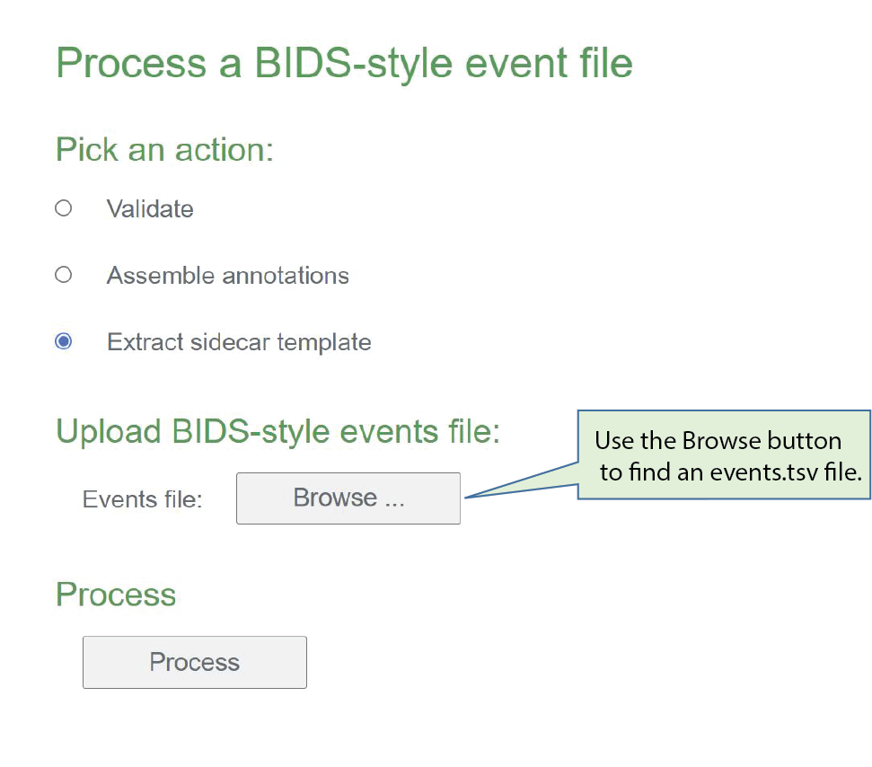
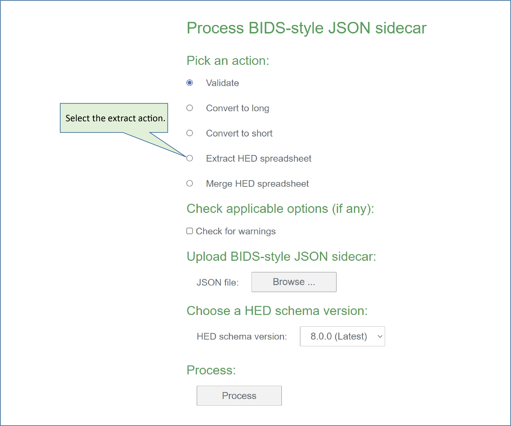
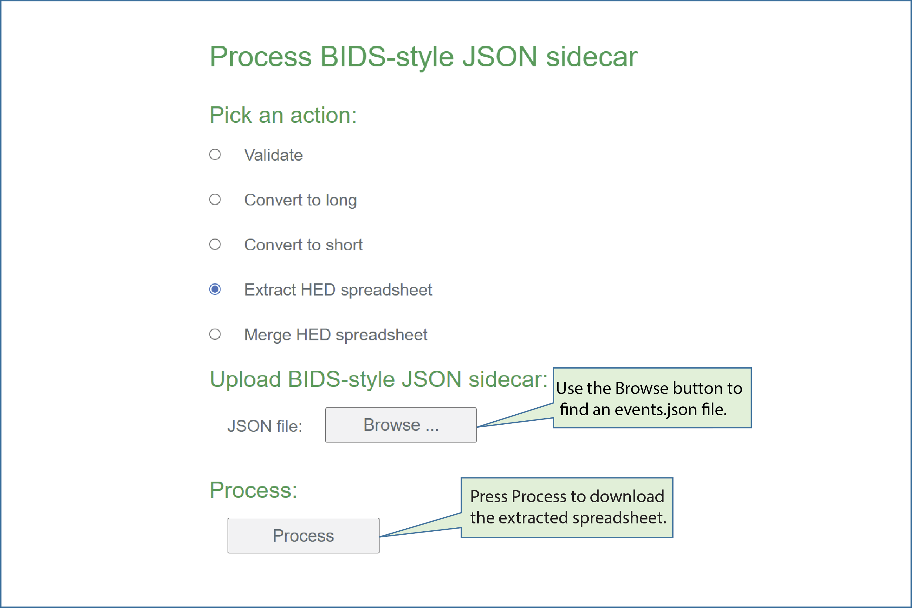

# BIDS annotation quickstart

**Note: This tutorial is in the process of being developed.** 

This tutorial provides a step-by-step guide to creating a JSON sidecar
containing the annotations needed to document your BIDs dataset events.
We assume that your dataset is already in the BIDS [**BIDS Brain Imaging Data Structure**](https://bids-specification.readthedocs.io/en/stable/) format
and focus on the mechanics of event annotation in BIDS using HED.

````{admonition} General strategy for machine-actionable annotation using HED.
**The goal is to construct a single `events.json` sidecar file with all the 
annotations needed for users to understand and analyze your data.**

You will put the finished annotation file at the top level of your dataset.
````

The approach that we will use is to create a template file from an `events.tsv` file
in your BIDS dataset using the online tools available at
[**hedtools.ucsd.edu/hed**](https://hedtools.ucsd.edu/hed).

You can then edit this JSON file directly using a text editor
to insert data descriptions and HED annotations.


You also have the option of converting this JSON template to a spreadsheet
templates for editing convenience as described below in 
[**Spreadsheet templates**](spreadsheet-templates-anchor).

````{warning}
Although the HED web tools base the template on the information extracted from a single
`events.tsv` file, this will be sufficient to produce a good template for most datasets.

For datasets with widely-varying event files, you should use the Jupyter notebook version
rather than the online tools.
The Jupyter notebook will consolidate information from all of the `events.tsv` files in the dataset
to produce a JSON sidecar template.
````

 
We are using an
[**abbreviated version**](https://raw.githubusercontent.com/hed-standard/hed-examples/main/datasets/eeg_ds003654s_hed/sub-002/eeg/sub-002_task-FacePerception_run-1_events.tsv)
of the `events.tsv`file from subject 002 run 1 from
[ds003654:Face processing MEEG dataset with HED annotation](https://openneuro.org/datasets/ds003645/versions/2.0.0)
dataset on OpenNeuro.
A reduced version of this dataset
[**eeg_ds003654s_hed**](https://github.com/hed-standard/hed-examples/tree/main/datasets/eeg_ds003654s_hed)
is also available.


(create-a-json-template-anchor)=
## Create a JSON template

This tutorial creates a sidecar template from the information in one of the
`events.tsv` files in your BIDS dataset.
Working from a template is much easier and faster than creating a sidecar from scratch.
Using the [**HED events online tools**](https://hedtools.ucsd.edu/hed/events),
the steps to create a template are: 

* [**Step 1: Select generate sidecar template action.**](step-1-select-generate-json-action-anchor)  
* [**Step 2: Upload an event file.**](step-2-upload-events-file-for-extraction-anchor)  
* [**Step 3: Select columns to annotate.**](step-3-select-columns-to-annotate-anchor)  
* [**Step 4: Download the extracted template.**](step-4-download-extracted-json-template-anchor)  
* [**Step 5: Complete the annotation.**](step-5-complete-the-annotation-anchor)  

You can then edit your JSON sidecar directly or convert it to a spreadsheet
to fill in the annotations.


(step-1-select-generate-json-action-anchor)=
### Step 1: Select generate JSON

Go to the [**Events**](https://hedtools.ucsd.edu/hed/events) page of the HED online tools.
You will see the following menu:


Select the **Generate sidecar template** action.
The application will adjust to your selection, showing only the information you need to provide.

(step-2-upload-events-file-for-extraction-anchor)=
### Step 2: Upload an events file.

Use the **Browse** button to choose an `events.tsv` file to upload.
When the upload is complete, the local file name of the uploaded events
file will be displayed next to the **Browse** button.



In this example, we have uploaded 
[**sub-002_task-FacePerception_run-1_events.tsv**](./_static/data/sub-002_task-FacePerception_run-1_events.tsv).
Here is a simplified excerpt from the beginning of this file:

````{admonition} A simplified excerpt from a BIDS event file.
| onset	| duration | sample | event_type | face_type | rep_status | trial | rep_lag | value | stim_file |
| ----- | -------- | ------ | ---------- | --------- | ---------- | ----- | ------- | ----- | --------- |
| 0.004 | n/a | 1.0 | setup_right_sym | n/a | n/a | n/a | n/a | 3 | n/a |
| 24.2098	| n/a | 6052 | show_face | unfamiliar_face | first_show | 1 | n/a | 13 | u032.bmp |
| 25.0353 | n/a | 6259 | show_circle | n/a | n/a | 1 | n/a | 0 | circle.bmp |
| 25.158 | n/a | 6290 | left_press | n/a | n/a | 1 | n/a | 256 | n/a |
| . . .  |     |        |            |     |     |   |     |     |     |
````

When the upload is complete, the application will expand to show
the columns present in the uploaded `events.tsv` file.

(step-3-select-columns-to-annotate-anchor)=
### Step 3: Select columns to annotate

Annotations consist of descriptions of the values in the
`events.tsv` file as well as associated HED tags that allow computer tools
to directly process these.

You will use the summary information provided about the columns in the `events.tsv` file
to decide which columns should be annotated.

The checkboxes on the left indicate which columns should be 
included in the JSON sidecar annotation template. 

The checkboxes on the right indicate which event file columns contain values that
you wish to annotate individually.
We refer to these columns as the categorical columns.

The numbers in parentheses next to the column names give the number
of unique values in each column.
You will not want to treat columns with a large number of unique values as
categorical columns, since you will need to provide an individual annotation
for each value in such a categorical column.


In the example, we have selected 7 columns to annotation.
We omitted the `onset`, `duration`, and `sample` columns,
since these columns have standardized meanings.
The `duration` column has only 1 unique value because particular 
dataset has `n/a` for all entries in the `duration` column.

We have selected the `event_type`, `face_type`, and `rep_status` columns
as categorical columns, meaning that we will annotate each unique
value in these columns in a separate annotation.
The `event_type`, `face_type`, and `rep_status` have a total of 16 unique values.

In addition, we have elected to annotate `trial`, `rep_lag`, `value`, and `stim_file`
by describing these columns as a whole, resulting in 4 additional annotations.

In all, we will have to provide a total of 8 + 4 + 4 + 1 + 1 + 1 + 1 = 20
annotation based on the selections we have made.

(step-4-download-extracted-json-template-anchor)=
### Step 4: Download the template.

After you press the **Process** button, the online tools produce a JSON template
file for you download.
Save the file, and you are ready to begin the actual annotation.
You can edit the JSON sidecar using a text editor or other appropriate tool.

The [**sub-002_task-FacePerception_run-1_events.tsv**](./_static/data/sub-002_task-FacePerception_run-1_events.tsv) file generates this
[**JSON sidecar template**](./_static/data/sub-002_task-FacePerception_run-1_events_extracted.json).
The following is a simplified excerpt of this template,
which we will use to illustrate the rest of the annotation process.

(simplified-json-template)=
```json
{
    "event_type": {
        "Description": "Description for event_type",
        "HED": {
            "setup_right_sym": "Label/setup_right_sym",
            "show_face": "Label/show_face",
            "left_press": "Label/left_press",
            "show_circle": "Label/show_circle"
        },
        "Levels": {
            "setup_right_sym": "Description for setup_right_sym",
            "show_face": "Description for show_face",
            "left_press": "Description for left_press",
            "show_circle": "Description for show_circle"
        }
    },
    "stim_file": {
        "Description": "Description for stim_file",
        "HED": "Label/#"
    }
}
```

Notice the difference in structure between annotations for columns
that are designated as categorical columns (such as `event_type`)
and columns that are designated as value columns (such as `stim_file`).
The HED annotations for the non-categorical value columns must contain a `#`
so that the individual column values can be substituted for the `#` placeholder
when the annotation is assembled.

(step-5-complete-the-annotation-anchor)=
### Step 5: Complete the annotation.

Once you have a JSON sidecar template, you should edit in your event annotations.
The following is an edited version of the 
[**simplified template excerpt](simplified-json-template)
containing a minimal set of HED annotations.

(excerpted-json-file-with-tags)=
```json
{
    "event_type": {
        "Description": "The main category of the event.",
        "HED": {
            "setup_right_sym": "Experiment-structure, Condition-variable/Right-key-assignment",
            "show_face": "Sensory-event, Experimental-stimulus, Visual-presentation, Image, Face",
            "left_press": "Agent-action, Participant-response, (Press, Keyboard-key)",
            "show_circle": "Sensory-event, (White, Circle), (Intended-effect, Cue)"
        },
        "Levels": {
            "setup_right_sym": "Right index finger key press means above average symmetry.",
            "show_face": "Display a stimulus face image.",
            "left_press": "Participant presses a key with left index finger.",
            "show_circle": "Display a white circle on black background."
        }
    },
    "stim_file": {
        "Description": "Filename of the presented stimulus image.",
        "HED": "(Image, Pathname/#)"
    }
}
```


If you feel comfortable working with JSON files you can edit the HED
annotations and descriptions directly in the JSON file.

The HED annotations in the examples are minimal to simplify the explanations.
See [**Basic HED Annotation**](BasicHedAnnotation.md) for guidelines on how
to select HED tags.

Once you have finished, you should validate your JSON file to make sure
that your annotations are correct.
See [HED validation](./HedValidation.md) for detailed guidance.

If you would rather work with spreadsheets when doing your annotations,

(spreadsheet-templates-anchor)=
## Spreadsheet templates

Many people find working with a spreadsheet of annotations easier than
direct editing a JSON events sidecar file.
The HED online tools provide an easy method for converting between
a JSON sidecar and a spreadsheet representation. 

You can convert the JSON events sidecar file into a spreadsheet for easier
editing and then convert back to a JSON file afterwards.
This tutorial assumes that you already have a JSON events sidecar
or have [**extracted a JSON sidecar template**](create-a-json-template-anchor).

Using the [**HED sidecar online tools**](https://hedtools.ucsd.edu/hed/sidecar),
the steps to create a template are:

* [**Step 1: Select the extract spreadsheet action.**](step-1-select-extract-spreadsheet-action-anchor)  
* [**Step 2: Upload a sidecar and process.**](step-2-upload-json-sidecar-for-extraction-anchor)
* [**Step 3: Extract a spreadsheet.**](step-3-extract-a-spreadsheet-anchor)
* [**Step 4: Edit the spreadsheet.**](step-4-edit the spreadsheet-anchor)
* [**Step 5: Merge the spreadsheet.**](step-5-merge-the-spreadsheet-anchor)

(step-1-select-extract-spreadsheet-action-anchor)=
### Step 1: Select extract spreadsheet

Go to the [**Sidecar**](https://hedtools.ucsd.edu/hed/sidecar) page of the HED online tools.
You will see the following menu:



Select the **Extract HED spreadsheet** action.
The application will adjust to your selection, showing only the information you need to provide.

(step-2-upload-json-sidecar-for-extraction-anchor)=
### Step 2: Upload a sidecar.

Use the **Browse** button to choose an `events.json` file to upload.
When the upload is complete, the local file name of the uploaded events
file will be displayed next to the **Browse** button.


*image caption*

(step-3-extract-a-spreadsheet-anchor)=
### Step 3: Extract a spreadsheet.

Pressing the **Process** button causes the application to generate a downloadable
tab-separated-value spreadsheet for editing:


An excerpt from the
[**spreadsheet**](./_static/data/sub-002_task-FacePerception_run-1_events_extracted_flattened.tsv)
generated from the 
[extracted JSON file](./_static/data/sub-002_task-FacePerception_run-1_events_extracted.json) is:

````{admonition} HED annotation table extracted from JSON sidecar template.
| **column_name** | **column_value** | **description** | **HED** |
| --------------- | ---------------- | --------------- | ------- |
| event_type | setup_right_sym | Description for setup_right_sym | Label/setup_right_sym |
| event_type | show_face | Description for show_face | Label/show_face |
| event_type | left_press | Description for left_press | Label/left_press |
| event_type | show_circle | Description for show_circle | Label/show_circle |
| stim_file | n/a | Description for stim_file | Label/# |
````
The spreadsheet has 4 columns: the **column_name** corresponds to the column
name in the `events.tsv` file.
The **column_value** corresponds to one of the unique values within that column.
The **description** column is used to fill in the corresponding `Levels` value,
while the **HED** column is used for the 
[**HED (Hierarchical Event Descriptor)**[https://hed-specification.readthedocs.io/en/latest/index.html]
tags that make your annotation machine-actionable.
These tags are from the corresponding `HED` entry in the sidecar.

The last row of the excerpt has `stim_file` as the **column_name**.
This column was not selected as a categorical column when the sidecar template was created.
The **column_value** for such columns is always `n/a`.
The **description** column is used for the `Description` value in the sidecar.
The **HED** column tags must include a `#`.
During analysis the column value is substituted for the `#` 
when the HED annotation is assembled.

(step-4-edit the spreadsheet-anchor)=
### Step 4: Edit the spreadsheet

After saving the file, you are free to edit it in a text editor
or in a tool such as Excel.
You may save the edited spreadsheet in either `.tsv` or `.xslx` format.

The following is the extracted spreadsheet corresponding to the
[**edited JSON sidecar above**](excerpted-json-file-with-tags).

````{admonition} HED annotation table extracted from JSON sidecar template.
| **column_name** | **column_value** | **description** | **HED** |
| --------------- | ---------------- | --------------- | ------- |
| event_type | setup_right_sym | Right index finger key press<br>means above average symmetry. | Experiment-structure,<br>Condition-variable/Right-key-assignment |
| event_type | show_face | Display a stimulus face image. | Sensory-event, Experimental-stimulus,<br>Visual-presentation, Image, Face |
| event_type | left_press | Participant presses key<br>with left index finger. | Agent-action, Participant-response,<br>(Press, Keyboard-key) |
| event_type | show_circle | Display a white circle <br>on black background. | Sensory-event, (White, Circle),<br>(Intended-effect, Cue)|
| stim_file | n/a | Filename of the presented <br>stimulus image. | (Image, Pathname/#) |
````
If you wish a particular table cell to be ignored, use `n/a` in the cell.

(step-5-merge-the-spreadsheet-anchor)=
### Step 5: Merge the spreadsheet

Although editing metadata in a spreadsheet is convenient,
BIDS stores all of its metadata in JSON files.
If you choose to extract a spreadsheet for editing your annotations,
you will need to merge the edited spreadsheet back into a JSON sidecar
before including in your BIDS dataset.

Using the [**HED sidecar online tools**](https://hedtools.ucsd.edu/hed/sidecar),
select the merge HED spreadsheet action as shown below.
You may choose an existing edited sidecar, the original template,
or an empty sidecar as the JSON target file for the merge.


Pressing the **Process** button causes the application to generate a downloadable
version of the merged JSON file.

The merging process replaces the `HED` section of the JSON file for a
specified column name and column value with the tags in the corresponding
**HED** column of the spreadsheet.

Similarly, merging replaces the `Levels` section of the JSON file for a
specified column name and column value with the description in the corresponding
**description** column of the spreadsheet.
For value columns, the description replaces the value of the `Description`
entry corresponding to that column.

Since the BIDS JSON sidecar files may contain other information besides
HED annotations,
the merging process tries to preserve the sidecar entries that are not
directly related to the HED annotations.
The merging process also ignores **description** and **HED** spreadsheet entries
containing `n/a`.

Notice that there is an option to include *Description* tags when doing the merge.
If this box is checked, the contents of the **description** field are
prepended with the *Description* tag and appended to the tags.

(how-hed-works-in-bids-anchor)=
## How HED works in BIDS


