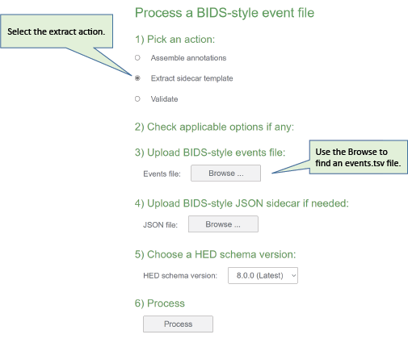
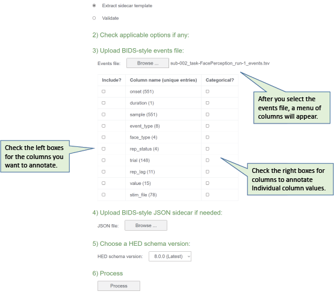
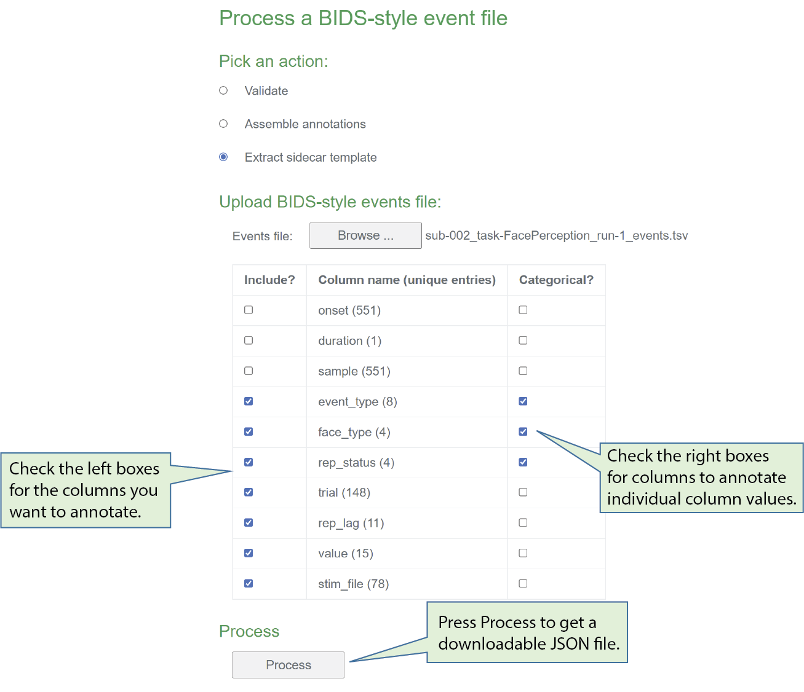

# Event annotation quickstart

**Note: This tutorial is in the process of being developed.** 

This tutorial provides a step-by-step guide to creating a JSON sidecar
containing the annotations needed to document your dataset's events.
The tutorial assumes that your dataset is in the BIDS [**BIDS Brain Imaging Data Structure**](https://bids-specification.readthedocs.io/en/stable/) format.
This tutorial focuses on the mechanics of event annotation.

We are using an
[**abbreviated version**](https://github.com/hed-standard/hed-examples/hedcode/data/tutorial_data/sub-002_task-FacePerception_run-1_events.tsv)
of the `events.tsv`file from subject 002 run 1 from
[ds003654:Face processing MEEG dataset with HED annotation](https://openneuro.org/datasets/ds003645/versions/2.0.0)
dataset on OpenNeuro.
You can also see a reduced version of the dataset itself at:
[**eeg_ds003654s_hed**](https://github.com/hed-standard/hed-examples/tree/main/datasets/eeg_ds003654s_hed).

The approach that we will use is to create a template file from one of your BIDS `events.tsv` files using the online
tools available at [**hedtools.ucsd.edu/hed**](https://hedtools.ucsd.edu/hed)

The goal is to construct a single `events.json` sidecar file with all the 
annotations needed for users to understand and analyze your data.
You will put the finished annotation file at the top level of your dataset.

You can then edit this JSON file directly using a text editor
to put in descriptions and HED annotations of your events.

You also have the option of converting this JSON template to a spreadsheet
for editing convenience as described in 
[**Using a HED spreadsheet**](EasierHEDEditing.md)

## Creating an annotation template

This tutorial creates a sidecar template from the information in one of the
`_events.tsv` files in your BIDS dataset.
Working from a template is much easier and faster than creating a sidecar from scratch.
The steps involved in using the online tools to create a template as follows: 

* [**Step 1: Select the Extract action.**](step-1-select-action)  
* [**Step 2: Upload your .events.tsv file.**](step-2-upload-events-file)   
* [**Step 3: Select event file columns to be annotated.**](step-3-choose-columns-to-use)  
* [**Step 4: Download the annotation template.**](step-4-download-json-template)  

You can then edit your JSON sidecar directly or convert it to a spreadsheet
to fill in the annotations.

(step-1-select-action)=
### Step 1: Select the Extract action

Go to the [**Events**](https://hedtools.ucsd.edu/hed/events) page of the HED online tools.
You will see the following menu:

Select the **Extract sidecar template** action.
The application will adjust to your selection, showing only the information you need to provide.

(step-2-upload-events-file)=
### Step 2: Upload your .events.tsv file.

Use the **Browse** button to choose an `_events.tsv` file to upload.
When the upload is complete, the local file name of the uploaded events
file will be displayed next to the **Browse** button.

(step-3-choose-columns-to-use)=
### Step 3: Select event file columns to be annotated.

When the upload is complete, the application will expand to show
the columns present in the uploaded `_events.tsv` file.

The checkboxes on the left indicate which columns should be 
included in the JSON sidecar annotation template. 

The checkboxes on the right indicate which event file columns contain values that
you wish to annotate individually.
We refer to these columns as the categorical columns.

The numbers in parentheses next to the column names give the number
of unique values in each column.
You will not want to treat columns with a large number of unique values as
categorical columns, since you will need to provide an individual annotation
for each value in such a categorical column.

In the example, we have selected 7 columns to annotation.
We omitted the `onset`, `duration`, and `sample` columns,
since these columns have standardized meanings.
The `duration` column has only 1 unique value because particular 
dataset has `n\a` for all entries in the `duration` column.

We have selected the `event_type`, `face_type`, and `rep_status` columns
as categorical columns, meaning that we will annotate each unique
value in these columns in a separate annotation.

The `event_type`, `face_type`, and `rep_status` have a total of 16 unique values,
which we have elected to annotate individually.

In addition, we have elected to annotate `trial`, `rep_lag`, `value`, and `stim_file`
by describing these columns as a whole, resulting in 4 additional annotations.

In all, we will have to provide a total of 8 + 4 + 4 + 1 + 1 + 1 + 1 = 20
annotation based on the selections we have made.

(step-4-download-json-template)=
### Step 4: Download the annotation template.

After you press the **Process** button, the application will produce a JSON template
file for you download.
Save the file, and you are ready to begin the actual annotation.
You can now edit the JSON sidecar using a text editor or other
appropriate tool.

Here is a copy of the resulting
[**JSON sidecar template**](https://github.com/hed-standard/hed-examples/hedcode/data/tutorial_data/sub-002_task-FacePerception_run-1_events_extracted.json).

## What next?

Many people find working with a spreadsheet of annotations easier than
direct editing into a sidecar file. 

You can convert the JSON file into a spreadsheet for easier editing
and then convert back afterwards.
See [**Easy HED editing**](EasierHEDEditing.md) for a walk-through of this process.

Another alternative to direct editing of the JSON file is the standalone GUI application, 
CTagger, which provides user-friendly assistance in tagging.
See [**HED tagging with CTagger**](HEDTaggingWithCTagger.md) for a step-by-step guide.

Annotation is usually an iterative process.
Once you have done the initial annotation, you can improve it by editing the sidecar.

**Remember** The goal is to produce a single JSON file with annotations
to describe your events. In a few cases, you will need to provide additional
sidecars to annotate events specific to a particular event file.
However, for most datasets only one top-level JSON file is required.

**Caveat** The template generated from the online tools is based on the values
and columns in a single `_events.tsv` file.
If the file you selected is not representative, you may need to manually add additional
keys to your sidecar.

The HED [**Jupyter notebooks**](JupyterNotebooksForAnnotation.md) provide
examples of using the HEDTools directly to create a template using information from all
the event files in the dataset.

This tutorial takes you through the steps of creating a JSON sidecar template.
The next step is to actually do the annotation.
The [**Basic HED Annotation](BasicHEDAnnotation.md) provides a short
guide for fast and easy annotation.
