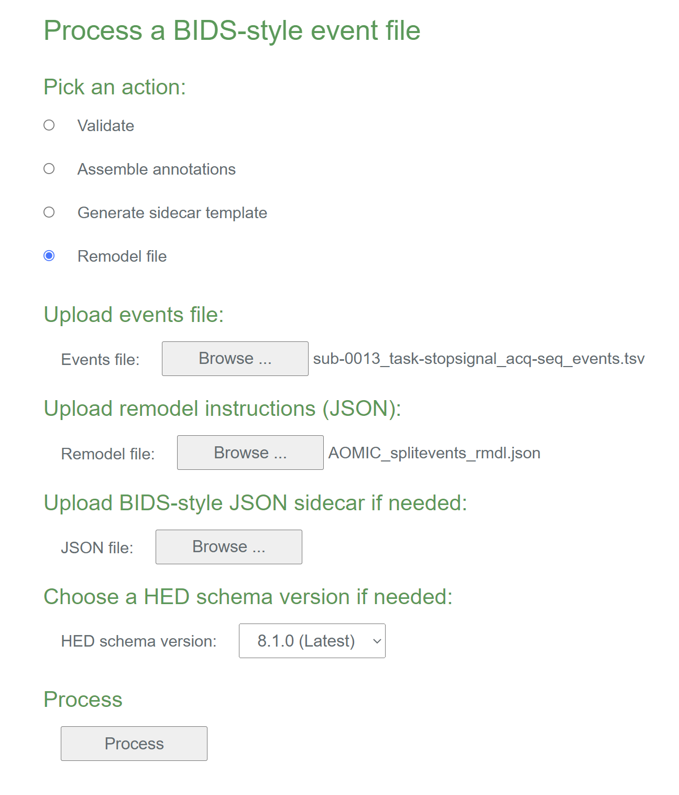

# Event file restructuring quickstart

This tutorial works through the process of restructuring event files using the HED event file remodeling tools.
The tools, which are written in Python, are designed to be run on an entire dataset.
This dataset can either be in BIDS 
([**Brain Imaging Data Structure**](https://bids.neuroimaging.io/)) format,
or can consist of files in a directory tree.
The later format is useful for restructuring that occurs early in the process,
during the conversion from the experimental control software formats.
In both cases, the event files are assumed to be in a tabular, tab-separated
value format.

The tools can be run using a command-line script, called from a Jupyter notebook,
or run using online tools. This quickstart covers the basic concepts of remodeling and
develops some basic examples of how remodeling is used. See the 
[**File remodeling tools**](https://hed-examples.readthedocs.io/en/latest/FileRemodelingTools.html#)
guide for detailed descriptions of the available operations.

* [**What is restructuring?**](what-is-event-file-restructuring-anchor)
* [**The remodeling process**](the-remodeling-process-anchor)
* [**JSON transformation files**](json-transformation-files-anchor)
  * [**Basic remodel command syntax**](basic-remodel-command-syntax-anchor)
  * [**Using multiple remodel commands**](using-multiple-remodel-commands-anchor)
  * [**More complex remodeling**](more-complex-remodeling-anchor)
  * [**Remodeling file locations**](remodeling-file-locations-anchor)
* [**Using the remodeling tools**](using-the-remodeling-tools-anchor)
  * [**Online tools for debugging**](online-tools-for-debugging-anchor)
  * [**Jupyter remodeling notebooks**](jupyter-remodeling-notebooks-anchor)
  * [**The command line interface**](the-command-line-interface-anchor)

(what-is-event-file-restructuring-anchor)=
## What is event file restructuring?

Event files, which consist of identified time markers linked to the timeline of the experiment,  provide a crucial link between what happens in
the experiment and the experimental data. 

Event files are often initially created using information in the logs files
generated by the experiment's presentation software or other control software.
These event files are then used to identify portions of the data
corresponding to particular points or blocks of data to be analyzed or compared.

Event file restructuring refers to creating, modifying, and
reorganizing the event markers in tabular files in order to
disambiguate or clarify the information for distribution and analysis.
Restructuring can occur at several stages during the acquisition and processing
of experimental data as shown in this schematic diagram:  
.  

In addition to restructuring during initial creation of the tabular event files,
restructuring may be required when the event files do not conform to the requirements
of a particular analysis.
Thus, restructuring is an iterative process,
which is supported by the HED remodeling tools for datasets with tabular event files.

The following table gives a summary of the tools available in the HED remodeling toolbox.

(summary-of-hed-remodeling-operations-anchor)=
````{table} Summary of the HED remodeling commands for tabular files.
| Category | Command | Example use case |
| -------- | ------- | -----|
| **clean-up** |  |  | 
|  | *remove_columns* | Remove temporary columns created during restructuring. |
|  | *remove_rows* | Remove rows with a particular value in a specified column. |
|  | *rename_columns* | Make columns names consistent across a dataset. |
|  | *reorder_columns* | Make column order consistent across a dataset. |
| **factor** |   |   | 
|  | *factor_column* | Extract factor vectors from a column of condition variables. |
|  | *factor_hed_tags* | Extract factor vectors from search queries of HED annotations. |
|  | *factor_hed_types* | Extract design matrices and/or condition variables. |
| **restructure** |  |  | 
|  | *create_event* |   |   |
|  | *label_context*  |   |   |
|  | *merge_consecutive* | Replace multiple consecutive events of the same type<br/>with one event of longer duration. |
|   | *number_groups*  |   |
|   | *number_rows*   |    | 
|  | *remap_columns* | Create *m* columns from values in *n* columns (for recoding). |
|  | *split_event* | Split trial-encoded rows into multiple events. |
| **summarization** |  |  | 
|  | *summarize_column_names* | Summarize column names and order in the files. |
|  | *summarize_column_values* |Count the occurrences of the unique column values. |
|  | *summarize_hed_type* | Create a detailed summary of a HED in dataset <br/>(used to automatically extract experimental designs). |
````

The **clean-up** commands are used at various phases of restructuring to assure consistency
across event files in the dataset.

The **factor** commands produce column vectors of the same length as the events file
that encode condition variables, design matrices, or the results of other search criteria.
See the 
[**HED conditions and design matrices**](https://hed-examples.readthedocs.io/en/latest/HedConditionsAndDesignMatrices.html)
for more information on factoring and analysis.

The **restructure** commands modify the way that event files represent events.

The **summarization** commands produce dataset-wide summaries of various aspects of the data.

(the-remodeling-process-anchor)=
## The remodeling process 

Remodeling consists of applying a list of commands to an events file
to restructure or modify the file in some way.

The following diagram shows a schematic of the remodeling process.


Initially, the user creates a backup of the event files.
This backup process is performed only once and the results are
stored in the `derivatives/remodeling/backups` subdirectory of the dataset.

Restructuring applies a sequence of remodeling commands given in a JSON transformation
file to produce a final result. 
The restructuring always proceeds by looking up each event file in the backup
and applying the transformation to the backup before writing into the data.

The transformation file provides a record of the operations performed on the file
starting with the original file.
If the user detects a mistake in the transformation,
he/she can correct the transformation file and rerun.

Usually, users will use the default backup, run the backup request once, and
work from the original backup.
However, user may also elect to create a named backup, use the backup
as a checkpoint mechanism, and develop scripts that use the check-pointed versions as the starting point.
This is useful if different versions of the events files are needed for different purposes.


(json-transformation-files-anchor)=
## JSON transformation files

The commands to restructure an event file are stored in a remodel file in JSON format.
The file consists of a list of JSON dictionaries. 

(basic-remodel-command-syntax-anchor)=
### Basic remodel command syntax

Each dictionary specifies a command, a description of the purpose, and the command parameters.
The basic syntax of a remodeler command is illustrated in the following command to rename
the *trial_type* column to *event_type*.


````{admonition} Example of a remodeler command.
:class: tip

```json
{ 
    "command": "rename_columns",
    "description": "Rename a trial type column to more specific event_type",
    "parameters": {
        "column_mapping": {
            "trial_type": "event_type"
        },
        "ignore_missing": true
    }
}
```
````

Each remodeler command has its own specific set of required parameters 
that can be found under [**File remodeling tools**](https://hed-examples.readthedocs.io/en/latest/FileRemodelingTools.html#). 
For *rename_columns*, the required commands are *column_mapping* and *ignore_missing*.
Some commands also have optional parameters.

(using-multiple-remodel-commands-anchor)=
### Using multiple remodel commands

In a remodeler transformation file one or more remodel commands should be provided in a list.
These commands will be performed by the remodeler in order. 
It is important to consider the order of the remodeler commands.
In the example below the summary will be performed after the renaming, so it will reflect the new column names.

````{admonition} An example JSON remodeler file with multiple commands.
:class: tip

```json
[
    { 
        "command": "rename_columns",
        "description": "Rename a trial type column to more specific event_type.",
        "parameters": {
            "column_mapping": {
                "trial_type": "event_type"
            },
            "ignore_missing": true
        }
    },
    {
        "command": "summarize_column_headers",
        "description": "Get column names across files to find any missing columns."
        "parameters": {
            "summary_name": "AfterRemodel",
            "summary_path" "D:\Data\BIDS_dataset\summaries"
        }      
    }
]
```
````

By stacking commands you can make several changes to an event file,
which is important because the changes are always applied to a copy of the original events backup.
If you are planning new changes to the event file, note that you are always changing the original file,
not a previously remodeled `events.tsv`.

(more-complex-remodeling-anchor)
### More complex remodeling

In this section we go over a more complex example using the
[**sub-0013_task-stopsignal_acq-seq_events.tsv**](./_static/data/sub-0013_task-stopsignal_acq-seq_events.tsv) 
events file of AOMIC-PIOP2 dataset available on [OpenNeuro](https://openneuro.org) as ds002790.
The example uses the *split_event* restructuring command to convert this
file from trial encoding to event encoding.
In trial encoding each event marker represents all the information in a single trial,
while event encoding includes event markers for each individual event within the trial.

Here is an excerpt of the event file.

(sample-remodeling-events-file-anchor)=
````{admonition} Excerpt from an event file from the stop-go task of AOMIC-PIOP2 (ds002790).
| onset | duration | trial_type | stop_signal_delay | response_time | response_accuracy | response_hand | sex |
| ----- | -------- | ---------- | ----------------- | ------------- | ----------------- | ------------- | --- |
| 0.0776 | 0.5083 | go | n/a | 0.565 | |correct | right | female 
| 5.5774 | 0.5083 | unsuccesful_stop | 0.2 | 0.49 | correct | right | female |
| 9.5856 | 0.5084 | go | n/a | 0.45 | correct | right | female |
| 13.5939 | 0.5083 | succesful_stop | 0.2 | n/a | n/a | n/a | female |
| 17.1021 | 0.5083 | unsuccesful_stop | 0.25 | 0.633 | correct | left | male |
| 21.6103 | 0.5083 | go | n/a | 0.443 | correct | left | male |
````

This event file correspond to a stop-signal experiment.
Subjects were presented with faces and had to decide the sex of the face
by pressing a button with left or right hand.
However, if a stop signal occurred before their selection,
the participant was to refrain from responding.

Notice that each row in this event file represents multiple events. 
The *stop_signal_delay* and *response_time* columns contain information about additional events
that happened in the trial in addition to the go signal presentation.

Our goal is to represent each of these events (go signal, stop signal and response)
in a separate row of the event file using the *split_event* restructuring command.
The following example shows the remodeling command to perform the splitting.


````{admonition} Example of split_events command for the AOMIC stop signal task.
:class: tip

```json
[
    {
        "command": "split_event",
        "description": "Split response event from trial event based on response_time column.",
        "parameters": {
            "anchor_column": "event_type",
            "new_events": {
                "response": {
                    "onset_source": ["response_time"],
                    "duration": [0],
                    "copy_columns": ["trial_type", "response_accuracy", "response_hand"]
                },
                "stop_signal": {
                    "onset_source": ["stop_signal_delay"],
                    "duration": [0.5],
                    "copy_columns": ["trial_type"]
                }
            },
            "remove_parent_event": false
        }    
    }
]
```
````

From the [**Split event**](https://hed-examples.readthedocs.io/en/latest/FileRemodelingTools.html#split-event)
explanation under [**File remodeling tools**](https://hed-examples.readthedocs.io/en/latest/FileRemodelingTools.html#)
we can read all the required parameters for the *split_event* command from the example. 
The required parameters are *anchor_column*, *new_events*, *remove_parent_event*.

The *anchor_column* is the column we want to write the new event name in.
In this case we are specifying new types of events, namely the stop signal, and the response,
so we will add an *anchor_column*: *event_type*. 
Note that is also possible to choose an existing column as an anchor column. 
The new events will be in new rows, so nothing will be overwritten.

Next we have to specify the new events. This is the most complex part to fill in.
Each new event has a name, which is a key in the *new_events* dictionary.
For each of these keys corresponds to a dictionary value which is in turn a dictionary
specifying the values of the following parameters.

* *onset_source*
* *duration*
* *copy_columns`*

The *onset_source* specifies list indicating how to calculate the onset for the new event
relative to the onset of the anchor event.
The list contains any combination of column names and numerical values,
which are evaluated and added to the anchor onset.
Column names are evaluated to the values in the corresponding columns.

In our example, the response time and stop signal delay are calculated relative to the trial's onset,
so we only need to add the value from the respective column.
Note that these new events do not exist for every trial. 
Rows where there was no stop signal have an *n/a* in the *stop_signal_delay* column.
This is processed automatically, and remodeler does not create new events
when any items in the *onset_source* list is missing.

The *duration* specifies the duration for the new events. 
The AOMIC data did not measure the durations of the button presses,
so we set the duration of the response event to 0.
The AOMIC data report indicates that the stop signal lasted 500 ms. 

The copy columns can be used to transfer context information to the new events from the original parent event.
We would like to transfer the *response_accuracy* and the *response_hand* information to the response event.
We also transferred *trial_type*, 
because we have found that keeping general context information is useful for downstream analysis.

Last parameter for the *split_event* command is the *remove_parent_event*. 
Sometimes *split_event* can be used to replace the original parent event. 
This is not the case here, since the original event still represents the stimulus presentation.
When the original event is replaced by a new event however,
it is possible for the remodeler to remove the parent event after creating the new events.
Here we set *remove_parent_event* to false.

The final remodeling file can be found at:
[**finished json remodeler**](./_static/data/AOMIC_splitevents_rmdl.json)

(remodeling-file-locations-anchor)=
### Remodeling file locations

The remodeling tools expect the full path for the JSON remodeling command file to be given
when the remodeling is executed.
However, it is a good practice to include all remodeling files used with the dataset.
The JSON remodeling command files are usually located in the
`derivatives/remodeling/models` subdirectory below the dataset root,
and have file names ending in `_rmdl.json`.

The backups are always in the `derivatives/remodeling/backups` subdirectory under the dataset root.
Summaries produced by the restructuring tools are located in `derivatives/remodeling/summaries`.

In the next section we will go over several ways to call the remodeler,
and illustrate the use of some commands.

(using-the-remodeling-tools-anchor)=
## Using the remodeling tools

The remodeler can be called in a number of ways including using online tools and from the command line.
The following sections explain various ways to use the available tools.

(online-tools-for-debugging-anchor)=
### Online tools for debugging

Although the event restructuring tools are designed to be run on an entire dataset,
it is useful to work with a single event file during debugging.
The HED online tools provide support for this.
Currently, the remodeling tools are only supported on the 
[**HED development server**](https://hedtools.ucsd.edu/hed_dev),
but will soon move to the regular [**HED online tools server](https://hedtools.ucsd.edu/hed).

The online tools are very useful for debugging your remodeling script and for 
seeing the effect on a single event file before running on the entire dataset.

To use the online remodeling tools, navigate to the events page and select the *Remodel file* action.
You then should browse to select the events file you want to act on and the JSON remodel file 
containing the remodeling commands. 
The following image shows these selections for the split event example of the previous section.



Just press the *Process* button to complete the action.
If the remodeling script has errors,
the result will be a downloaded text file with the errors identified.
If the remodeling script is correct,
the result will be an events file with the remodeling transformations applied.
If the remodeling script contains summarization commands,
the result will be a zip file with the modified events file and the summaries included.

If you are using one of the remodeling commands that relies on HED tags, you will
also need to upload a suitable JSON sidecar file containing the HED annotation for the events file.

(jupyter-remodeling-notebooks-anchor)=
### Jupiter remodeling notebook
... Coming soon ...

(The-command-line-interface-anchor)=
### The command line interface

After installing the remodeler you can it on a full BIDS dataset, 
or any directory with a set of events.tsv files, using the command line interface.
You do this by calling the remodeler and providing it with the necessary arguments.

The main arguments to provide are the path to the root BIDS directory and the path to the json remodeler file.
Depending on the operations you run, there may be other necessary arguments.
A full overview of all arguments is provided under [**File remodeling tools**](https://hed-examples.readthedocs.io/en/latest/FileRemodelingTools.html#remodel-command-arguments-anchor)
If you are not running the remodeler on a directory that is not in BIDS,
you may specify a file extension and suffix to search for.

From the command line it is possible to run summary operations. 
These operations do not return a modified event file but provide a summary of values found in all events.tsv files in a dataset.

If we want to run the split events operation we demonstrated earlier on the full AOMIC dataset, 
we might first want to check whether the response_time exists for all subjects. 
We can do this by running the `summarize_column_headers` operation.

First we prepare the remodeler json file again.

````{admonition} Split events remodeler json file for the AOMIC stop signal task.
:class: tip

```json
[
    {
        "command": "summarize_column_names",
        "description": "Summarize existing column header across entire AOMIC dataset.",
        "parameters": {
            "summary_name": "AOMIC_column_headers",
            "summary_filename": "AOMIC_column_headers"
            }    
    }
]
```
````

This simple summary does not require many input parameters. Like any summary it requires you to indicate
the summary name and the filename to write the summary to. 

Open your computer's command line interface. 
To run the summary we have to provide the following arguments:

* `data dir`
* `-m`, `--model-path`
* `-s`, `--save-formats`
* `-b`, `--bids-format`

The exact paths will look different on your computer but the full command should look something like this:

(remodel-run-anchor)=
````{admonition} Command to run summary on AOMIC dataset.
:class: tip

```bash
python run_remodel.py .\ds002790-data -m .\ds002790\derivatives\models\AOMIC_summarize_rmdl.json -s .txt -b 

```
````

The summaries will be written to a `.\derivatives\summaries` folder the BIDS root folder.
Here we specified we wanted the output in text format. It is also possible to get it in a json file.
By default the summary operations will return both.

The [**summary file**](./_static/data/AOMIC_column_headers_2022_09_14_T_14_38_40_600448.txt) list all different column combinations and for each combination, the files with those columns.
Looking at the different column combinations you can see there are three, one for each task that was performed for this dataset.
All event files for the stop signal task contain the `stop_signal_delay` column and the `response_time` column.

Now you can try out the split_events on the full dataset!
