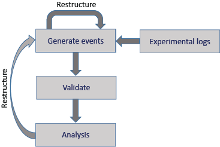

# Event file restructuring quickstart

This tutorial works through the process of restructuring event files using the HED event file remodeling tools.
The tools, which are written in Python, are designed to be run on an entire BIDS dataset.
The tools can be run using a command-line script, called from a Jupyter notebook,
or run using online tools. This quickstart covers the basic concepts of remodeling and
develops some basic examples of how remodeling is used. See the 
[**File remodeling tools**](https://hed-examples.readthedocs.io/en/latest/FileRemodelingTools.html#)
guide for detailed descriptions of the available operations.

* [**What is restructuring?**](what-is-event-file-restructuring-anchor)
* [**The remodeling process**](the-remodeling-process-anchor) 

(what-is-event-file-restructuring-anchor)=
## What is event file restructuring?

The event files in an experiment provide a crucial link between what happens in
the experiment and the experimental data by providing identified time markers
linked to the timeline of the experiment.

Event files are often initially created using information in the logs files
generated by the experiment's presentation software or other control software.
These event files are then used to identify portions of the data
corresponding to particular points or blocks of data to be analyzed or compared.

Event file restructuring refers to creating, modifying, and
reorganizing the event markers in tabular files in order to
disambiguate or clarify the information for distribution and analysis.
Restructuring can occur at several stages during the acquisition and processing
of experimental data as shown in this schematic diagram:  
.  

In addition to restructuring during initial creation of the tabular event files,
restructuring may be required when the event files do not conform to the requirements
of a particular analysis.
Thus, restructuring is an iterative process,
which is supported by the HED remodeling tools for datasets with tabular event files.

The following table gives a summary of the tools available in the HED remodeling toolbox.

(summary-of-hed-remodeling-operations-anchor)=
````{table} Summary of the HED remodeling commands for tabular files.
| Category | Command | Example use case |
| -------- | ------- | -----|
| **clean-up** |  |  | 
|  | *remove_columns* | Remove temporary columns created during restructuring. |
|  | *remove_rows* | Remove rows with n/a values in a specified column. |
|  | *rename_columns* | Make columns names consistent across a dataset. |
|  | *reorder_columns* | Make column order consistent across a dataset. |
| **factor** |   |   | 
|  | *factor_column* | Extract factor vectors from a column of condition variables. |
|  | *factor_hed_tags* | Extract factor vectors from search queries of HED annotations. |
|  | *factor_hed_types* | Extract design matrices and/or condition variables. |
| **restructure** |  |  | 
|  | *create_event* |   |   |
|  | *label_context*  |   |   |
|  | *merge_consecutive* | Replace multiple consecutive events of the same type<br/>with one event of longer duration. |
|   | *number_groups*  |   |
|   | *number_rows*   |    | 
|  | *remap_columns* | Create m columns from values in n columns (for recoding). |
|  | *split_event* | Split trial-encoded rows into multiple events. |
| **summarization** |  |  | 
|  | *summarize_column_names* | Summarize column names and order in the files. |
|  | *summarize_column_values* |Count the occurrences of the unique column values. |
|  | *summarize_hed_type* | Create a detailed summary of a HED in dataset <br/>(used to automatically extract experimental designs). |
````

The **clean-up** commands are used at various phases of restructuring to assure consistency
across event files in the dataset.

The **factor** commands produce column vectors of the same length as the events file
that encode condition variables, design matrices, or satisfaction of other search criteria.
See the 
[**HED conditions and design matrices**](https://hed-examples.readthedocs.io/en/latest/HedConditionsAndDesignMatrices.html)
for more information on factoring and analysis.

The **restructure** commands modify the way that event files represent events.

The **summarization** commands produce dataset-wide summaries of various aspects of the data.

(the-remodeling-process-anchor)=
## The remodeling process 

Remodeling consists of applying a list of commands to an events file
to restructure or modify the file in some way.

The following diagram shows a schematic of the remodeling process.


Initially, the user creates a backup of the event files.
Restructuring applies a sequence of remodeling commands given in a JSON transformation file
to produce a final result.
The transformation file provides a record of the operations performed on the file.
If the user detects a mistake in the transformation,
he/she can correct the transformation file and restore the backup to rerun.
