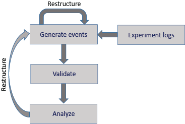
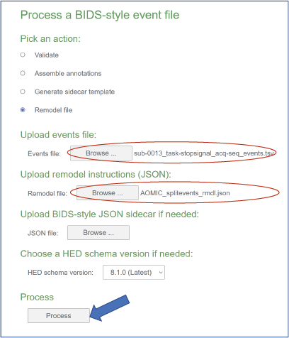

(file-remodeling-quickstart-anchor)=
# File remodeling quickstart

This tutorial works through the process of restructuring tabular (`.tsv`) files using the HED file remodeling tools.
These tools particularly useful for creating event files from
information in experimental logs and for restructuring event files to enable a particular analysis.

The tools, which are written in Python, are designed to be run on an entire dataset.
This dataset can be in BIDS 
([**Brain Imaging Data Structure**](https://bids.neuroimaging.io/)),
Alternative users can specify files with a particular suffix and extension appearing 
in a specified directory tree.
The later format is useful for restructuring that occurs early in the experimental process,
for example, during the conversion from the experimental control software formats.

The tools can be run using a command-line script, called from a Jupyter notebook,
or run using online tools. This quickstart covers the basic concepts of remodeling and
develops some basic examples of how remodeling is used. See the 
[**File remodeling tools**](./FileRemodelingTools.md)
guide for detailed descriptions of the available operations.

* [**What is remodeling?**](what-is-remodeling-anchor)
* [**The remodeling process**](the-remodeling-process-anchor)
* [**JSON remodeling files**](json-remodeling-files-anchor)
  * [**Basic remodel operation syntax**](basic-remodel-operation-syntax-anchor)
  * [**Applying multiple remodel operations**](applying-multiple-remodel-operations-anchor)
  * [**More complex remodeling**](more-complex-remodeling-anchor)
  * [**Remodeling file locations**](remodeling-file-locations-anchor)
* [**Using the remodeling tools**](using-the-remodeling-tools-anchor)
  * [**Online tools for debugging**](online-tools-for-debugging-anchor)
  * [**The command-line interface**](the-command-line-interface-anchor)
  * [**Jupyter notebooks for remodeling**](jupyter-notebooks-for-remodeling-anchor)

(what-is-remodeling-anchor)=
## What is remodeling?

Although the remodeling process can be applied to any tabular file,
they are most often used for restructuring event files.
Event files, which consist of identified time markers linked to the timeline of the experiment, 
provide a crucial bridge between what happens in
the experiment and the experimental data. 

Event files are often initially created using information in the log files
generated by the experiment control software.
The entries in the log files mark time points within the experimental record at which something
changes or happens (such as the onset or offset of a stimulus or a participant response).
These event files are then used to identify portions of the data
corresponding to particular points or blocks of data to be analyzed or compared.

**Remodeling** refers to the process of file restructuring including creating, modifying, and
reorganizing tabular files in order to
disambiguate or clarify their information to enable or streamline 
their analysis and/or further distribution.
HED-based remodeling can occur at several stages during the acquisition and processing
of experimental data as shown in this schematic diagram:  
.  

In addition to restructuring during initial structuring of the tabular files,
further event file restructuring may be useful when the event files are not suited to the requirements of a particular analysis. Thus, restructuring can be an iterative process, which is supported by the HED Remodeling Tools for datasets with tabular event files.

The following table gives a summary of the tools available in the HED remodeling toolbox.

(summary-of-hed-remodeling-operations-anchor)=
````{table} Summary of the HED remodeling operations for tabular files.
| Category | Operation | Example use case |
| -------- | ------- | -----|
| **clean-up** |  |  | 
|  | [*remove_columns*](remove-columns-anchor) | Remove temporary columns created during restructuring. |
|  | [*remove_rows*](remove-rows-anchor) | Remove rows with a particular value in a specified column. |
|  | [*rename_columns*](rename-columns-anchor) | Make columns names consistent across a dataset. |
|  | [*reorder_columns*](reorder-columns-anchor) | Make column order consistent across a dataset. |
| **factor** |   |   | 
|  | [*factor_column*](factor-column-anchor) | Extract factor vectors from a column of condition variables. |
|  | [*factor_hed_tags*](factor-hed-tags-anchor) | Extract factor vectors from search queries of HED annotations. |
|  | [*factor_hed_type*](factor-hed-type-anchor) | Extract design matrices and/or condition variables. |
| **restructure** |  |  | 
|  | [*merge_consecutive*](merge-consecutive-anchor) | Replace multiple consecutive events of the same type<br/>with one event of longer duration. |
|  | [*remap_columns*](remap-columns-anchor) | Create *m* columns from values in *n* columns (for recoding). |
|  | [*split_rows*](split-rows-anchor) | Split trial-encoded rows into multiple events. |
| **summarization** |  |  | 
|  | [*summarize_column_names*](summarize-column-names-anchor) | Summarize column names and order in the files. |
|  | [*summarize_column_values*](summarize-column-values-anchor) |Count the occurrences of the unique column values. |
|  | [*summarize_definitions*](summarize-definitions-anchor) |Summarize definitions used and report inconsistencies. |       
|  | [*summarize_hed_tags*](summarize-hed-tags-anchor) | Summarize the HED tags present in the  <br/> HED annotations for the dataset. |
|  | [*summarize_hed_type*](summarize-hed-type-anchor) | Summarize the detailed usage of a particular type tag <br/> such as *Condition-variable* or *Task* <br/> (used to automatically extract experimental designs). |
|  | [*summarize_hed_validation*](summarize-hed-validation-anchor) | Validate the data files and report any errors. | 
|  | [*summarize_sidecar_from_events*](summarize-sidecar-from-events-anchor) | Generate a sidecar template from an event file. | 
````

The **clean-up** operations are used at various phases of restructuring to assure consistency
across files in the dataset.

The **factor** operations produce column vectors of the same length as the number of rows in a file
in order to encode condition variables, design matrices, or the results of other search criteria.
See the 
[**HED conditions and design matrices**](./HedConditionsAndDesignMatrices.md)
for more information on factoring and analysis.

The **restructure** operations modify the way that files represent information.

The **summarization** operations produce dataset-wide and individual file
summaries of various aspects of the data.

More detailed information about the remodeling operations can be found in
the [**File remodeling tools**](file-remodeling-tools-anchor) guide.

(the-remodeling-process-anchor)=
## The remodeling process 

Remodeling consists of applying a list of operations to a tabular file
to restructure or modify the file in some way. 
The following diagram shows a schematic of the remodeling process.


Initially, the user creates a backup of the selected files.
This backup process is performed only once, and the results are
stored in the `derivatives/remodel/backups` subdirectory of the dataset.

Restructuring applies a sequence of remodeling operations given in a JSON remodeling
file to produce a final result.
By convention, we name these remodeling instruction files `_rmdl.json` 
and store them in the `derivatives/remodel/remodeling_files` directory relative
to the dataset root directory.

The restructuring always proceeds by looking up each data file in the backup
and applying the transformation to the backup before overwriting the non-backed up version.

The remodeling file provides a record of the operations performed on the file
starting with the original file.
If the user detects a mistake in the transformation instructions,
he/she can correct the remodeling JSON file and rerun.

Usually, users will use the default backup, run the backup request once, and
work from the original backup.
However, user may also elect to create a named backup, use the backup
as a checkpoint mechanism, and develop scripts that use the check-pointed versions as the starting point.
This is useful if different versions of the events files are needed for different purposes.


(json-remodeling-files-anchor)=
## JSON remodeling files

The operations to restructure a tabular file are stored in a remodel file in JSON format.
The file consists of a list of JSON dictionaries. 

(basic-remodel-operation-syntax-anchor)=
### Basic remodel operation syntax

Each dictionary specifies an operation, a description of the purpose, and the operation parameters.
The basic syntax of a remodeler operation is illustrated in the following example which renames
the *trial_type* column to *event_type*.


````{admonition} Example of a remodeler operation.
:class: tip

```json
{ 
    "operation": "rename_columns",
    "description": "Rename a trial type column to more specific event_type",
    "parameters": {
        "column_mapping": {
            "trial_type": "event_type"
        },
        "ignore_missing": true
    }
}
```
````

Each remodeler operation has its own specific set of required parameters 
that can be found under [**File remodeling tools**](./FileRemodelingTools.md). 
For *rename_columns*, the required operations are *column_mapping* and *ignore_missing*.
Some operations also have optional parameters.

(applying-multiple-remodel-operations-anchor)=
### Applying multiple remodel operations

A remodel JSON file consists of a list of one or remodel operations,
each specified in a dictionary.
These operations are performed by the remodeler in the order they appear in the file.
In the example below, a summary is performed after renaming, 
so the result reflects the new column names.

````{admonition} An example JSON remodeler file with multiple operations.
:class: tip

```json
[
    { 
        "operation": "rename_columns",
        "description": "Rename a trial type column to more specific event_type.",
        "parameters": {
            "column_mapping": {
                "trial_type": "event_type"
            },
            "ignore_missing": true
        }
    },
    {
        "operation": "summarize_column_names",
        "description": "Get column names across files to find any missing columns.",
        "parameters": {
            "summary_name": "Columns after remodeling",
            "summary_filename": "columns_after_remodel"
        }      
    }
]
```
````

By stacking operations you can make several changes to a data file,
which is important because the changes are always applied to a copy of the original backup.
If you are planning new changes to the file, note that you are always changing 
a copy of the original backed up file, not a previously remodeled `.tsv`.

(more-complex-remodeling-anchor)=
### More complex remodeling

This section discusses a complex example using the
[**sub-0013_task-stopsignal_acq-seq_events.tsv**](./_static/data/sub-0013_task-stopsignal_acq-seq_events.tsv) 
events file of AOMIC-PIOP2 dataset available on [OpenNeuro](https://openneuro.org) as ds002790.
Here is an excerpt of the event file.


(sample-remodeling-events-file-anchor)=
````{admonition} Excerpt from an event file from the stop-go task of AOMIC-PIOP2 (ds002790).
| onset | duration | trial_type | stop_signal_delay | response_time | response_accuracy | response_hand | sex |
| ----- | -------- | ---------- | ----------------- | ------------- | ----------------- | ------------- | --- |
| 0.0776 | 0.5083 | go | n/a | 0.565 | |correct | right | female 
| 5.5774 | 0.5083 | unsuccesful_stop | 0.2 | 0.49 | correct | right | female |
| 9.5856 | 0.5084 | go | n/a | 0.45 | correct | right | female |
| 13.5939 | 0.5083 | succesful_stop | 0.2 | n/a | n/a | n/a | female |
| 17.1021 | 0.5083 | unsuccesful_stop | 0.25 | 0.633 | correct | left | male |
| 21.6103 | 0.5083 | go | n/a | 0.443 | correct | left | male |
````

This event file corresponds to a stop-signal experiment.
Participants were presented with faces and had to decide the sex of the face
by pressing a button with left or right hand.
However, if a stop signal occurred before this selection, the participant was to refrain from responding.

The structure of this file corresponds to the [**BIDS**](https://bids.neuroimaging.io/) format
for event files.
The first column, which must be called `onset` represents the time from the start of recording 
in seconds of the temporal marker represented by that row in the file.
In this case that temporal marker represents the presentation of a face image.

Notice that the *stop_signal_delay* and *response_time* columns contain information
about additional events (when a trial stop signal was presented and when the participant
pushed a button).
These events are encoded implicitly as offsets from the presentation of the go signal.
Each row is the file encodes information for an entire trial rather than what occurred
at a single temporal marker.
This strategy is known as *trial-level* encoding. 

Our goal is to represent all the trial events (e.g., go signal, stop signal, and response)
in separate rows of the event file using the *split_rows* restructuring operation.
The following example shows the remodeling operations to perform the splitting.

````{admonition} Example of split_rows operation for the AOMIC stop signal task.
:class: tip

```json
[
    {
        "operation": "split_rows",
        "description": "Split response event from trial event based on response_time column.",
        "parameters": {
            "anchor_column": "trial_type",
            "new_events": {
                "response": {
                    "onset_source": ["response_time"],
                    "duration": [0],
                    "copy_columns": ["response_accuracy", "response_hand"]
                },
                "stop_signal": {
                    "onset_source": ["stop_signal_delay"],
                    "duration": [0.5]
                }
            },
            "remove_parent_row": false
        }    
    }
]
```
````

The example uses the *split_rows* operation to convert this
file from trial encoding to event encoding.
In trial encoding each event marker (row in the event file) represents 
all the information in a single trial.
Event markers such as the participant's response key-press are encoded implicitly
as an offset from the stimulus presentation.
while event encoding includes event markers for each individual event within the trial.

The [**Split rows**](./FileRemodelingTools.md#split-rows)
explanation under [**File remodeling tools**](./FileRemodelingTools.md)
shows the required parameters for the *split_rows* operation. 
The required parameters are *anchor_column*, *new_events*, and *remove_parent_row*.

The *anchor_column* is the column we want to add new events corresponding to the stop signal and the response.
In this case we are going to add events to an existing column: *trial_type*.
The new events will be in new rows and the existing rows will not be overwritten
because *remove_parent_event* is false.
(After splitting we may want to rename *trial_type* to *event_type* since the individual
rows in the data file no longer represent trials, but individual events within the trial.)

Next we specify how the new events are generated in the *new_events* dictionary. 
Each type of new event has a name, which is a key in the *new_events* dictionary.
Each key is associated with a dictionary
specifying the values of the following parameters.

* *onset_source*
* *duration*
* *copy_columns*

The *onset_source* is a list indicating how to calculate the onset for the new event
relative to the onset of the anchor event.
The list contains any combination of column names and numerical values,
which are evaluated and added to the onset value of the row being split.
Column names are evaluated to the row values in the corresponding columns.

In our example, the response time and stop signal delay are calculated relative to the trial's onset,
so we only need to add the value from the respective column.
Note that these new events do not exist for every trial. 
Rows where there was no stop signal have an `n/a` in the *stop_signal_delay* column.
This is processed automatically, and remodeler does not create new events
when any items in the *onset_source* list is missing or `n/a`.

The *duration* specifies the duration for the new events. 
The AOMIC data did not measure the durations of the button presses,
so we set the duration of the response event to 0.
The AOMIC data report indicates that the stop signal lasted 500 ms. 

The *copy_columns* is an optional parameter indicating which columns from the parent event should be copied to the
newly-created event.
We would like to transfer the *response_accuracy* and the *response_hand* information to the *response* event. 
Since no extra column values are to be transferred for *stop_signal*, columns other than *onset*, *duration*,
and *trial_type* are filled with `n/a`.


The final remodeling file can be found at:
[**finished json remodeler**](./_static/data/AOMIC_splitevents_rmdl.json)

(remodeling-file-locations-anchor)=
### Remodeling file locations

The remodeling tools expect the full path for the JSON remodeling operation file to be given
when the remodeling is executed.
However, it is a good practice to include all remodeling files used with the dataset.
The JSON remodeling operation files are usually located in the
`derivatives/remodel/remodeling_files` subdirectory below the dataset root,
and have file names ending in `_rmdl.json`.

The backups are always in the `derivatives/remodel/backups` subdirectory under the dataset root.
Summaries produced by the restructuring tools are located in `derivatives/remodel/summaries`.

In the next section we will go over several ways to call the remodeler.

(using-the-remodeling-tools-anchor)=
## Using the remodeling tools

The remodeler can be called in a number of ways including using online tools and from the command line.
The following sections explain various ways to use the available tools.

(online-tools-for-debugging-anchor)=
### Online tools for debugging

Although the event restructuring tools are designed to be run on an entire dataset,
you should consider working with a single data file during debugging.
The HED online tools provide support for debugging your remodeling script and for 
seeing the effect of remodeling on a single data file before running on the entire dataset.
You can access these tools on the [**HED tools online tools server**](https://hedtools.ucsd.edu/hed).

To use the online remodeling tools, navigate to the events page and select the *Execute remodel script* action.
Browse to select the data file to be remodeled and the JSON remodel file
containing the remodeling operations. 
The following screenshot shows these selections for the split rows example of the previous section.



Press the *Process* button to complete the action.
If the remodeling script has errors,
the result will be a downloaded text file with the errors identified.
If the remodeling script is correct,
the result will be a data file with the remodeling transformations applied.
If the remodeling script contains summarization operations,
the result will be a zip file with the modified data file and the summaries included.

If you are using one of the remodeling operations that relies on HED tags, you will
also need to upload a suitable JSON sidecar file containing the HED annotations for the data file
if you turn the *Include summaries* option on.

(the-command-line-interface-anchor)=
### The command-line interface

After [**installing the remodeler**](./FileRemodelingTools.md#installing-the-remodel-tools),
you can run the tools on a full BIDS dataset,
or on any directory using the command-line interface using
`run_remodel_backup`, `run_remodel`, and `run_remodel_restore`.
A full overview of all arguments is available at
[**File remodeling tools**](./FileRemodelingTools.md#remodel-command-line-arguments).

The `run_remodel_backup` is usually run only once for a dataset. 
It makes the baseline backup of the event files to assure that nothing will be lost. 
The remodeling always starts from the backup files.

The `run_remodel` restores the data files from the corresponding backup files and then
executes remodeling operations from a JSON file.
A sample command line call for `run_remodel` is shown in the following example.

(remodel-run-anchor)=
````{admonition} Command to run a summary for the AOMIC dataset.
:class: tip

```bash
python run_remodel /data/ds002790  /data/ds002790/derivatives/remodel/remodeling_files/AOMIC_summarize_rmdl.json \
 -b -s .txt -x derivatives

```
````

The parameters are as follows:

* `data_dir` -  (Required first argument) Root directory of the dataset.
* `model_path` - (Required second argument) Path of JSON file with remodeling operations.
* `-b` - (Optional) If present, assume BIDS formatted data.
* `-s` - (Optional) list of formats to save summaries in.
* `-x` - (Optional) List of directories to exclude from event processing.

There are three types of command line arguments: 

[**Positional arguments**](./FileRemodelingTools.md#positional-arguments),
[**Named arguments**](./FileRemodelingTools.md#named-arguments), 
and [**Named arguments with values**](./FileRemodelingTools.md#named-arguments).

The positional arguments, `data_dir` and `model_path` are not optional and must
be the first and second arguments to `run_remodel`, respectively.
The named arguments (with and without values) are optional.
They all have default values if omitted.

The `-b` option is a named argument indicating whether the dataset is in BIDS format.
If in BIDS format, the remodeling tools can extract information such as the HED schema
and the HED annotations from the dataset.
BIDS data file names are unique, which is convenient for reporting summary information.
Name arguments are flags-- their presence indicates true and absence indicates false.

The `-s` and `-x` options are examples of named arguments with values.
The `-s .txt` specifies that summaries should be saved in text format.
The `-x derivatives` indicates that the `derivatives` subdirectory should not
be processed during remodeling.

This script can be run multiple times without doing backups and restores, 
since it always starts with the backed up files.

The first argument of the command line scripts is the full path to the root directory of the dataset.
The `run_remodel` requires the full path of the json remodeler file as the second argument.
A number of optional key-value arguments are also available.

After the `run_remodel` finishes, it overwrites the data files (not the backups)
and writes any requested summaries in `derivatives/remodel/summaries`.

The summaries will be written to `/data/ds002790/derivatives/remodel/summaries` folder in text format. 
By default, the summary operations will return both.

The [**summary file**](./_static/data/AOMIC_column_names_2022_12_21_T_13_12_35_641062.txt) lists all different column combinations and for each combination, the files with those columns.
Looking at the different column combinations you can see there are three, one for each task that was performed for this dataset.

Going back to the [**split rows example**](#more-complex-remodeling) of remodeling,
we see that splitting the rows into multiple rows only makes sense if the event files have the same columns.
Only the event files for the stop signal task contain the `stop_signal_delay` column and the `response_time` column.
The summarizing the column names across the dataset allows users to check whether the column
names are consistent across the dataset.
A common use case for BIDS datasets is that the event files have a different structure 
for different tasks.  
The `-t` command-line option allows users to specify which tasks to perform remodeling on.
Using this option allows users to select only the files that have the specified task names
in their filenames.


Now you can try out the *split_rows* on the full dataset!


(jupyter-notebooks-for-remodeling-anchor)=
### Jupyter notebooks for remodeling

Three Jupyter remodeling notebooks are available at 
[**Jupyter notebooks for remodeling**](https://github.com/hed-standard/hed-examples/tree/main/src/jupyter_notebooks/remodeling).

These notebooks are wrappers that create the backup as well as run restructuring operations on data files.
If you do not have access to a Jupyter notebook facility, the article
[Six easy ways to run your Jupyter Notebook in the cloud](https://www.dataschool.io/cloud-services-for-jupyter-notebook/) discusses various no-cost options
for running Jupyter notebooks online.
