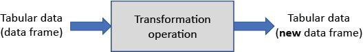
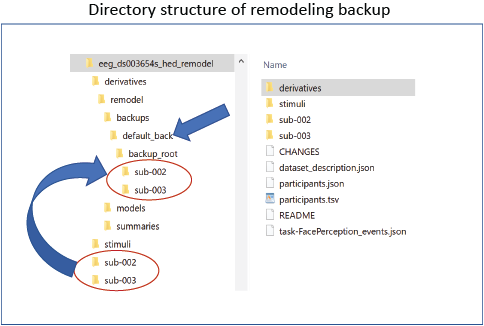

(file-remodeling-tools-anchor)=
# File remodeling tools

**Remodeling** refers to the process of transforming a tabular file
into a different form in order to disambiguate the
information or to facilitate a particular analysis.
The remodeling operations are specified in a JSON (`.json`) file,
giving a record of the transformations performed.

There are two types of remodeling operations: **transformation** and **summarization**.
The **transformation** operations modify the tabular files,
while **summarization** produces an auxiliary information file but leaves
the tabular files unchanged.

The file remodeling tools can be applied to any tab-separated value (`.tsv`) file
but are particularly useful for restructuring files representing experimental events.
Please read the [**File remodeling quickstart**](./FileRemodelingQuickstart.md)
tutorials for an introduction and basic use of the tools.

The file remodeling tools can be applied to individual files using the 
[**HED online tools**](https://hedtools.ucsd.edu/hed) or to entire datasets 
using the [**remodel command-line interface**](remodel-command-line-interface-anchor)
either by calling Python scripts directly from the command line 
or by embedding calls in a Jupyter notebook.
The tools are also available as 
[**HED RESTful services**](./HedOnlineTools.md#hed-restful-services).
The online tools are particularly useful for debugging.

This user's guide contains the following topics:

* [**Overview of remodeling**](overview-of-remodeling-anchor)
* [**Installing the remodel tools**](installing-the-remodel-tools-anchor)
* [**Remodel command-line interface**](remodel-command-line-interface-anchor)
* [**Remodel scripts**](remodel-scripts-anchor)
  * [**Backing up files**](backing-up-files-anchor)
  * [**Remodeling files**](remodeling-files-anchor)
  * [**Restoring files**](restoring-files-anchor)
* [**Remodel with HED**](remodel-with-hed-anchor)
* [**Remodel sample files**](remodel-sample-files-anchor)
  * [**Sample remodel file**](sample-remodel-file-anchor)
  * [**Sample remodel event file**](sample-remodel-event-file-anchor)
  * [**Sample remodel sidecar file**](sample-remodel-sidecar-file-anchor)
* [**Remodel transformations**](remodel-transformations-anchor)
  * [**Factor column**](factor-column-anchor) 
  * [**Factor HED tags**](factor-hed-tags-anchor) 
  * [**Factor HED type**](factor-hed-type-anchor)
  * [**Merge consecutive**](merge-consecutive-anchor)
  * [**Remap columns**](remap-columns-anchor)
  * [**Remove columns**](remove-columns-anchor) 
  * [**Remove rows**](remove-rows-anchor) 
  * [**Rename columns**](rename-columns-anchor)
  * [**Reorder columns**](reorder-columns-anchor)
  * [**Split event**](split-event-anchor)
* [**Remodel summarizations**](remodel-summarizations-anchor)
  * [**Summarize column names**](summarize-column-names-anchor)
  * [**Summarize column values**](summarize-column-values-anchor)
  * [**Summarize events to sidecar**](summarize-events-to-sidecar-anchor)
  * [**Summarize hed tags**](summarize-hed-tags-anchor)
  * [**Summarize hed type**](summarize-hed-type-anchor)
  * [**Summarize hed validation**](summarize-hed-validation-anchor)
* [**Remodel implementation**](remodel-implementation-anchor)


(overview-of-remodeling-anchor)=
## Overview of remodeling

Remodeling consists of restructuring and/or extracting information from tab-separated
value files based on a specified list of operations contained in a JSON file.

Internally, the remodeling operations represent the tabular file using a
[**Pandas DataFrame**](https://pandas.pydata.org/docs/reference/api/pandas.DataFrame.html).

(transformation-operations-anchor)=
### Transformation operations

**Transformation** operations, shown schematically in the following
figure, are designed to transform an incoming tabular file
into a new DataFrame without modifying the incoming data.



Transformation operations are stateless and do not save any context information or
affect future applications of the transformation.

Transformations, themselves, do not have any output and just return a new,
transformed DataFrame.
In other words, transformations do not operate in place on the incoming DataFrame,
but rather, they create a new DataFrame containing the result.

Typically, the calling program is responsible for reading and saving the tabular file,
so the user can choose whether to overwrite or create a new file.

See the [**remodeling tool program interface**](remodel-command-line-interface-anchor)
section for information on how to call the operations.

(summarization-operations-anchor)=
### Summarization operations

**Summarization** operations do not modify the input DataFrame
but rather extract and save information from the input DataFrame 
in an internally stored context state as shown schematically in the following figure.


The dispatcher that executes remodeling operations can be interrogated at any time
for the state information contained in the context and can save the contexts.
Usually summaries are dumped at the end of processing to the `derivatives/remodel/summaries`
subdirectory under the dataset root.

Summarization operations may appear anywhere in the operation list,
and the same type of summary may appear multiple times under different names in order to track progress.

The dispatcher stores information from each uniquely named summarization operation 
as a separate context.
Within its context information, most summarization operations keep a separate 
summary for each individual file and have methods to create an overall summary
of the information for all the files that have been processed by the summarization..

Summarization results are available in JSON (`.json`) and text (`.txt) formats.

(available-operations-anchor)=
### Available operations

The following table lists the available remodeling operations with brief example use cases
and links to further documentation. Operations not listed in the summarize section are transformations.

(remodel-operation-summary-anchor)=
````{table} Summary of the HED remodeling operations for tabular files.
| Category | Operation | Example use case |
| -------- | ------- | -----|
| **clean-up** |  |  | 
|  | [*remove_columns*](remove-columns-anchor) | Remove temporary columns created during restructuring. |
|  | [*remove_rows*](remove-rows-anchor) | Remove rows with n/a values in a specified column. |
|  | [*rename_columns*](rename-columns-anchor) | Make columns names consistent across a dataset. |
|  | [*reorder_columns*](reorder-columns-anchor) | Make column order consistent across a dataset. |
| **factor** |   |   | 
|  | [*factor_column*](factor-column-anchor) | Extract factor vectors from a column of condition variables. |
|  | [*factor_hed_tags*](factor-hed-tags-anchor) | Extract factor vectors from search queries of HED annotations. |
|  | [*factor_hed_type*](factor-hed-type-anchor) | Extract design matrices and/or condition variables. |
| **restructure** |  |  | 
|  | [*merge_consecutive*](merge-consecutive-anchor) | Replace multiple consecutive events of the same type<br/>with one event of longer duration. |
|  | [*remap_columns*](remap-columns-anchor) | Create m columns from values in n columns (for recoding). |
|  | [*split_event*](split-event-anchor) | Split trial-encoded rows into multiple events. |
| **summarize** |  |  | 
|  | [*summarize_column_names*](summarize-column-names-anchor) | Summarize column names and order in the files. |
|  | [*summarize_column_values*](summarize-column-values-anchor) | Count the occurrences of the unique column values. |
|  | [*summarize_events_to_sidecar*](summarize-events-to-sidecar-anchor) | Generate a sidecar template from an event file. |
|  | [*summarize_hed_tags*](summarize-hed-tags-anchor) | Summarize the HED tags present in the  <br/> HED annotations for the dataset. |
|  | [*summarize_hed_type*](summarize-hed-type-anchor) | Summarize the detailed usage of a particular type tag <br/> such as *Condition-variable* or *Task* <br/> (used to automatically extract experimental designs). |
|  | [*summarize_hed_validation*](summarize-hed-validation-anchor) | Validate the data files and report any errors. |
````

The **clean-up** operations are used at various phases of restructuring to assure consistency
across dataset files.

The **factor** operations produce column vectors with the same number of rows as the data file
from which they were calculated.
They encode condition variables, design matrices, or other search criteria.
See the [**HED conditions and design matrices**](./HedConditionsAndDesignMatrices.md)
for more information on factoring and analysis.

The **restructure** operations modify the way in which a data file represents its information.

The **summarize** operations produce dataset-wide summaries of various aspects of the data files
as well as summaries of the individual files.

(installing-the-remodel-tools-anchor)=
## Installing the remodel tools 

The remodeling tools are available in the GitHub 
[**hed-python**](https://github.com/hed-standard/hed-python) repository
along with other tools for data cleaning and curation.
Although version 0.1.0 of this repository is available on [**PyPI**](https://pypi.org/)
as `hedtools`, the version containing the restructuring tools (Version 0.2.0)
is still under development and has not been officially released.
However, the code is publicly available on the `develop` branch of the 
hed-python repository and
can be directly installed from GitHub using `pip`:

```text
pip install git+https://github.com/hed-standard/hed-python/@develop
```

The web services and online tools supporting remodeling are available
on the [**HED online tools dev server**](https://hedtools.ucsd.edu/hed_dev).
When version 0.2.0 of `hedtools` is officially released on PyPI, restructuring
will become available on the released [**HED online tools**](https://hedtools.ucsd.edu/hed).
A docker version is also under development.

The following diagram shows a schematic of the remodeling process.


Initially, the user creates a backup of the specified tabular files (usually `events.tsv` files).
This backup is a mirror of the data files in the dataset,
but is located in the `derivatives/remodel/backups` directory and never modified once the backup is created.

Remodeling applies a sequence of operations specified in a JSON remodel file
to the backup versions of the data files.
The JSON remodel file provides a record of the operations performed on the file.
If the user detects a mistake in the transformations,
he/she can correct the transformation file and rerun the transformations.

Remodeling always runs on the original backup version of the file rather than
the transformed version, so the transformations can always be corrected and rerun.
It is possible to by-pass the backup, particularly if only using summarization operations,
but this is not recommended and should be done with care.

(remodel-command-line-interface-anchor)=
## Remodel command-line interface

The remodeling toolbox provides Python scripts with command-line interfaces
to create or restore backups and to apply operations to the files in a dataset.
The file remodeling tools may be applied to datasets that are in free form under a directory root
or that are in [**BIDS-format**](https://bids.neuroimaging.io/).
Some operations use [**HED (Hierarchical Event Descriptors)**](./HedIntroduction.md) annotations.
See the [**Remodel with HED**](remodel-with-hed-anchor) section for a discussion
of these operations and how to use them.

The remodeling command-line interface can be used from the command line,
called from another Python program, or used in a Jupyter notebooks.
Example notebooks can be found in the
[**Jupyter notebooks**](https://github.com/hed-standard/hed-examples/tree/main/hedcode/jupyter_notebooks/remodeling)
 to support remodeling.


(calling-remodel-tools-anchor)=
### Calling remodel tools

The remodeling tools provide three Python programs for backup (`run_remodel_backup`),
remodeling (`run_remodel`) and restoring (`run_remodel_restor`) event files.
These programs can be called from the command line or from another Python program.

The programs use a standard command-line argument list for specifying input as summarized in the following table.

(remodeling-operation-summary-anchor)=
````{table} Summary of command-line arguments for the remodeling programs.
| Script name | Arguments | Purpose | 
| ----------- | -------- | ------- |
|*run_remodel_backup* | *data_dir*<br/>*-e -\\-extensions*<br/>*-f -\\-file-suffix*<br/>*-n -\\-backup-name*<br/>*-t -\\-task-names*<br/>*-v -\\-verbose*<br/>*-x -\\-exclude-dirs*| Create a backup event files. |
|*run_remodel* | *data_dir*<br/>*model_path*<br/>*-b -\\-bids-format*<br/>*-e -\\-extensions*<br/>*-f -\\-file-suffix*<br/>*-i -\\-include-individual*<br/>*-n -\\-backup-name*<br/>*-j -\\-json-sidecar*<br/>*-r -\\-hed-version*<br/>*-s -\\-save-formats*<br/>*-t -\\-task-names*<br/>*-v -\\-verbose*<br/>*-x -\\-exclude-dirs* | Restructure or summarize the event files. |
|*run_remodel_restore* | *data_dir*<br/>*-n -\\-backup-name*<br/>*-v -\\-verbose* | Restore a backup of event files. |

````
All the scripts have a required argument, which is the full path of the dataset root (*data_dir*).
The `run_remodel` program has a required parameter which is the full path of a JSON file
containing a specification of the remodeling commands to be run.

(remodel-command-line-arguments-anchor)=
### Remodel command-line arguments

This section describes the arguments that are used for the remodeling command-line interface
with examples and more details.

#### Positional arguments

Positional arguments are required and must be given in the order specified.

`data_dir`
> The full path of dataset root directory.

`model_path`
> The full path of the JSON remodel file (for *run_remodel* only).
> 
#### Named arguments

Named arguments consist of a key starting with a hyphen and are possibly followed by a value.
Named arguments can be given in any order or omitted. 
If omitted, a specified default is used.
Argument keys and values are separated by spaces.

For argument values that are lists, the key is given followed by the items in the list,
all separated by spaces.

Each command has two different forms of the key name: a short form (a single hyphen followed by a single character)
and a longer form (two hyphens followed by a more self-explanatory name).
Users are free to use either form.

`-b`, `--bids-format`
> If this flag present, the dataset is in BIDS format with sidecars. Tabular files are located using BIDS naming.

`-e`, `--extensions`
> This option is followed by a list of file extension(s) of the data files to process.
> The default is `.tsv`. Comma separated tabular files are not permitted.

`-f`, `--file-suffix`
> This option is followed by the suffix names of the files to be processed.
> For example `events` (the default) captures files named `events.tsv` if the default extension is used.
> The filename without the extension must end in one of the specified suffixes in order to be
> backed up or transformed.

`-i`, `--include-individual`
> If this flag is present, summary information for individual files as well as an overall dataset summary
> is reported for all summarization operations.

`-j`, `--json-sidecar`
> This option is followed by the full path of the JSON sidecar with HED annotations to be
> applied during the processing of HED-related remodeling operations.

`-n`, `--backup_name`
> The name of the backup used for the remodeling (default: `default_back`).

`-r`, `--hed-versions`
> This option is followed by one or more HED versions. Versions of the standard schema are specified
> by their semantic versions (e.g., `8.1.0`), while library schema versions are prefixed by their
> library name (e.g., `score_1.0.0`). 

> If more than one HED schema version is given, all but one of the versions must start with an
> additional namespace designator (e.g., `sc:`). At most one version can omit the namespace designator
> when multiple schema are being used. In annotations, tags must start with the namespace
> designator of the corresponding schema from which they were selected (e.g. `sc:Sleep-modulator`
> if the SCORE library was designated by `sc:score_1.0.0`).

`-s`, `--save-formats`
> This option is followed by the extensions (including .) of the formats in which 
> to save summaries (default: `.txt` `.json`).

`-t`, `--task-names`
> The name(s) of the tasks to be included (for BIDS-formatted files only).
> When a dataset includes multiple tasks, the event files are often structured 
> differently for each task and thus require different transformation files.
> This option allows the backups and operations to be restricted to a single task.
> If this option is omitted, all tasks are used.

`-v`, `--verbose`
> If present, more comprehensive messages documenting transformation progress
> are printed to standard output.

`-x`, `--exclude-dirs`
> The directories to exclude when gathering the data files to process.
> For BIDS datasets, these are typically `derivatives`, `stimuli`, and `sourcecode`.
> Any subdirectory with a path component named `remodel` is automatically excluded from remodeling, as
> these directories are reserved for storing backup, state, and result information for the remodeling process itself.

(remodel-scripts-anchor)=
## Remodel scripts

This section discusses the three main remodeling scripts with command-line interfaces
to support backup, remodeling, and restoring the tabular files used in the remodeling process.
These scripts can be run from the command line or from another Python program using a function call.

(backing-up-files-anchor)=
### Backing up files

The `run_remodel_backup` Python program creates a backup of the specified files.
The backup is always created in the `derivatives/remodel/backups` subdirectory
under the dataset root as shown in the following example for the
sample dataset `eeg_ds003654s_hed_remodel`,
which can be found in the `datasets` subdirectory of the 
[**hed-examples**](https://github.com/hed-standard/hed-examples) GitHub repository.


 

The backup process creates a mirror of the directory structure of the source files to be backed up
in the directory `derivatives/remodel/backups/backup_name/backup_root` as shown in the figure above. 
The default backup name is `default_back`.

In the above example, the backup has subdirectories `sub-002` and `sub-003` just
like the main directory of the dataset.
These subdirectories only contain backups of the files to be transformed 
(by default files with names ending in `events.tsv`).

In addition to the `backup_root`, the backup directory also contains a dictionary of backup files
in the `backup_lock.json` file. This dictionary is used internally by the remodeling tools.
The backup should be created once and not modified by the user.

The following example shows how to run the `run_remodel_backup.py` program from the command line
to back up the dataset located at `/datasets/eeg_ds003654s_hed_remodel`.

(remodel-backup-anchor)=
````{admonition} Example of calling run_remodel_backup from the command line.
:class: tip

```bash
python run_remodel_backup.py /datasets/eeg_ds003654s_hed_remodel -x derivatives stimuli

```
````

Since the `-f` and `-e` arguments are not given, the default file suffix and extension values
apply, so only files of the form `events.tsv` are backed up.
The `-x` option excludes any source files from the `derivatives` and `stimuli` subdirectories.
These choices can be overridden using additional command-line arguments.

The following shows how the `run_remodel_backup` program can be called from a 
Python program or a Jupyter notebook.
The command-line arguments are given in a list instead of on the command line.

(remodel-backup-jupyter-anchor)=
````{admonition} Example of Python code to call run_remodel_backup using a function call.
:class: tip

```python

import hed.tools.remodeling.cli.run_remodel_backup as cli_backup

data_root = '/datasets/eeg_ds003654s_hed_remodel'
arg_list = [data_root, '-x', 'derivatives', 'stimuli']
cli_backup.main(arg_list)

```
````

During remodeling, each file in the source is associated with a backup file using 
its relative path from the dataset root.
Remodeling is performed by reading the backup file, performing the operations specified in the
JSON remodel file, and overwriting the source file as needed.

Users can also create alternatively named backups by providing the `-n` argument with a backup name to
the `run_remodel_backup` program.
To use backup files from another named backup, call the remodeling program with
the `-n` argument and the correct backup name.
Named backups can provide checkpoints to allow the execution of
transformations to start from intermediate points.

**NOTE**: You should not delete backups, even if you have created multiple named backups.
The backups provide useful state and provenance information about the data.

(remodeling-files-anchor)=
### Remodeling files

Remodeling consists of applying a sequence of operations from the 
[**remodel operation summary**](remodel-operation-summary-anchor) 
to successively transform each backup file according to the instructions
and to overwrite the actual files with the final result.

If the dataset has no backups, the actual data files rather than the backups are transformed.
You are expected to [**create the backup**](backing-up-files-anchor) (just once) 
before running the remodeling operations.
Going without backup is not recommended unless you are only doing summarization operations.

The operations are specified as a list of dictionaries in a JSON file in the
[**remodel sampe files**](remodel-sample-files-anchor) as discussed below.

Before running remodeling transformations on an entire dataset,
consider using the [**HED online tools**](https://hedtools.ucsd.edu/hed) 
to debug your remodeling operation file on a single file.
The remodeling process always starts with the original backup files,
so the usual development path is to incrementally add operations to the end 
of your transformation JSON file as you develop and test on a single file
until you have the desired end result.

The following example shows how to run a remodeling script from the command line.
The example assumes that the backup has already been created for the dataset.

(run-remodel-anchor)=
````{admonition} Example of calling run_remodel from the command line.
:class: tip

```bash
python run_remodel.py /datasets/eeg_ds003654s_hed_remodel /datasets/remove_extra_rmdl.json -x derivatives simuli

```
````

The script has two required arguments the dataset root and the path to the JSON remodel file.
Usually, the JSON remodel files are stored with the dataset itself in the 
`derivatives/remodel/models` subdirectory, but common scripts can be stored in a central place elsewhere.

The additional keyword option, `-x` in the example indicates that directory paths containing the component `derivatives` or the component `stimuli` should be excluded.
Excluded directories need not have their excluded path component at the top level of the dataset.
Subdirectory paths containing the `remodel` path component are automatically excluded.

The command-line interface can also be used in a Jupyter notebook or as part of a larger Python
program by calling the `main` function with the equivalent command-line arguments provided
in a list with the positional arguments appearing first.

The following example shows Python code to remodel a dataset using the command-line interface.
This code can be used in a Jupyter notebook or in another Python program.

````{admonition} Example Python code to call run_remodel using a function call.
:class: tip

```python
import hed.tools.remodeling.cli.run_remodel as cli_remodel

data_root = '/datasets/eeg_ds003654s_hed_remodel'
model_path = '/datasets/remove_extra_rmdl.json'
arg_list = [data_root, model_path, '-x', 'derivatives', 'stimuli']
cli_remodel.main(arg_list)

```
````

(restoring-files-anchor)=
### Restoring files

Since remodeling always uses the backed up version of each data file,
there is no need to restore these files to their original state
between remodeling runs.
However, when finished with an analysis, 
you may want to restore the data files to their original state.

The following example shows how to call `run_remodel_restore` to
restore the data files from the default backup.
The restore operation restores all the files in the specified backup.

(run-remodel-restore-anchor)=
````{admonition} Example of calling run_remodel_restore from the command line.
:class: tip

```bash
python run_remodel_restore.py /datasets/eeg_ds003654s_hed_remodel

```
````

As with the other command-line programs, `run_remodel_restore` can be also called using a function call.

````{admonition} Example Python code to call *run_remodel_restore* using a function call.
:class: tip

```python
import hed.tools.remodeling.cli.run_restore as cli_remodel

data_root = '/datasets/eeg_ds003654s_hed_remodel'
cli_remodel.main([data_root])

```
````
(remodel-with-hed-anchor)=
## Remodel with HED

[**HED**](hed-introduction-anchor) (Hierarchical Event Descriptors) is a
system for annotating data in a manner that is both human-understandable and machine-actionable.
HED provides much more detail about the events and their meanings,
If you are new to HED see the 
[**HED annotation quickstart**](./HedAnnotationQuickstart.md).
For information about HED's integration into BIDS (Brain Imaging Data Structure) see
[**BIDS annotation quickstart**](./BidsAnnotationQuickstart.md).

Currently, five remodeling operations rely on HED annotations: 
[**factor_hed_tags**](factor-hed-tags-anchor), [**factor_hed_type**](factor-hed-type-anchor),
[**summarize_hed_tags**](summarize-hed-tags-anchor),
[**summarize_hed_type**](summarize-hed-type-anchor), and
[**summarize_hed_validation**](summarize-hed-validation-anchor).

HED tags provide a mechanism for advanced data analysis and for 
extracting experiment-specific information from the data files. 
However, since HED information is not always stored in the data files themselves,
you may need to provide a HED schema and a JSON sidecar.

The HED schema defines the allowed HED tag vocabulary, and the JSON sidecar
associates HED annotations with the information in the columns of the event files.
If you are not using any of the HED operations in your remodeling,
you do not have to provide this information.


(extracting-hed-information-from-bids-anchor)=
### Extracting HED information from BIDS

The simplest way to use HED with `run_remodel` is to use the `-b` option, 
which indicates that the dataset is in [**BIDS**](https://bids.neuroimaging.io/) (Brain Imaging Data Structure) format.

BIDS is a standardized way of organizing neuroimaging data.
HED and BIDS are well integrated.
If you are new to BIDS, see the
[**BIDS annotation quickstart**](./BidsAnnotationQuickstart.md).

A HED-annotated BIDS dataset provides the HED schema version in the `dataset_description.json`
file located directly under the BIDS dataset root.

BIDS datasets must have filenames in a specific format, 
and the HED tools can locate the relevant JSON sidecars for each data file based on this information.


(directly-specifying-hed-information-anchor)=
### Directly specifying HED information

If your data is already in BIDS format, using the `-b` option is ideal since
the needed information can be located automatically.
However, early in the experimental process, 
your datafiles are not likely to be organized in BIDS format,
and this option will not be available if you want to use HED. 

Without the `-b` option, the remodeling tools locate the appropriate files based
on specified filename suffixes and extensions.
In order to use HED operations, you must explicitly specify the HED versions
using the `-r` option.
The `-r` option supports a list of HED versions if multiple HED schemas are used.
For example: `-r 8.1.0 sc:score_1.0.0` specifies that vocabulary will be drawn
from standard HED Version [**8.1.0**](https://www.hedtags.org/display_hed.html) and from
HED SCORE library version [**0.0.1**](https://www.hedtags.org/display_hed_score.html).
Annotations containing tags from SCORE should be prefixed with `sc:`.

Usually, annotators will consolidate HED annotations in a single JSON sidecar file
located at the top-level of the dataset.
The path of this sidecar can be passed as a command-line argument using the `-j` option.
If more than one JSON sidecar file contains HED annotations, users will need to call the lower-level
remodeling functions to perform these operations.

The following example illustrates a command-line call that passes both a HED schema version and
the path to the JSON file with the HED annotations.

(run-remodel-with-hed-direct-anchor)=
````{admonition} Remodeling a non-BIDS dataset using HED.
:class: tip

```bash
python run_remodel.py /datasets/eeg_ds003654s_hed_remodel /datasets/summarize_conditions_rmdl.json \
-x derivatives simuli -r 8.1.0 -j /datasets/eeg_ds003654s_hed_remodel/task-FacePerception_events.json

```
````

(remodel-with-hed-direct-python-anchor)=
````{admonition} Example Python code to use run_remodel on a non-BIDS dataset.
:class: tip

```python
import hed.tools.remodeling.cli.run_remodel as cli_remodel

data_root = '/datasets/eeg_ds003654s_hed_remodel'
model_path = '/datasets/summarize_conditions_rmdl.json'
json_path = '/datasets/eeg_ds003654s_hed_remodel/task-FacePerception_events.json'
arg_list = [data_root, model_path, '-x', 'derivatives', 'stimuli', '-r' 8.1.0 '-j' json_path]
cli_remodel.main(arg_list)

```
````

(remodel-error-handling-anchor)=
## Remodel error handling

Errors can occur during several stages in during remodeling and how they are
handled depends on the type of error and where the error occurs.
The underlying

(errors-in-the-remodel-file-anchor)=
### Errors in the remodel file

Each individual operation raises an exception if required parameters are missing or
the values provided for the parameters are of the wrong type.
However, the higher-level calling mechanisms provided through `run_remodel` 
call the `parse_operations` static method provided by the `Dispatcher` to create
a parsed operation list.
This call either returns a list of parsed operations or a list of parse errors for
the operations in the list.

If there are any errors in the remodel file,
no operations are run, but the errors for all operations in the list are reported.
This allows users to correct errors in all operations in one pass without any data modification.
The [**HED online tools**](https://hedtools.ucsd.edu/hed) are particularly useful for debugging
the syntax and other issues in the remodeling process. 

(execution-time-remodel-errors-anchor)=
### Execution-time remodel errors

When an error occurs during execution, an exception is raised.
Exceptions are raised for invalid or missing files or if a transformed file
is unable to be rewritten due to improper file permissions.
Each individual operation may also raise an exception if the
data file being processed does not have the expected information,
such as a column with a particular name.

Exceptions raised during execution cause the process to be terminated and no
further files are processed.


(remodel-sample-files-anchor)=
## Remodel sample files

All remodeling operations are specified in a standardized JSON remodel input file.
The following shows the contents of the JSON remodeling file `remove_extra_rmdl.json`,
which contains a single operation with instructions to remove the `value` and `sample` columns 
from the data file if the columns exist.

(sample-remodel-file-anchor)=
### Sample remodel file

````{admonition} JSON remodeling file with an operation to remove the value and sample columns if they exist.
:class: tip

```json
[
    {
        "operation": "remove_columns",
        "description": "Remove unwanted columns prior to analysis",
        "parameters": {
            "remove_names": ["value", "sample"],
            "ignore_missing": true
        }
    }
]

```
````

Each operation is specified in a dictionary with three top-level keys: "operation", "description",
and "parameters". The value of the "operation" is the name of the operation.
The "description" value should include the reason this operation was needed,
not just a description of the operation itself.
Finally, the "parameters" value is a dictionary mapping parameter name to 
parameter value. 

The parameters for each operation are listed in
[**Remodel transformations**](remodel-transformations-anchor) and
[**Remodel summarizations**](remodel-summarizations-anchor) sections.
An operation may have both required and optional parameters.
Optional parameters may be omitted if unneeded, but all parameters are specified in
the "parameters" section of the dictionary.

The remodeling JSON files should have names ending in `_rmdl.json` to more easily
distinguish them from other JSON files.
Although these files can be stored anywhere, their preferred location is
in the `deriviatves/remodel/models` subdirectory under the dataset root so
that they can provide provenance for the dataset.

(sample-remodel-event-file-anchor)=
### Sample remodel event file

Several examples illustrating the remodeling operations use the following excerpt of the stop-go task from sub-0013
of the AOMIC-PIOP2 dataset available on [**OpenNeuro**](https://openneuro.org) as ds002790.
The full event file is 
[**sub-0013_task-stopsignal_acq-seq_events.tsv**](./_static/data/sub-0013_task-stopsignal_acq-seq_events.tsv).


````{admonition} Excerpt from an event file from the stop-go task of AOMIC-PIOP2 (ds002790).
| onset | duration | trial_type | stop_signal_delay | response_time | response_accuracy | response_hand | sex |
| ----- | -------- | ---------- | ----------------- | ------------- | ----------------- | ------------- | --- |
| 0.0776 | 0.5083 | go | n/a | 0.565 | |correct | right | female 
| 5.5774 | 0.5083 | unsuccesful_stop | 0.2 | 0.49 | correct | right | female |
| 9.5856 | 0.5084 | go | n/a | 0.45 | correct | right | female |
| 13.5939 | 0.5083 | succesful_stop | 0.2 | n/a | n/a | n/a | female |
| 17.1021 | 0.5083 | unsuccesful_stop | 0.25 | 0.633 | correct | left | male |
| 21.6103 | 0.5083 | go | n/a | 0.443 | correct | left | male |
````

(Sample-remodel-sidecar-file-anchor)=
### Sample remodel sidecar file

For remodeling operations that use HED, a JSON sidecar is usually required to provide the
necessary HED annotations. The following JSON sidecar excerpt is used in several examples to
illustrate some of these operations.
The full JSON file can be found at
[**task-stopsiqnal_acq-seq_events.json**](./_static/data/task-stopsignal_acq-seq_events.json).


````{admonition} Excerpt of JSON sidecar with HED annotations for the stop-go task of AOMIC-PIOP2.
:class: tip

```json
{
    "trial_type": {
        "HED": {
            "succesful_stop": "Sensory-presentation, Visual-presentation, Correct-action, Image, Label/succesful_stop",
            "unsuccesful_stop": "Sensory-presentation, Visual-presentation, Incorrect-action, Image, Label/unsuccesful_stop",
            "go": "Sensory-presentation, Visual-presentation, Image, Label/go"
        }
    },
    "stop_signal_delay": {
        "HED": "(Auditory-presentation, Delay/# s)"
        },
    "sex": {
        "HED": {
            "male": "Def/Male-image-cond",
            "female": "Def/Female-image-cond"
        }
    },
    "hed_defs": {
        "HED": {
            "def_male": "(Definition/Male-image-cond, (Condition-variable/Image-sex, (Male, (Image, Face))))",
            "def_female": "(Definition/Female-image-cond, (Condition-variable/Image-sex, (Female, (Image, Face))))"
        }
    }
}
```
````
Notice that the JSON file has some keys (e.g., "trial_type", "stop_signal_delay", and "sex")
which also correspond to columns in the events file.
The "hed_defs" key corresponds to an extra entry in the JSON file that, in this case, provides the definitions needed in the HED annotation.

HED operations also require the HED schema. Most of the examples use HED standard schema version 8.1.0.

(remodel-transformations-anchor)=
## Remodel transformations

(factor-column-anchor)=
### Factor column

The *factor_column* operation appends factor vectors to tabular files
based on the values in a specified file column. 
Each factor vector contains a 1 if the corresponding row had that column value and a 0 otherwise.
The *factor_column* is used to reformat event files for analyses such as linear regression
based on column values.

(factor-column-parameters-anchor)=
#### Factor column parameters

```{admonition} Parameters for the *factor_column* operation.
:class: tip

|  Parameter   | Type | Description | 
| ------------ | ---- | ----------- | 
| *column_name* | str | The name of the column to be factored.| 
| *factor_values* | list | Column values to be included as factors. |
| *factor_names* | list| Column names for created factors. |
```

If *column_name* is not a column in the data file, a `ValueError` is raised.

If *factor_values* is empty, factors are created for each unique value in *column_name*.
Otherwise, only factors for the specified column values are generated.
If a specified value is missing in a particular file, the corresponding factor column contains all zeros.

If *factor_names* is empty, the newly created columns are of the 
form *column_name.factor_value*.
Otherwise, the newly created columns have names *factor_names*.
If *factor_names* is not empty, then *factor_values* must also be specified and
both lists must be of the same length.

(factor-column-example-anchor)=
#### Factor column example

The *factor_column* operation in the following example specifies that factor columns
should be created for *succesful_stop* and *unsuccesful_stop* of the *trial_type* column.
The resulting columns are called *stopped* and *stop_failed*, respectively.


````{admonition} A sample *factor_column* operation.
:class: tip

```json
{ 
    "operation": "factor_column"
    "description": "Create factors for the succesful_stop and unsuccesful_stop values."
    "parameters": {
        "column_name": "trial_type",
        "factor_values": ["succesful_stop", "unsuccesful_stop"],
        "factor_names": ["stopped", "stop_failed"]
    }
}
```
````

The results of executing this *factor_column* operation on the 
[**sample remodel event file**](sample-remodel-event-file-anchor) are:

````{admonition} Results of the factor_column operation on the sampe data.

| onset | duration | trial_type | stop_signal_delay | response_time | response_accuracy | response_hand | sex | stopped | stop_failed |
| ----- | -------- | ---------- |  ----------------- | ------------- | ----------------- | ------------- | --- | ---------- | ---------- |
| 0.0776 | 0.5083 | go | n/a | 0.565 | correct | right | female | 0 | 0 |
| 5.5774 | 0.5083 | unsuccesful_stop | 0.2 | 0.49 | correct | right | female | 0 | 1 |
| 9.5856 | 0.5084 | go | n/a | 0.45 | correct | right | female | 0 | 0 |
| 13.5939 | 0.5083 | succesful_stop | 0.2 | n/a | n/a | n/a | female | 1 | 0 |
| 17.1021 | 0.5083 | unsuccesful_stop | 0.25 | 0.633 | correct | left | male | 0 | 1 |
| 21.6103 | 0.5083 | go | n/a | 0.443 | correct | left | male | 0 | 0 |
````

(factor-hed-tags-anchor)=
### Factor HED tags

The *factor_hed_tags* operation is similar to the *factor_column* operation
in that it produces factor vectors containing 0's and 1.
However, rather than basing these vectors on values in a specified column,
the factors are computed by searching the assembled HED annotations for each row
for a specified search query.

A simple search example might be whether the event was tagged with a particular tag value.

The HED annotation assembly process is described [XXX]. 
HED searches are based on a list of query filters, which are applied in succession
to the assembled HED strings for the event file.
Only events that satisfy each query filter as applied in succession 
will have a 1 value in the row.

(factor-hed-tags-parameters-anchor)=
#### Factor HED tags parameters

```{admonition} Parameters for the *factor_hed_tags* operation.
:class: tip

|  Parameter   | Type | Description | 
| ------------ | ---- | ----------- | 
| *factor_name* | str | Name of the column to create for the factor. | 
| *remove_types* | list | Structural HED tags to be removed (usually *Condition-variable* and *Task*). | 
| *filter_queries* | list | Queries to be applied in succession to filter. | 

```

(factor-hed-tags-example-anchor)=
#### Factor HED tags example

[FIX THIS]
The *factor_hed-tags* operation in the following example specifies . . .

````{admonition} Example *factor_hed_tags* operation.
:class: tip

```json
{ 
    "operation": "factor_hed_tags"
    "description": "xxx"
    "parameters": {
        "column_name": "match_side",
        "source_columns": ["response_accuracy", "response_hand"],
        "mapping": {
            "left": [["correct", "left"], ["incorrect", "right"]],
            "right": [["correct", "right"], ["incorrect", "left"]]
        }
    }
}
```
````

The results of executing this *factor_hed-tags* operation on the 
[**sample remodel event file**](sample-remodel-event-file-anchor) using the
[**sample remodel sidecar file**](sample-remodel-sidecar-file-anchor) for HED annotations is:


````{admonition} Results of *factor_hed_tags*.

| onset | duration | trial_type | stop_signal_delay | response_time | response_accuracy | response_hand | sex |
| ----- | -------- |---------- | ----------------- | ------------- | ----------------- | ------------- | --- |
| 0.0776 | 0.5083 | go | n/a | 0.565 | correct | right | female |
| 5.5774 | 0.5083 | unsuccesful_stop | <b>right</b> | 0.2 | 0.49 | correct | right | female |
| 9.5856 | 0.5084 | go | n/a | 0.45 | correct | right | female |
| 13.5939 | 0.5083 | succesful_stop | 0.2 | n/a | n/a | n/a | female |
| 17.1021 | 0.5083 | unsuccesful_stop | 0.25 | 0.633 | correct | left | male |
| 21.6103 | 0.5083 | go | n/a | 0.443 | correct | left | male |
````


(factor-hed-type-anchor)=
### Factor HED type

The *factor_hed_type* operation produces factor columns
based on values of the specified HED type tag. 
The most common type is the HED *Condition-variable* tag, which corresponds to
factor vectors based on the experimental design.
Other commonly use type tags include *Task*, *Control-variable*, and *Time-block*.

We assume that the dataset has been annotated using HED tags to properly document
information such as experimental conditions, and focus on how such an annotated dataset can be
used with remodeling to produce factor columns corresponding to these
type variables.

For additional information on how to encode experimental designs using HED, see
[**HED conditions and design matrices**](./HedConditionsAndDesignMatrices.md).

(factor-hed-type-parameters-anchor)=
#### Factor HED type parameters

```{admonition} Parameters for *factor_hed_type* operation.
:class: tip

|  Parameter   | Type | Description | 
| ------------ | ---- | ----------- | 
| *type_tag* | str | HED tag used to find the factors (most commonly *Condition-variable*).| 
| *type_values* | list | Values to factor for the *type_tag*.<br>If empty, all values of that *type_tag* are used. |
```

(factor-hed-type-example-anchor)=
#### Factor HED type example

The *factor_hed_type* operation in the following example appends
additional columns to each data file corresponding to
each possible value of each *Condition-variable* tag.
The columns contain 1's for rows corresponding to rows (e.g., events) for which that condition
applies and 0's otherwise.

````{admonition} Example *factor_hed_type* operation.
:class: tip

```json
{ 
    "operation": "factor_hed_type"
    "description": "Factor based on the sex of the images being presented."
    "parameters": {
        "type_tag": "Condition-variable",
        "type_values": []
    }
}
```
````

The results of executing this *factor_hed-tags* operation on the 
[**sample remodel event file**](sample-remodel-event-file-anchor) using the
[**sample remodel sidecar file**](sample-remodel-sidecar-file-anchor) for HED annotations are:


````{admonition} Results of *factor_hed_type*.

| onset | duration | trial_type | stop_signal_delay | response_time | response_accuracy | response_hand | sex | Image-sex.Female-image-cond | Image-sex.Male-image-cond |
| ----- | -------- | ---------- | ----------------- | ------------- | ----------------- | ------------- | --- | ------- | ---------- |
| 0.0776 | 0.5083 | go | n/a | 0.565 | correct | right | female | 1 | 0 |
| 5.5774 | 0.5083 | unsuccesful_stop | 0.2 | 0.49 | correct | right | female | 1 | 0 |
| 9.5856 | 0.5084 | go | n/a | 0.45 | correct | right | female | 1 | 0 |
| 13.5939 | 0.5083 | succesful_stop | 0.2 | n/a | n/a | n/a | female | 1 | 0 |
| 17.1021 | 0.5083 | unsuccesful_stop | 0.25 | 0.633 | correct | left | male | 0 | 1 |
| 21.6103 | 0.5083 | go | n/a | 0.443 | correct | left | male | 0 | 1 |
````
**Note**: Put in a table of the assembled HED tags here to explain how these variables were created.

(merge-consecutive-anchor)=
### Merge consecutive

Sometimes a single long event in experimental logs is represented by multiple repeat events. 
The *merge_consecutive* operation collapses these consecutive repeat events into one event with
duration updated to encompass the temporal extent of the merged events.

(merge-consecutive-parameters-anchor)=
#### Merge consecutive parameters

```{admonition} Parameters for the *merge_consecutive* operation.
:class: tip

|  Parameter   | Type | Description | 
| ------------ | ---- | ----------- | 
| *column_name* | str | The name of the column which is the basis of the merge.| 
| *event_code* | str, int, float | The value in *column_name* that triggers the merge. | 
| *match_columns* | list | Columns whose values must match to collapse events.  |
| *set_durations* | bool | If true, set durations based on merged events. |
| *ignore_missing* | bool | If true, missing *column_name* or *match_columns* do not raise an error. |  
```

The first of the group of rows (each representing an event) to be merged is called the anchor
for the merge. After the merge, it is the only row in the group
that remains in the data file. The result is identical
to its original version, except for the value in the `duration` column.

If the *set_duration* parameter is true, the new duration is calculated as though
the event began with the onset of the first event (the anchor row) in the group and
ended at the point where all the events in the group have ended.
This method allows for small gaps between events and for events in which an
intermediate event in the group ends after later events.
If the *set_duration* parameter is false, the duration of the merged row is set to `n/a`.

If the data file has other columns besides `onset`, `duration` and column *column_name*, 
the values in the other columns must be considered during the merging process.
The *match_columns* is a list of the other columns whose values must agree with those
of the anchor row in order for a merge to occur.  If *match_columns* is empty, the
other columns in each row are not taken into account during the merge.

(merge-consecutive-example-anchor)=
#### Merge consecutive example

The *merge_consecutive* operation in the following example causes consecutive
`succesful_stop` events whose `stop_signal_delay`, `response_hand`, and `sex` columns
have the same values to be merged into a single event.


````{admonition} A sample *merge_consecutive* operation.
:class: tip

```json
{ 
    "operation": "merge_consecutive"
    "description": "Merge consecutive *succesful_stop* events that match the *match_columns."
    "parameters": {
        "column_name": "trial_type",
        "event_code": "succesful_stop",
        "match_columns": ["stop_signal_delay", "response_hand", "sex"],
        "set_durations": true,
        "ignore_missing": true
    }
}
```
````

When this operation is applied to the following input file, 
the three events with a value of `succesful_stop` in the `trial_type` column starting
at `onset` value 13.5939 are merged into a single event.

````{admonition} Input file for a *merge_consecutive* operation.

| onset | duration | trial_type | stop_signal_delay | response_hand | sex |
| ----- | -------- | ---------- | ----------------- | ------------- | --- |
| 0.0776 | 0.5083 | go | n/a | right | female| 
| 5.5774 | 0.5083 | unsuccesful_stop | 0.2 | right | female| 
| 9.5856 | 0.5084 | go | n/a | right | female| 
| 13.5939 | 0.5083 | succesful_stop | 0.2 | n/a | female| 
| 14.2 | 0.5083 | succesful_stop | 0.2 |  n/a | female| 
| 15.3 | 0.7083 | succesful_stop | 0.2 |  n/a | female| 
| 17.3 | 0.5083 | unsuccesful_stop | 0.25 |  n/a | female| 
| 19.0 | 0.5083 | unsuccesful_stop | 0.25 | n/a | female| 
| 21.1021 | 0.5083 | unsuccesful_stop | 0.25 | left | male| 
| 22.6103 | 0.5083 | go | n/a | left | male |
````

Notice that the `succesful_stop` event at `onset` value `17.3` is not
merged because the `stop_signal_delay` column value does not match the value in the previous event.
The final result has `duration`  computed as `2.4144` = `15.3` + `0.7083` - `13.5939`.

````{admonition} The results of the *merge_consecutive* operation.

| onset | duration | trial_type |  stop_signal_delay | response_hand | sex |
| ----- | -------- | ---------- | ------------------ | ------------- | --- |
| 0.0776 | 0.5083 | go | n/a | right | female |
| 5.5774 | 0.5083 | unsuccesful_stop | 0.2 | right | female |
| 9.5856 | 0.5084 | go | n/a | right | female |
| 13.5939 | 2.4144 | succesful_stop | 0.2 | n/a | female |
| 17.3 | 2.2083 | unsuccesful_stop | 0.25 |  n/a | female |
| 21.1021 | 0.5083 | unsuccesful_stop | 0.25 | left | male |
| 22.6103 | 0.5083 | go | n/a | left | male |
````

The events that had onsets at `17.3` and `19.0` are also merged in this example

(remap-columns-anchor)=
### Remap columns

The *remap_columns* operation maps combinations of values in *m* specified columns of a data file
into values in *n* columns using a defined mapping.
Remapping is useful during analysis to create columns in event files that are more directly useful
or informative for a particular analysis.

Remapping is also important during the initial generation of event files from experimental logs.
The log files generated by experimental control software often generate a code for each type of log entry.
Remapping can be used to convert the column containing these codes into one or more columns with more informative information.


(remap-columns-parameters-anchor)=
#### Remap columns parameters


```{admonition} Parameters for the *remap_columns* operation.
:class: tip

|  Parameter   | Type | Description | 
| ------------ | ---- | ----------- | 
| *source_columns* | list | A list of *m* names of the source columns for the map.| 
| *destination_columns* | list | A list of *n* names of the destination columns for the map. |
| *map_list* | list | A list of mappings. Each element is a list of *m* source <br/>column values followed by *n* destination values.<br/> Mapping source values are treated as strings. |  
| *ignore_missing* | bool | If false, source column values not in the map generate "n/a"<br/> destination values instead of errors. |
```
A column cannot be both a source and a destination,
and all source columns must be present in the data files.
New columns are created for destination columns that are missing from a data file.

The *map_list* parameter specifies how each unique combination of values from the source 
columns will be mapped into the destination columns.
If there are *m* source columns and *n* destination columns,
then each entry in *map_list* must be a list with *m* + *n* elements.
The first *m* elements are the key values from the source columns.
The *map_list* should have targets for all combinations of values that appear in the *m* source columns
unless *ignore_missing* is true.

After remapping, the tabular file will contain both source and destination columns.
If you wish to replace the source columns with the destination columns,
use a *remove_columns* transformation after the *remap_columns*.


(remap-columns-example-anchor)=
#### Remap columns example

The *remap_columns* operation in the following example creates a new column called *response_type*
based on the unique values in the combination of columns *response_accuracy* and *response_hand*.

````{admonition} An example *remap_columns* operation.
:class: tip

```json
{ 
    "operation": "remap_columns",
    "description": "Map response_accuracy and response hand into a single column.",
    "parameters": {
        "source_columns": ["response_accuracy", "response_hand"],
        "destination_columns": ["response_type"],
        "map_list": [["correct", "left", "correct_left"],
                     ["correct", "right", "correct_right"],
                     ["incorrect", "left", "incorrect_left"],
                     ["incorrect", "right", "incorrect_left"],
                     ["n/a", "n/a", "n/a"]],
        "ignore_missing": true
    }
}
```
````

The results of executing the previous *remap_column* command on the
[**sample remodel event file**](sample-remodel-event-file-anchor) are:

````{admonition} Mapping columns *response_accuracy* and *response_hand* into a *response_type* column.

| onset | duration | trial_type | stop_signal_delay | response_time | response_accuracy | response_hand | sex | response_type | 
| ----- | -------- | ---------- | ---------- | ----------------- | ------------- | ----------------- |  --- | ------------------- | 
| 0.0776 | 0.5083 | go | n/a | 0.565 | correct | right | female | correct_right | 
| 5.5774 | 0.5083 | unsuccesful_stop | 0.2 | 0.49 | correct | right | female | correct_right | 
| 9.5856 | 0.5084 | go | n/a | 0.45 | correct | right | female | correct_right | 
| 13.5939 | 0.5083 | succesful_stop | 0.2 | n/a | n/a | n/a | female | n/a | 
| 17.1021 | 0.5083 | unsuccesful_stop | 0.25 | 0.633 | correct | left | male | correct_left | 
| 21.6103 | 0.5083 | go | n/a | 0.443 | correct | left | male | correct_left | 
````

In this example, *remap_columns* combines the values from columns `response_accuracy` and
`response_hand` to produce a new column called `response_type` that specifies both response hand and correctness information using a single code.

(remove-columns-anchor)=
### Remove columns

Sometimes columns are added during intermediate processing steps. The *remove_columns*
operation is useful for cleaning up unnecessary columns after these processing steps complete.

(remove-columns-parameters-anchor)=
#### Remove columns parameters

```{admonition} Parameters for the *remove_columns* operation.
:class: tip

|  Parameter   | Type | Description | 
| ------------ | ---- | ----------- | 
| *column_names* | list of str | A list of columns to remove.| 
| *ignore_missing* | boolean | If true, missing columns are ignored, otherwise raise `KeyError`. |
```

If one of the specified columns is not in the file and the *ignore_missing*
parameter is *false*, a `KeyError` is raised for the missing column.

(remove-columns-example-anchor)=
#### Remove columns example

The following example specifies that the *remove_columns* operation should remove the `stop_signal_delay`,
`response_accuracy`, and `face` columns from the tabular data.

````{admonition} An example *remove_columns* operation.
:class: tip

```json
{   
    "operation": "remove_columns",
    "description": "Remove extra columns before the next step.",
    "parameters": {
        "column_names": ["stop_signal_delay", "response_accuracy", "face"],
        "ignore_missing": true
    }
}
```
````

The results of executing this operation on the
[**sample remodel event file**](sample-remodel-event-file-anchor)
are shown below.
The *face* column is not in the data, but it is ignored, since *ignore_missing* is true.
If *ignore_missing* had been false, a `KeyError` would have been raised.

```{admonition} Results of executing the *remove_columns*.
| onset | duration | trial_type | response_time | response_hand | sex |
| ----- | -------- | ---------- | ------------- | ------------- | --- |
| 0.0776 | 0.5083 | go | 0.565 | right | female |
| 5.5774 | 0.5083 | unsuccesful_stop | 0.49 | right | female |
| 9.5856 | 0.5084 | go | 0.45 | right | female |
| 13.5939 | 0.5083 | succesful_stop | n/a | n/a | female |
| 17.1021 | 0.5083 | unsuccesful_stop | 0.633 | left | male |
| 21.6103 | 0.5083 | go | 0.443 | left | male |
````

(remove-rows-anchor)=
### Remove rows

The *remove_rows* operation eliminates rows in which the named column has one of the specified values.
This operation is useful for removing event markers corresponding to particular types of events
or, for example having `n/a` in a particular column.


(remove-rows-parameters-anchor)=
#### Remove rows parameters

```{admonition} Parameters for *remove_rows*.
:class: tip

|  Parameter   | Type | Description | 
| ------------ | ---- | ----------- | 
| *column_name* | str | The name of the column to be tested.| 
| *remove_values* | list | A list of values to be tested for removal. | 
```
The operation does not raise an error if a data file does not have a column named
*column_name* or is missing a value in *remove_values*.

(remove-rows-example-anchor)=
#### Remove rows example

The following *remove_rows* operation removes the rows whose *trial_type* column 
contains either `succesful_stop` or `unsuccesful_stop`.

````{admonition} Sample *remove_rows* operation.
:class: tip

```json
{   
    "operation": "remove_rows",
    "description": "Remove rows where trial_type is either succesful_stop or unsuccesful_stop.",
    "parameters": {
        "column_name": "trial_type",
        "remove_values": ["succesful_stop", "unsuccesful_stop"]
    }
}
```
````

The results of executing the previous *remove_rows* operation on the 
[**sample remodel event file**](sample-remodel-event-file-anchor) are:

````{admonition} The results of executing the previous *remove_rows* operation.

| onset | duration | trial_type | stop_signal_delay | response_time | response_accuracy | response_hand | sex |
| ----- | -------- | ---------- | ----------------- | ------------- | ----------------- | ------------- | --- |
| 0.0776 | 0.5083 | go | n/a | 0.565 | correct | right | female |
| 9.5856 | 0.5084 | go | n/a | 0.45 | correct | right | female |
| 21.6103 | 0.5083 | go | n/a | 0.443 | correct | left | male |
````

After removing rows with `trial_type` equal to `succesful_stop` or `unsuccesful_stop` only the
three `go` trials remain.


(rename-columns-anchor)=
### Rename columns

The `rename_columns` operations uses a dictionary to map old column names into new ones.

(rename-columns-parameters-anchor)=
#### Rename columns parameters

```{admonition} Parameters for *rename_columns*.
:class: tip

|  Parameter   | Type | Description | 
| ------------ | ---- | ----------- | 
| *column_mapping* | dict | The keys are the old column names and the values are the new names.| 
| *ignore_missing* | bool | If false, a `KeyError` is raised if a dictionary key is not a column name. | 

```

If *ignore_missing* is false, a `KeyError` is raised if a column specified in
the mapping does not correspond to a column name in the data file.

(rename-columns-example-anchor)=
#### Rename columns example

The following example renames the `stop_signal_delay` column to be `stop_delay` and
the `response_hand` to be `hand_used`.

````{admonition} Example *rename_columns* operation.
:class: tip

```json
{   
    "operation": "rename_columns",
    "description": "Rename columns to be more descriptive.",
    "parameters": {
        "column_mapping": {
            "stop_signal_delay": "stop_delay",
            "response_hand": "hand_used"
        },
        "ignore_missing": true
    }
}

```
````

The results of executing the previous *rename_columns* operation on the
[**sample remodel event file**](sample-remodel-event-file-anchor) are:

````{admonition} After the *rename_columns* operation is executed, the sample events file is:
| onset | duration | trial_type | stop_delay | response_time | response_accuracy | hand_used | sex |
| ----- | -------- | ---------- | ----------------- | ------------- | ----------------- | ------------- | --- |
| 0.0776 | 0.5083 | go | n/a | 0.565 | correct | right | female |
| 5.5774 | 0.5083 | unsuccesful_stop | 0.2 | 0.49 | correct | right | female |
| 9.5856 | 0.5084 | go | n/a | 0.45 | correct | right | female |
| 13.5939 | 0.5083 | succesful_stop | 0.2 | n/a | n/a | n/a | female |
| 17.1021 | 0.5083 | unsuccesful_stop | 0.25 | 0.633 | correct | left | male |
| 21.6103 | 0.5083 | go | n/a | 0.443 | correct | left | male |
````

(reorder-columns-anchor)=
### Reorder columns

The *reorder_columns* operation reorders the indicated columns in the specified order.
This operation is often used to place the most important columns near the beginning of the file for readability
or to assure that all the data files in dataset have the same column order.
Additional parameters control how non-specified columns are treated.

(reorder-columns-parameters-anchor)=
#### Reorder columns parameters

```{admonition} Parameters for the *reorder_columns* operation.
:class: tip

|  Parameter   | Type | Description | 
| ------------ | ---- | ----------- | 
| *column_order* | list | A list of columns in the order they should appear in the data.| 
| *ignore_missing* | bool | Controls handling column names in the reorder list that aren't in the data. | 
| *keep_others* | bool | Controls handling of columns not in the reorder list. | 

```

If *ignore_missing* is true
and items in the reorder list do not exist in the file, the missing columns are ignored.
On the other hand, if *ignore_missing* is false,
a column name in the reorder list that is missing from the data raises a *ValueError*.

The *keep_others* parameter controls whether columns in the data that
do not appear in the *column_order* list are dropped (*keep_others* is false) or
put at the end in the relative order that they appear in the file (*keep_others* is true).

BIDS event files are required to have `onset` and `duration` as the first and second columns, respectively.

(reorder-columns-example-anchor)=
#### Reorder columns example

The *reorder_columns* operation in the following example specifies that the first four
columns of the dataset should be: `onset`, `duration`, `response_time`, and `trial_type`.
Since *keep_others* is false, these will be the only columns retained.

````{admonition} An example specification of the *reorder_columns* operation.
:class: tip

```json
{   
    "operation": "reorder_columns",
    "description": "Reorder columns.",
    "parameters": {
        "column_order": ["onset", "duration", "response_time",  "trial_type"],
        "ignore_missing": true,
        "keep_others": false
    }
}
```
````


The results of executing the previous *reorder_columns* transformation on the
[**sample remodel event file**](sample-remodel-event-file-anchor) are:

````{admonition} Results of *reorder_columns*.

| onset | duration | response_time | trial_type |
| ----- | -------- | ---------- | ------------- |
| 0.0776 | 0.5083 | 0.565 | go |
| 5.5774 | 0.5083 | 0.49 | unsuccesful_stop |
| 9.5856 | 0.5084 | 0.45 | go |
| 13.5939 | 0.5083 | n/a | succesful_stop |
| 17.1021 | 0.5083 | 0.633 | unsuccesful_stop |
| 21.6103 | 0.5083 | 0.443 | go |
````

(split-event-anchor)=
### Split event

The *split_event* operation
is often used to convert event files from trial-level encoding to event-level encoding.

In **trial-level** encoding, all the events in a single trial
(usually some variation of the cue-stimulus-response-feedback-ready sequence)
are represented by a single row in the data file.
Often, the onset corresponds to the presentation of the stimulus,
and the other events are not reported or are implicitly reported.

In **event-level** encoding, each row represents the temporal marker for a single event.
In this case a trial consists of a sequence of multiple events.


(split-event-parameters-anchor)=
#### Split event parameters

```{admonition} Parameters for the *split_event* operation.
:class: tip

|  Parameter   | Type | Description | 
| ------------ | ---- | ----------- | 
| *anchor_column* | str | The name of the column that will be used for split-event codes.| 
| *new_events* | dict | Dictionary whose keys are the codes to be inserted as new events<br>in the *anchor_column* and whose values are dictionaries with<br>keys *onset_source*, *duration*, and *copy_columns*. | 
| *remove_parent_event* | bool | If true, remove parent event. | 

```


The *split_event* operation requires an *anchor_column*, which could be an existing
column or a new column to be appended to the data.
The purpose of the *anchor_column* is to hold the codes for the new events.

The *new_events* dictionary has the new events to be created.
The keys are the new event codes to be inserted into the *anchor_column*.
The values in *new_events* are themselves dictionaries.
Each of these dictionaries has three keys: 

- *onset_source* is a list of items to be added to the *onset*
of the event row being split to produce the `onset` column value for the new event. These items can be any combination of numerical values and column names.
- *duration* a list of numerical values and/or column names whose values are to be added
to compute the `duration` column value for the new event.
- *copy_columns* a list of column names whose values should be copied into each new event.
Unlisted columns are filled with `n/a`.


The *split_event* operation sorts the split events by the `onset` column and raises a `TypeError`
if the `onset` and `duration` are improperly defined.
The `onset` column is converted to numeric values as part splitting process.

(split-events-example-anchor)=
#### Split events example

The *split_event* operation in the following example specifies that new rows should be added
to encode the response and stop signal. The anchor column is `trial_type`.


````{admonition} An example *split_event* operation.
:class: tip

```json
{
  "operation": "split_events",
  "description": "add response events to the trials.",
        "parameters": {
            "anchor_column": "trial_type",
            "new_events": {
                "response": {
                    "onset_source": ["response_time"],
                    "duration": [0],
                    "copy_columns": ["response_accuracy", "response_hand", "sex", "trial_number"]
                },
                "stop_signal": {
                    "onset_source": ["stop_signal_delay"],
                    "duration": [0.5],
                    "copy_columns": ["trial_number"]
                }
            },	
            "remove_parent_event": false
        }
    }
```
````

The results of executing this *split_event* operation on the
[**sample remodel event file**](sample-remodel-event-file-anchor) are:

````{admonition} Results of the previous *split_event* operation.

| onset | duration | trial_type | stop_signal_delay | response_time | response_accuracy | response_hand | sex |
| ----- | -------- | ---------- | ----------------- | ------------- | ----------------- | ------------- | --- |
| 0.0776 | 0.5083 | go | n/a | 0.565 | correct | right | female |
| 0.6426 | 0 | response | n/a | n/a | correct | right | female |
| 5.5774 | 0.5083 | unsuccesful_stop | 0.2 | 0.49 | correct | right | female |
| 5.7774 | 0.5 | stop_signal | n/a | n/a | n/a | n/a | n/a |
| 6.0674 | 0 | response | n/a | n/a | correct | right | female |
| 9.5856 | 0.5084 | go | n/a | 0.45 | correct | right | female |
| 10.0356 | 0 | response | n/a | n/a | correct | right | female |
| 13.5939 | 0.5083 | succesful_stop | 0.2 | n/a | n/a | n/a | female |
| 13.7939 | 0.5 | stop_signal | n/a | n/a | n/a | n/a | n/a |
| 17.1021 | 0.5083 | unsuccesful_stop | 0.25 | 0.633 | correct | left | male |
| 17.3521 | 0.5 | stop_signal | n/a | n/a | n/a | n/a | n/a |
| 17.7351 | 0 | response | n/a | n/a | correct | left | male |
| 21.6103 | 0.5083 | go | n/a | 0.443 | correct | left | male |
| 22.0533 | 0 | response | n/a | n/a | correct | left | male |
````

In a full processing example, it might make sense to rename `trial_type` to be
`event_type` and to delete the `response_time` and the `stop_signal_delay` columns,
since these items have been unfolded into separate events.
This could be accomplished in subsequent clean-up operations.

(remodel-summarizations-anchor)=
## Remodel summarizations

Summarizations differ transformations in two respects: they do not modify the input data file,
and they keep information about the results from each file that has been processed.
Summarization operations may be used at several points in the operation list as checkpoints
during debugging as well as for their more typical informational uses.

All summary operations have two required parameters: *summary_name* and *summary_filename*.

The *summary_name* is the unique key used to identify the
particular incarnation of this summary in the dispatcher.
Since a particular operation file may use a given operation multiple times,
care should be taken to make sure that it is unique.

The *summary_filename* should also be unique and is used for saving the summary upon request.
When the remodeler is applied to full datasets rather than single files,
the summaries are saved in the `derivatives/remodel/summaries` directory under the dataset root.
A time stamp and file extension are appended to the *summary_filename* when the
summary is saved.

(summarize-column-names-anchor)=
### Summarize column names

The *summarize_column_names* tracks the unique column name patterns found in data files across
the dataset and which files have these column names. 
This summary is useful for determining whether there are any non-conforming data files.

Often event files associated with different tasks have different column names,
and this summary can be used to verify that the files corresponding to the same task
have the same column names.

A more problematic issue is when some event files for the same task
have reordered column names or use different column names.

(summarize-columns-names-parameters-anchor)=
#### Summarize column names parameters

The *summarize_column_names* operation has no parameters and only requires the
*summary_name* and the *summary_filename* to specify the operation.

The *summarize_column_names* operation only has the two parameters required of
all summaries. 

```{admonition} Parameters for the *summarize_column_names* operation.
:class: tip

|  Parameter   | Type | Description | 
| ------------ | ---- | ----------- | 
| *summary_name* | str | A unique name used to identify this summary.| 
| *summary_filename* | str | A unique file basename to use for saving this summary. |
```

(summarize-column-names-example-anchor)=
#### Summarize column names example

The following example remodeling file produces a summary, which when saved 
will appear with file name `AOMIC_column_names_xxx.txt` or
`AOMIC_column_names_xxx.json` where `xxx` is a timestamp.

````{admonition} An example *summarize_column_names* operation.
:class: tip
```json   
{
    "operation": "summarize_column_names",
    "description": "Summarize column names.",
    "parameters": {
        "summary_name": "AOMIC_column_names",
        "summary_filename": "AOMIC_column_names"
    }    
}
```
````

When this operation is applied to the [**sample remodel event file**](sample-remodel-event-file-anchor),
the following text summary is produced.

````{admonition} Result of applying *summarize_column_names* to the sample remodel file.
:class: tip

```text

Context name: AOMIC_column_names
Context type: column_names
Context filename: AOMIC_column_names

Summary details:

Dataset: Number of files=1
    Columns: ['onset', 'duration', 'trial_type', 'stop_signal_delay', 'response_time', 'response_accuracy', 'response_hand', 'sex']
        sub-0013_task-stopsignal_acq-seq_events.tsv

Individual files:

   sub-0013_task-stopsignal_acq-seq_events.tsv: ['onset', 'duration', 'trial_type', 'stop_signal_delay', 'response_time', 'response_accuracy', 'response_hand', 'sex']
		
```
````

Since we are only summarizing one event file, there is only one unique pattern -- corresponding
to the columns: *onset*, *duration*, *trial_type*, *stop_signal_delay*, *response_time*, *response_accuracy*, *response_hand*, and *response_time*.

When the dataset has multiple column name patterns, the summary lists unique pattern separately along 
with the names of the data files that have this pattern.

The JSON version of the summary is useful for programmatic manipulation,
while the text version shown above is more readable.


(summarize-column-values-anchor)=
### Summarize column values

The summarize column values operation provides a summary of the number of times various
column values appear in event files across the dataset. 


(summarize-columns-values-parameters-anchor)=
#### Summarize column values parameters

The following table lists the parameters required for using the summary.

```{admonition} Parameters for the *summarize_column_values* operation.
:class: tip

|  Parameter   | Type | Description | 
| ------------ | ---- | ----------- | 
| *summary_name* | str | A unique name used to identify this summary.| 
| *summary_filename* | str | A unique file basename to use for saving this summary. |
| *skip_columns* | list | A list of column names to omit from the summary.| 
| *value_columns* | list | A list of columns to omit the listing unique values. |
```

In addition to the standard parameters, *summary_name* and *summary_filename* required of all summaries,
the *summarize_column_values* operation requires two additional lists to be supplied.
The *skip_columns* list specifies the names of columns to skip entirely in the summary.
Typically, the `onset` and `sample` columns are skipped, since they have unique values for
each row and their values have limited information. Limited information is also gathered for
those columns are specified as *value_columns*. The unique values in the remaining columns
are counted.

For datasets that include multiple tasks, the event values for each task may be distinct.
The *summarize_column_values* operation does not separate by task, but expects the
calling programs filter the files by task as desired.
The `run_remodel` program supports selecting files corresponding to a particular task.


(summarize-column-values-example-anchor)=
#### Summarize column values example

The following example shows the JSON for including this operation in a remodeling file.

````{admonition} Sample *summarize_column_values* operation.
:class: tip
```json
{
   "operation": "summarize_column_values",
   "description": "Summarize the column values in an excerpt.",
   "parameters": {
       "summary_name": "AOMIC_column_values",
       "summary_filename": "AOMIC_column_values",
       "skip_columns": ["onset", "duration"],
       "value_columns": ["response_time", "stop_signal_delay"]
   }
},  
```
````

A text format summary of the results of executing this operation on the
[**sample remodel event file**](sample-remodel-event-file-anchor)
is shown in the following example.

````{admonition} Sample *summarize_column_values* operation results in text format.
:class: tip
```text
Context name: AOMIC_column_values
Context type: column_values
Context filename: AOMIC_column_values

Summary details:

Dataset: Total events=6 Total files=1
   Categorical column values[Events, Files]:
      response_accuracy:
         correct[5, 1] n/a[1, 1]
      response_hand:
         left[2, 1] n/a[1, 1] right[3, 1]
      sex:
         female[4, 1] male[2, 1]
      trial_type:
         go[3, 1] succesful_stop[1, 1] unsuccesful_stop[2, 1]
   Value columns[Events, Files]:
      response_time[6, 1]
      stop_signal_delay[6, 1]

Individual files:

   sub-0013_task-stopsignal_acq-seq_events.tsv:
      Categorical column values[Events, Files]:
         response_accuracy:
            correct[5, 1] n/a[1, 1]
         response_hand:
            left[2, 1] n/a[1, 1] right[3, 1]
         sex:
            female[4, 1] male[2, 1]
         trial_type:
            go[3, 1] succesful_stop[1, 1] unsuccesful_stop[2, 1]
      Value columns[Events, Files]:
         response_time[6, 1]
         stop_signal_delay[6, 1]
```
````

Because the [**sample remodel event file**](sample-remodel-event-file-anchor)
only has 6 events, we expect that no value will be represented in more than 6 events.
The column names corresponding to value columns just have the event counts in them.

This command was executed with the `-i` option in `run_remodel`,
results from the individual data files are shown after the overall summary.
The individual results are similar to the overall summary because only one data file
was processed.

(summarize-events-to-sidecar-anchor)=
### Summarize events to sidecar

The summarize events to sidecar operation generates a sidecar template from the event
files in the dataset. 


(summarize-events-to-sidecar-parameters-anchor)=
#### Summarize events to sidecar parameters

The following table lists the parameters required for using the summary.

```{admonition} Parameters for the *summarize_events_to_sidecar* operation.
:class: tip

|  Parameter   | Type | Description | 
| ------------ | ---- | ----------- | 
| *summary_name* | str | A unique name used to identify this summary.| 
| *summary_filename* | str | A unique file basename to use for saving this summary. |
| *skip_columns* | list | A list of column names to omit from the sidecar.| 
| *value_columns* | list | A list of columns to treat as value columns in the sidecar. |
```
The standard summary parameters, *summary_name* and *summary_filename* are required.
The *summary_name* is the unique key used to identify the
particular incarnation of this summary in the dispatcher.
Since a particular operation file may use a given operation multiple times,
care should be taken to make sure that it is unique.

The *summary_filename* should also be unique and is used for saving the summary upon request.
When the remodeler is applied to full datasets rather than single files,
the summaries are saved in the `derivatives/remodel/summaries` directory under the dataset root.
A time stamp and file extension are appended to the *summary_filename* when the
summary is saved.

In addition to the standard parameters, *summary_name* and *summary_filename* required of all summaries,
the *summarize_column_values* operation requires two additional lists to be supplied.
The *skip_columns* list specifies the names of columns to skip entirely in
generating the sidecar template.
The *value_columns* list specifies the names of columns to treat as value columns
when generating the sidecar template.

(summarize-events-to-sidecar-example-anchor)=
#### Summarize events to sidecar example

The following example shows the JSON for including this operation in a remodeling file.

````{admonition} Sample *summarize_events_to_sidecar* operation.
:class: tip
```json
{
    "operation": "summarize_events_to_sidecar",
    "description": "Generate a sidecar from the excerpted events file.",
    "parameters": {
        "summary_name": "AOMIC_generate_sidecar",
        "summary_filename": "AOMIC_generate_sidecar",
        "skip_columns": ["onset", "duration"],
        "value_columns": ["response_time", "stop_signal_delay"]
    }
}
  
```
````

The results of executing this operation on the
[**sample remodel event file**](sample-remodel-event-file-anchor)
are shown in the following example using the text format.

````{admonition} Sample *summarize_events_to_sidecar* operation results in text format.
:class: tip
```text
Context name: AOMIC_generate_sidecar
Context type: events_to_sidecar
Context filename: AOMIC_generate_sidecar

Dataset: Currently no overall sidecar extraction is available

Individual files:

aomic_sub-0013_excerpt_events.tsv: Total events=6 Skip columns: ['onset', 'duration']
Sidecar:
{
    "trial_type": {
        "Description": "Description for trial_type",
        "HED": {
            "go": "(Label/trial_type, Label/go)",
            "succesful_stop": "(Label/trial_type, Label/succesful_stop)",
            "unsuccesful_stop": "(Label/trial_type, Label/unsuccesful_stop)"
        },
        "Levels": {
            "go": "Here describe column value go of column trial_type",
            "succesful_stop": "Here describe column value succesful_stop of column trial_type",
            "unsuccesful_stop": "Here describe column value unsuccesful_stop of column trial_type"
        }
    },
    "response_accuracy": {
        "Description": "Description for response_accuracy",
        "HED": {
            "correct": "(Label/response_accuracy, Label/correct)"
        },
        "Levels": {
            "correct": "Here describe column value correct of column response_accuracy"
        }
    },
    "response_hand": {
        "Description": "Description for response_hand",
        "HED": {
            "left": "(Label/response_hand, Label/left)",
            "right": "(Label/response_hand, Label/right)"
        },
        "Levels": {
            "left": "Here describe column value left of column response_hand",
            "right": "Here describe column value right of column response_hand"
        }
    },
    "sex": {
        "Description": "Description for sex",
        "HED": {
            "female": "(Label/sex, Label/female)",
            "male": "(Label/sex, Label/male)"
        },
        "Levels": {
            "female": "Here describe column value female of column sex",
            "male": "Here describe column value male of column sex"
        }
    },
    "response_time": {
        "Description": "Description for response_time",
        "HED": "(Label/response_time, Label/#)"
    },
    "stop_signal_delay": {
        "Description": "Description for stop_signal_delay",
        "HED": "(Label/stop_signal_delay, Label/#)"
    }
}
```
````

The current version of the summary does not generate a dataset-wide sidecar.

(summarize-hed-tags-anchor)=
### Summarize HED tags

The *summarize_hed_tags* operation extracts a summary of the HED tags present
in the annotations of a dataset.
This summary operation assumes that the structure in question is suitably 
annotated with HED (Hierarchical Event Descriptors).
You must provide a HED schema version.
If the data has annotations in a JSON sidecar, you must also provide its path.

(summarize-hed-tags-parameters-anchor)=
#### Summarize HED tags parameters

The *summarize_column_names* operation only has the two parameters required of
all summarizes. 
The *summarize_column_names* operation only has the two parameters required of
all summarizes. 

```{admonition} Parameters for the *summarize_hed_tags* operation.
:class: tip

|  Parameter   | Type | Description | 
| ------------ | ---- | ----------- | 
| *summary_name* | str | A unique name used to identify this summary.| 
| *summary_filename* | str | A unique file basename to use for saving this summary. |
| *type_tag* | str | Tag to produce a summary for (most often *condition-variable*).| 
```
The *summary_name* is the unique key used to identify the
particular incarnation of this summary in the dispatcher.
Since a particular operation file may use a given operation multiple times,
care should be taken to make sure that it is unique.

The *summary_filename* should also be unique and is used for saving the summary upon request.
When the remodeler is applied to full datasets rather than single files,
the summaries are saved in the `derivatives/remodel/summaries` directory under the dataset root.
A time stamp and file extension are appended to the *summary_filename* when the
summary is saved.

The *type_tag* can be any tag, but for experimental design summaries the *condition-variable*
tag is used.


(summarize-hed-tags-example-anchor)=
#### Summarize HED tags example

````{admonition} An example *summarize_hed_tags* operation.
:class: tip
```json
{
   "operation": "summarize_hed_tags",
   "description": "Summarize column names.",
   "parameters": {
       "summary_name": "AOMIC_condition_variables",
       "summary_filename": "AOMIC_condition_variables",
       "type_tag": "condition-variable"
   }
}
```
````

The results of executing this operation on the
[**sample remodel event file**](sample-remodel-event-file-anchor) are shown below.

````{admonition} Text summary of *summarize_hed_tags* operation on the sample remodel file.
:class: tip

```text
Context name: summarize_hed_tags
Context type: hed_tag_summary
Context filename: summarize_hed_tags

Summary details:

Dataset: Total events=6 Total files=1
	Main tags[events,files]:
		Sensory events:
			Sensory-presentation[6,1] Visual-presentation[6,1] Auditory-presentation[3,1]
		Agent actions:
			Incorrect-action[2,1] Correct-action[1,1]
		Objects:
			Image[6,1]
	Other tags[events,files]:
		Label[6,1] Def[6,1] Delay[3,1]

Individual files:
    
    aomic_sub-0013_excerpt_events.tsv: Type=condition-variable Total events=6 
        Main tags[events,files]:
            Sensory events:
                Sensory-presentation[6,1] Visual-presentation[6,1] Auditory-presentation[3,1]
            Agent actions:
                Incorrect-action[2,1] Correct-action[1,1]
            Objects:
                Image[6,1]
        Other tags[events,files]:
            Label[6,1] Def[6,1] Delay[3,1]

```
````

Because *summarize_hed_tags* is a HED operations, we must also provide information
about the HED annotations.
This summary was produced by using `hed_version="8.1.0"` when creating the `dispatcher`
and using the [**sample sidecar file**](sample-remodel-sidecar-file-anchor) in the `do_op`.
The sidecar provides the annotations that use the `condition-variable` tag in the summary.


(summarize-hed-type-anchor)=
### Summarize HED type

The *summarize_hed_type* operation is designed to extract experimental design matrices or other
experimental structure.
This summary operation assumes that the structure in question is suitably 
annotated with HED (Hierarchical Event Descriptors). 
The [**HED conditions and design matrices**](https://hed-examples.readthedocs.io/en/latest/HedConditionsAndDesignMatrices.html)
explains how this works.

(summarize-hed-type-parameters-anchor)=
#### Summarize HED type parameters

The *summarize_hed_type* operation provides detailed information about a specified tag,
usually *Condition-variable* or *Task*.
This summary provides useful information about experimental design.

```{admonition} Parameters for the *summarize_hed_type* operation.
:class: tip

|  Parameter   | Type | Description | 
| ------------ | ---- | ----------- | 
| *summary_name* | str | A unique name used to identify this summary.| 
| *summary_filename* | str | A unique file basename to use for saving this summary. |
| *type_tag* | str | Tag to produce a summary for (most often *condition-variable*).| 
```
In addition to the two standard parameters (*summary_name* and *summary_filename*),
the *type_tag* parameter is required.
Only one tag can be given, so you must provide a separate operations in the remodel file
for multiple type tags.

(summarize-hed-type-example-anchor)=
#### Summarize HED type example

````{admonition} An example *summarize_hed_type* operation.
:class: tip
```json
{
   "operation": "summarize_hed_type",
   "description": "Summarize column names.",
   "parameters": {
       "summary_name": "AOMIC_condition_variables",
       "summary_filename": "AOMIC_condition_variables",
       "type_tag": "condition-variable"
   }
}
```
````

The results of executing this operation on the
[**sample remodel event file**](sample-remodel-event-file-anchor) are shown below.

````{admonition} Text summary of *summarize_hed_types* operation on the sample remodel file.
:class: tip

```text
Context name: AOMIC_condition_variables
Context type: hed_type_summary
Context filename: AOMIC_condition_variables

Summary details:

Dataset: Type=condition-variable Total events=6 Total files=1
   image-sex:
      Files:['aomic_sub-0013_excerpt_events.tsv']
      Events: 6 out of 6 total events in 1 files
         Levels[Events,Files]: [Tags]
            female-image-cond [4,1]: ['Female', 'Image', 'Face']
            male-image-cond [2,1]: ['Male', 'Image', 'Face']

Individual files:

   aomic_sub-0013_excerpt_events.tsv: Type=condition-variable Total events=6 
      image-sex:
         Levels:2  Events:6
         Levels[Events,Files]: [Tags]
            female-image-cond [4,1]: ['Female', 'Image', 'Face']
            male-image-cond [2,1]: ['Male', 'Image', 'Face']
```
````

Because *summarize_hed_type* is a HED operation, 
a HED schema version is required and a JSON sidecar is also usually needed.
This summary was produced by using `hed_version="8.1.0"` when creating the `dispatcher`
and using the [**sample remodel sidecar file**](sample-remodel-sidecar-file-anchor) in the `do_op`.
The sidecar provides the annotations that use the `condition-variable` tag in the summary.

(summarize-hed-validation-anchor)=
### Summarize HED validation

The *summarize_hed_validation* operation runs the HED validator on the requested data
and produces a summary of the errors. 
See the [**HED validation guide**](./HedValidationGuide.md) for available methods of
running the HED validator.


(summarize-hed-validation-parameters-anchor)=
#### Summarize HED validation parameters

In addition to the required *summary_name* and *summary_filename* parameters,
the *summarize_hed_validation* operation has a required boolean parameter *check_for_warnings*.
If *check_for_warnings* is false, the summary will not report warnings.

```{admonition} Parameters for the *summarize_hed_validation* operation.
:class: tip

|  Parameter   | Type | Description | 
| ------------ | ---- | ----------- | 
| *summary_name* | str | A unique name used to identify this summary.| 
| *summary_filename* | str | A unique file basename to use for saving this summary. |
| *check_for_warnings* | bool | If true, warnings are reported, otherwise warnings are ignored. | 
```
The *summarize_hed_validation* is a HED operation and the calling program must provide a HED schema version
and usually a JSON sidecar containing the HED annotations.

The validation process takes place in two stages: first the JSON sidecar is validated.
If the JSON sidecar has errors (warnings don't count), the validation process is terminated
without validation of the data file and assembled HED annotations.
If the JSON sidecar does not have errors, 
the validator assembles the annotations for each line in the data files and validates
the assembled HED annotation.
Data file-wide consistency, such as matched onsets and offsets, is also checked.
This strategy is used because a single error in the JSON sidecar can generate an error message
for every line in the corresponding data file.


(summarize-hed-validation-example-anchor)=
#### Summarize HED validation example

````{admonition} An example *summarize_hed_validation* operation.
:class: tip
```json
{
   "operation": "summarize_hed_validation",
   "description": "Summarize validation errors in the sample dataset.",
   "parameters": {
       "summary_name": "AOMIC_sample_validation",
       "summary_filename": "AOMIC_sample_validation",
       "check_for_warnings": true
   }
}
```
````

To demonstrate the output of the validation operation, we modified the first row of the
[**sample remodel event file**](sample-remodel-event-file-anchor) 
so that `trial_type` column contained the value `baloney` rather than `go`.
This modification generates a warning because the meaning of `baloney` is not defined 
in the [**sample remodel sidecar file**](sample-remodel-sidecar-file-anchor).
The results of executing the example operation with the modified file are shown
in the following example.


````{admonition} Text summary of *summarize_hed_validation* operation on a modified sample data file.
:class: tip

```text
Context name: AOMIC_sample_validation
Context type: hed_validation
Context filename: AOMIC_sample_validation

Summary details:

Dataset: [1 sidecar files, 1 event files]
   task-stopsignal_acq-seq_events.json: 0 issues
   sub-0013_task-stopsignal_acq-seq_events.tsv: 6 issues

Individual files:

   sub-0013_task-stopsignal_acq-seq_events.tsv: 1 sidecar files
      task-stopsignal_acq-seq_events.json has no issues
      sub-0013_task-stopsignal_acq-seq_events.tsv issues:
            HED_UNKNOWN_COLUMN: WARNING: Column named 'onset' found in file, but not specified as a tag column or identified in sidecars.
            HED_UNKNOWN_COLUMN: WARNING: Column named 'duration' found in file, but not specified as a tag column or identified in sidecars.
            HED_UNKNOWN_COLUMN: WARNING: Column named 'response_time' found in file, but not specified as a tag column or identified in sidecars.
            HED_UNKNOWN_COLUMN: WARNING: Column named 'response_accuracy' found in file, but not specified as a tag column or identified in sidecars.
            HED_UNKNOWN_COLUMN: WARNING: Column named 'response_hand' found in file, but not specified as a tag column or identified in sidecars.
            HED_SIDECAR_KEY_MISSING[row=0,column=2]: WARNING: Category key 'baloney' does not exist in column.  Valid keys are: ['succesful_stop', 'unsuccesful_stop', 'go']

```
````

This summary was produced using HED schema version `hed_version="8.1.0"` when creating the `dispatcher`
and using the [**sample remodel sidecar file**](sample-remodel-sidecar-file-anchor) in the `do_op`.

(remodel-implementation-anchor)=
## Remodel implementation

Operations are defined as classes that extent `BaseOp` regardless of whether 
they are transformations or summaries. However, summaries must also implement
an additional supporting class that extends `BaseContext` to hold the summary information.

In order to be executed by the remodeling functions, 
an operation must appear in the `valid_operations` dictionary.

All operations must provide a `PARAMS` dictionary, a constructor that calls the
base class constructor, and a `do_ops` method.

### The PARAMS dictionary

The class-wide `PARAMS` dictionary has `operation`, `required_parameters` and `optional_parameters` keys.
The `required_parameters` and `optional_parameters` have values that are themselves dictionaries
specifying the names and types of the operation parameters.

The following example shows the `PARAMS` dictionary for the `RemoveColumnsOp` class.

````{admonition} The class-wide PARAMS dictionary for the RemoveColumnsOp class.
:class: tip
```python
PARAMS = {
    "operation": "remove_columns",
    "required_parameters": {
        "column_names": list,
        "ignore_missing": bool
    },
    "optional_parameters": {}
}
```
````
The `PARAMS` dictionary allows the remodeling tools to check the syntax of the remodel input file for errors.


(operation-class-constructor-anchor)=
### Operation class constructor

All the operation classes have constructors that start with a call to the superclass constructor `BaseOp`.
The following example shows the constructor for the `RemoveColumnsOp` class.

````{admonition} The class-wide PARAMS dictionary for the RemoveColumnsOp class.
:class: tip
```python
    def __init__(self, parameters):
        super().__init__(self.PARAMS, parameters)
        self.column_names = parameters['column_names']
        ignore_missing = parameters['ignore_missing']
        if ignore_missing:
            self.error_handling = 'ignore'
        else:
            self.error_handling = 'raise'
```
````
    
After the call to the base class constructor, the operation constructor assigns the operation-specific
values to class properties and does any additional required operation-specific checks
to assure that the parameters are valid.


(the-do_op-implementation-anchor)=
### The do_op implementation

The main method that must be implemented by each operation is `do_op`, which takes
an instance of the `Dispatcher` class as the first parameter and a Pandas `DataFrame`
representing the event file as the second parameter.
A third required parameter is a name used to identify the event file in error messages and summaries. 
This name is usually the filename or the filepath from the dataset root.
An additional optional argument, a sidecar containing HED annotations,
only need be included for HED operations.

The following example shows a sample implementation for `do_op`.

````{admonition} The implementation of do_op for the RemoveColumnsOp class.
:class: tip
```python

    def do_op(self, dispatcher, df, name, sidecar=None):
        return df.drop(self.remove_names, axis=1, errors=self.error_handling)
```
````

The `do_op` in this case is a wrapper for the underlying Pandas `DataFrame`
operation for removing columns.

**IMPORTANT NOTE**: The `do_op` operation always assumes that `n/a` values have been
replaced by `numpy.NaN` values in the incoming dataframe `df`.
The `Dispatcher` class has a static method `prep_data` that does this replacement.
At the end of running all the remodeling operations on a data file `Dispatcher` `run_operations`
method replaces all of the `numpy.NaN` values with `n/a`, the value expected by BIDS.
This operation is performed by the `Dispatcher` static method `post_proc_data`. replaces

(the-do_op-for summarization-anchor)=
### The do_op for summarization

The `do_op` operation for summarization operations has a slightly different form,
as it serves primarily as a wrapper for the actual summary information as illustrated
by the following example.

(implementation-of-do-op_summarize-column-names-anchor)=
````{admonition} The implementation of do_op for SummarizeColumnNamesOp.
:class: tip
```python
    def do_op(self, dispatcher, df, name, sidecar=None):
        summary = dispatcher.context_dict.get(self.summary_name, None)
        if not summary:
            summary = ColumnNameSummaryContext(self)
            dispatcher.context_dict[self.summary_name] = summary
        summary.update_context({"name": name, "column_names": list(df.columns)})
        return df

```
````

A `do_op` operation for a summarization checks the `dispatcher` to see if the
summary name is already in the dispatcher's `context_dict`. 
If that summary is not yet in the `context_dict`, 
the operation creates a `BaseContext` object for its summary (e.g., `ColumnNameSummaryContext`)
and adds this object to the dispatcher's `context_dict`,
otherwise the operation fetches the `BaseContext` object from 
It then asks its `BaseContext` object to update the context based on the dataframe
as explained in the next section.

(additional-requirements-for-summarization-anchor)=
### Additional requirements for summarization

Any summary operation must implement a supporting class that extends `BaseContext`.
This class is used to hold and accumulate the information specific to the summary.
This support class must implement two methods: `update_context` and `get_summary_details`.

The `update_context` method is called by its associated `BaseOp` operation during the `do_op`
to update the summary information based on the current dataframe.
The `update_context` information takes a single parameter, which is a dictionary of information
specific to this operation.

````{admonition} The update_context method required to be implemented by all BaseContext objects.
:class: tip
```python
  def update_context(self, new_context)
```
````

In the example [do_op for ColumnNamesOp](implementation-of-do-op_summarize-column-names-anchor),
the dictionary is contains keys for `name` and `column_names.

The `get_summary_details` returns a dictionary with the summary-specific information
currently in the summary.
The `BaseContext` provides universal methods for converting this summary to JSON or text format.


````{admonition} The get_summary_details method required to be implemented by all BaseContext objects.
:class: tip
```python
  get_summary_details(self, verbose=True)
```
````
The operation associated with this instance of it associated with a given informat
implementation