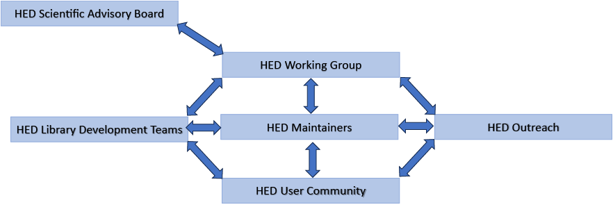

# HED INCF Standard Application

The following application was submitted to [**International Neuroinformatics Coordinating Facility (INCF)**](https://incf.or)
for consideration as an INCF standard. The application was reviewed, and the INCF has now called for community comments.

PLEASE COMMENT NOW AT: 
<a href="https://www.incf.org/commentaries/hed">INCF HED Community Review</a>

## Introduction

*Hierarchical Event Descriptors (HED)* is an open standard and supporting ecosystem for describing experimental events, 
conditions, and experiment organization in a format that is both human- and machine-readable to enable analysis, 
re-analysis, and meta/mega-analysis. HED is particularly relevant for neuroimaging and behavioral experiments 
where events are a central organizing focus for analysis. HED consists of:

1. A **specification** for how standardized vocabularies should be constructed, how these vocabularies
should be used to annotate dataset, and how tools should handle HED-annotated dataset in search, summary,
and analysis.  

2. A set of community-developed **standardized vocabularies** and a specified process for how other 
community groups can develop additional vocabularies.

3. A **reference implementation** in Python for validation and other operations as described in the specification.

The **goals** of HED are:

* To **enable and support** the storing and sharing of recorded data in a fully analysis-ready format for 
efficient and effective within and cross-study data search, summary, and analysis.

* To make the process of annotation **accessible and usable** for the global neuroimaging and related communities.

* To **open opportunities** for new types of analysis and automation.

All HED resources are open and freely available, as summarized in Table 1 below.

***Table 1:** HED resources and their locations.*

| Resource | URLs                                                                                                                                                                                                                                                                                                                                                   |
| :---- |:-------------------------------------------------------------------------------------------------------------------------------------------------------------------------------------------------------------------------------------------------------------------------------------------------------------------------------------------------------|
| Specification | [doi.org/10.5281/zenodo.7869149](http://doi.org/10.5281/zenodo.7869149) (DOI) [hed-specification.readthedocs.io/en/latest/](https://hed-specification.readthedocs.io/en/latest/) (HTML) [github.com/hed-standard/hed-specification/docs](http://github.com/hed-standard/hed-specification/docs) (src)                                          |
| Homepage | [www.hedtags.org](http://www.hedtags.org) (home) [github.com/hed-standard/hed-standard.github.io](http://github.com/hed-standard/hed-standard.github.io) (src)                                                                                                                                                                                     |
| HED schemas (vocabularies) | [www.hedtags.org/display\_hed.html](http://www.hedtags.org/display\_hed.html) (viewer) [doi.org/10.5281/zenodo.7876037](http://doi.org/10.5281/zenodo.7876037) (standard schema DOI) [doi.org/10.5281/zenodo.7897596](http://doi.org/10.5281/zenodo.7897596) (score schema DOI)                                                                    |
| Python codebase | [doi.org/10.5281/zenodo.8056010](http://doi.org/10.5281/zenodo.8056010) (DOI) [hed-python.readthedocs.io/en/latest](http://hed-python.readthedocs.io/en/latest) (API docs HTML) [github.com/hed-standard/hed-python](http://github.com/hed-standard/hed-python) (src) [https://pypi.org/project/hedtools/](https://pypi.org/project/hedtools/) (PyPI) |
| JavaScript codebase | [doi.org/10.5281/zenodo.8172804](http://doi.org/10.5281/zenodo.8172804) (DOI) [github.com/hed-standard/hed-validator](http://github.com/hed-standard/hed-validator) (src) [www.npmjs.com/package/hed-validator](http://www.npmjs.com/package/hed-validator) (npm)                                                                                     |
| Documentation | [www.hed-resources.org](http://www.hed-resources.org) (HTML) [github.com/hed-standard/hed-examples/docs](https://github.com/hed-standard/hed-examples/docs) (src)                                                                                                                                                                                      |
| Example datasets | [github.com/hed-standard/hed-examples/datasets](http://github.com/hed-standard/hed-examples/datasets) (src)                                                                                                                                                                                                                                            |
| Youtube channel | [www.youtube.com/playlist?list=PLeII6cRFsP6L5S6icwRrJp0DHkhOHtbp-](http://www.youtube.com/playlist?list=PLeII6cRFsP6L5S6icwRrJp0DHkhOHtbp-)                                                                                                                                                                                                            |
| Online tools | [hedtools.org](http://hedtools.org)  (online tools) [github.com/hed-standard/hed-web](http://github.com/hed-standard/hed-web) (src)                                                                                                                                                                                                                    |

## Open

**1. Is the SBP covered under an open license so that it is free to implement and reuse by all interested parties (including commercial)?**   Yes.

**2. What license is used?**  

The HED specification and HED schemas use Creative Commons Attribution 
4.0 International (CC-4). The HED Python and JavaScript codebases use the MIT license (with attribution). 
[**Note added 07-Aug-2024:** the original submission indicated that some libraries were released under different licenses, but this is no longer the case.]

**3. Does the SBP follow open development practices?**  

Yes.  All resources (source and documentation) use 
the standard practices for open source repositories on GitHub. All updates are done through the pull-request mechanism. 
Code repositories have unit tests that are run automatically through the GitHub actions mechanism.  
The repositories maintain GitHub issues forums and have corresponding documentation sites hosted on *readthedocs*.  
The repositories follow these rules for branch naming (with respect to documentation on *readthedocs*):

* [**develop**](https://hed-specification.readthedocs.io/en/develop/index.html) \- development branch with features under discussion.  
* [**latest**](https://hed-specification.readthedocs.io/en/latest/index.html) \- (main or master) revisions approved by the HED Working Group and tested, but not officially released.  
* [**stable**](https://hed-specification.readthedocs.io/en/stable/index.html) \- the latest released form.

Releases for the specification as well as the Python and Javascript tools use the GitHub tagged release mechanism 
and are also archived to Zenodo with permanent DOIs. The HED schemas do not get tagged GitHub releases. 
However, each official release of the HED standard schema or a library schema is assigned a permanent DOI 
and archived on Zenodo.

**4. Where and how are the code/documents managed?**  

All HED source code (including source documentation) 
is located on GitHub in public repositories in the **HED Standard GitHub organization** ([github.com/hed-standard](http://github.com/hed-standard)).
The **HED home page** ([www.hedtags.org](http://www.hedtags.org)) has quick links and a search bar linked to the HED documentation.
**HED resources** are consolidated at [www.hed-resources.org](http://www.hed-resources.org). Table 1 above summaries the various HED resources 
and source code.

**5. Any additional comments on the openness of the SBP?**   No.

## FAIR

**Consider the SBP from the point of view of some (not all) of the FAIR criteria [(Wilkinson et al. 2016\)](https://paperpile.com/c/yju7xW/FyNM).
Is the SBP itself [FAIR](https://www.go-fair.org/fair-principles/)? Does it result in the production of FAIR research objects?**  Yes.

**1. SBP uses/permits persistent identifiers where appropriate ([F1](https://www.go-fair.org/fair-principles/f1-meta-data-assigned-globally-unique-persistent-identifiers/)).**

HED uses persistent identifiers and semantic versioning throughout its ecosystem.

  a. The **HED specification** is hosted on **GitHub** and uses the GitHub tag/release mechanism with semantic
  versioning to permanently identify specific versions. At the time of each release, the release is uploaded 
  to **zenodo.org**, where it is permanently archived and is assigned a DOI.

  b. Each officially released version of the **HED standard schema** is uploaded and permanently archived 
  to **zenodo.org** where it receives a DOI. Each released version of each HED library schema is similarly 
  uploaded and archived to [zenodo.org](https://zenodo.org/record/7897596).

  c. The **HEDTools Python library** uses the GitHub tag/release mechanism with semantic versioning.
  Releases are uploaded to [zenodo.org](https://zenodo.org/record/8056010) for permanent archiving where they receive a DOI.
  Releases are also permanently deployed on [pypi.org](https://pypi.org/project/hedtools/) The **HED Javascript tools**
  (mainly the hed-validator used as a library in BIDS for validation) use a similar GitHub tag/release mechanism, 
  and releases are tagged and uploaded to [www.npmjs.com/package/hed-validator](https://www.npmjs.com/package/hed-validator).

  d. HED requires each node or term in a schema vocabulary to be unique. Consequently, each node in the 
  HED standard schema has the globally unique identifier ***HED\_term***. Similarly, each term in a library schema 
  is uniquely identified by ***HED-libraryName\_term***. The HED vocabulary terms are permanent in the sense that, 
  once added a term cannot be removed, only deprecated. 

Beginning with HED schema version 8.2.0, the *deprecatedFrom* schema attribute was added to indicate the last 
version of the schema in which a term was not deprecated. Work has started on an embedding of the HED schemas 
into a formal ontologies based on this ID format. Unique IDs for the terms in the HED schema will correspond 
to terms in the HED ontology.

  e. HED also is registered in the **SciCrunch Registry** and has an **RRID** under **HEDTags:  RRID:SCR\_014074**.

**2. SBP allows addition of rich metadata to research objects ([F2](https://www.go-fair.org/fair-principles/F2))**.  

The goal of HED is to add rich metadata to datasets in order to enable analysis.

**3. SBP uses/permits addition of appropriate PIDs to metadata ([F3](https://www.go-fair.org/fair-principles/F3))**.  

Item F3 in the FAIR principles document concerns the situation in which the metadata is stored 
separately from the actual data. For datasets stored in BIDS format, the HED annotations for a recording are 
contained either in an *events.tsv* files or in a corresponding *events.json* file.  
BIDS uses file names to associate these files with the recording information to which it corresponds. 
HED does not have a separate mechanism for associating annotations with data. HED integration with NWB 
(NeuroData Without Borders) is ongoing via the development of an extension proposal, but no specification 
or implementation has been released at this time.

**4. The protocol allows for authentication and authorization when required ([A1-2](https://www.go-fair.org/fair-principles/A1-2)).**  

All resources are accessible on the web via repositories or websites that use the *https* protocol. 
Authorization is handled by the relevant hosting site. The hed-schema vocabularies are directly accessible 
to tools through the [hed-schemas](https://github.com/hed-standard/hed-schemas) GitHub repository.

**5. SBP uses or allows the use of vocabularies that follow the FAIR principles ([I2](https://www.go-fair.org/fair-principles/I2)).**   

HED vocabularies are designed around the FAIR principles: HED uses controlled vocabularies that 
have been created by the community. Each term has a detailed text description and may have a number 
of attributes (which are defined by the HED standard) to define other term characteristics. 
  
As mentioned in the response 1d above, each HED term or tag is a self-defining globally unique identifier. 
The schemas are retrievable by tools or humans through GitHub. A [schema viewer](https://www.hedtags.org/display\_hed.html) is available to view 
all of the terms in all schemas. The schemas are directly retrievable through GitHub.

**6. SBP includes/allows qualified links to other identifiers ([I3](https://www.go-fair.org/fair-principles/I3)).**  

Currently, HED supports the *suggestedTag* and *relatedTag* attributes that link a term to other 
terms within the schema or its partnered schema. The *suggestedTag* attribute indicates a term 
that should be considered to be included in an annotation containing the given tag. 
The *relatedTag* attribute indicates a term that is similar to the given tag or that might 
be considered instead of the given tag in an annotation. These links reflect HED’s primary 
purpose as a front-end annotation technology for supporting searching and summary.  

An RDF/OWL representation of the HED schemas and infrastructure is being developed using namespace 
[https://purl.org/hed](https://purl.org/hed). However, this representation is not directly relevant to HED’s main purpose, 
which is as an annotation mechanism for events and other experimental metadata. 
Rather, the goal of this development is to allow the association of external information that 
is accessible to downstream tools. The HED Working Group plans to eventually apply to the 
OBO (Open Biological and Biomedical Ontologies) Foundry for recognition when this embedding is complete.

**7. Does the standard interoperate with other relevant standards in the same domain? ([I1](https://www.go-fair.org/fair-principles/I)).**  

Yes. HED is integrated and interoperable with [BIDS](https://bids.neuroimaging.io/) (**Brain Imaging Data Structure**) the
ost widely used standard for structuring human neuroimaging datasets. The standards are loosely coupled 
with clear guidance on how to interoperate in both BIDS (via the [Hierarchical Event Descriptors](https://bids-specification.readthedocs.io/en/stable/appendices/hed.html) appendix 
of the [BIDS Specification](https://bids-specification.readthedocs.io/en/stable/appendices/hed.html) and in BIDS the BIDS Starter Kit tutorial [Annotating a BIDS dataset](https://bids-standard.github.io/bids-starter-kit/tutorials/annotation.html)) 
and in HED (via the [HED support of BIDS](https://hed-specification.readthedocs.io/en/latest/06\_Infrastructure\_and\_tools.html\#hed-support-of-bidskit/tutorials/annotation.html) chapter in the [HED specification](https://hed-specification.readthedocs.io/en/latest/index.html) and 
in the [BIDS annotation quickstart](https://www.hed-resources.org/en/latest/BidsAnnotationQuickstart.html) on the [HED resources](https://www.hed-resources.org/en/latest/index.html) site.  
 
By design the validators are loosely coupled with the BIDS validator, which calls the HED validator 
if it detects HED is being used in a dataset annotation. This means that adaptations of one code 
base only force changes in the other when significant architectural changes occur.

Work is beginning on the integration of HED into [***NWB***](https://www.nwb.org/) ***(NeuroData Without Borders***), 
which (in the U.S. at least) is second to BIDS as a widely used standard for electrophysiology data. 

The HED library schema infrastructure provides a mechanism for standardized vocabularies in specialized 
subfields that leverages the HED framework for downstream analysis. 
For example the [SCORE](https://pubmed.ncbi.nlm.nih.gov/28838815/) (Standardized Computer-based Organized Reporting of EEG) standard, 
a widely-endorsed standard for clinical annotation of EEG, has been translated into a [HED-Score](https://hed-schemas.readthedocs.io/en/latest/hed\_score\_schema.html\#) library schema, 
allowing standardized terminology to be applied in an open, standardized manner.

**8. Does the SBP provide citation metadata so its use can be documented and tracked? ([R1.2](https://www.go-fair.org/fair-principles/r1-2-metadata-associated-detailed-provenance/))**  

Yes. Each release of the HED specification and each release of each schema has an associated DOI provided 
through the Zenodo archive. These permanent identifiers can be used as citations as indicated in Table 1.

**9. Does the SBP have a clear versioning scheme and appropriate documentation?**  

Yes. The specification, schemas, and codebases (python and JavaScript) each use semantic versioning. 
Semantic versions are associated with releases. The specific rules for what determines a major, minor, 
or patch version are described on the respective websites for these items.

**10. Any additional comments on aspects of FAIR?**  

A primary goal of HED is to be FAIR and to facilitate sharing and reproducibility, especially 
to enable cross-study analysis. 

## Design, Testing and Implementation

*These may not all apply, if so, leave blank or mark N/A. Proper design, testing, and implementation, 
in addition to supporting tools greatly aid in adoption of a standard.*

**1. What is the technical expertise level required to implement this? Even if it is quite difficult, 
should it be implemented anyway?**  

As summarized in the following discussion, annotation using HED requires very little expertise. 
HED schema development requires domain expertise, but no particular technical expertise. 
HED tool development requires significant technical expertise, but HEDTools provides a core infrastructure 
upon which users can build their own scripts. Alternatively, the [HED specification](https://hed-specification.readthedocs.io/en/latest/index.html) fully documents 
how HED vocabularies and tools must behave, allowing independent of HED-compatible ecosystems.

**a. Annotation:** The use of HED to annotate datasets can be done without any programming or 
expertise using the [HED online tools](https://hedtools.org). The following [BIDS annotation quickstart](https://www.hed-resources.org/en/latest/BidsAnnotationQuickstart.html) 
and [HED annotation quickstart](https://www.hed-resources.org/en/latest/HedAnnotationQuickstart.html) tutorials guide users through this process. 

**b. Analysis:** Much of the useful functionality of the HED tools (including validation, 
creation of summaries, restructuring event files, tag assembly, conversions between forms, expanding 
or shrinking definitions, and creating factor vectors based on HED tag searches) can be performed 
through the command line interface provided by the HED remodeling tools without any programming. 
Users create JSON files listing the commands that they wish to execute and then run the remodeling tools on a dataset.

No programming is required to call the remodeling tools from the command line.  
See the [File remodeling quickstart](https://www.hed-resources.org/en/latest/FileRemodelingQuickstart.html) tutorial and the [File remodeling tools](https://www.hed-resources.org/en/latest/FileRemodelingTools.html) user manual 
for additional information.

Users can also access the functionality of the online tools through HED web services. 
See [HED services in MATLAB](https://www.hed-resources.org/en/latest/HedMatlabTools.html\#hed-services-in-matlab) for examples of how these services can be called from MATLAB.  
Example code for all of the services can be found in the [hed-examples](https://github.com/hed-standard/hed-examples/tree/main/hedcode/matlab\_scripts/web\_services) GitHub repository. 

**c. Schema development:** The [HED schema developer’s guide](https://www.hed-resources.org/en/latest/HedSchemaDevelopersGuide.html) describes HED’s 
open process for adding a vocabulary to the HED ecosystem. While this process requires 
considerable domain knowledge, it does not require technical expertise beyond basic use of GitHub.

**d. Tool development:**  The Python [HEDTools](https://pypi.org/project/hedtools/) is a downloadable library which provides 
an infrastructure including validation of schemas and HED annotations, schema loading and manipulation, 
as well as classes representing the main structural elements of HED to enable the building of tools for analysis.  

**2. Does the SBP provide an architectural concept to understand its implementation and relationships to external entities?**  

Yes. The [HED specification](https://hed-specification.readthedocs.io/en/latest/index.html) outlines in detail the rules that HED annotations must follow and 
how compliant downstream tools must treat HED annotations. Further, the HED specification repository 
has a fairly complete set of language-independent [valid/invalid test cases](https://github.com/hed-standard/hed-specification/tree/master/tests/json\_tests) specified in JSON. 
The test cases for each error code named in the specification are contained in a separate file whose 
name is the error code. The causes for a given error code are given in Appendix B of the specification. 
Appendix B is organized so that each error code appears in its own web-addressable section. 
Thus, when tools raise a particular error code, the error message can be directly linked to 
the explanation of causes that appears in the specification.

**3. Does the SBP have a reference implementation?**  

Yes. The python [hedtools](https://pypi.org/project/hedtools/) library provides a reference implementation of the HED ecosystem 
including validation and tools. The library includes a lower-level API for the underlying implementation.

**4. What software resources (files/scripts/libraries/tools) are available to support the SBP?**  

HED Python [hedtools](https://pypi.org/project/hedtools) library has full support for HED and is installable using the standard 
pip install mechanism. HED also supports access through the [HED online tools](https://hedtools.org) and a command line interface.

**5. Are the supporting software resources tools and implementations covered under an open source license?**  

Yes.  All HED software tools are covered under the MIT attributable license. Documentation and other assets 
are covered by Creative Commons Attribution 4.0 International. 
[**Note added 07-Aug-2024:** the original submission indicated that some libraries were released under different licenses, but this is no longer the case.]

**a.  Are the supporting software resources well documented (documentation of I/O operations, programming interfaces, 
user interfaces, installation)?**  

Yes.  HED has an extensive and ever-growing collection of tutorials and user guides. 
The Python and Javascript codebases follow the standard practice for documenting functions and classes. 
Installation of the stable versions can be done using standard pip (Python) and npm (JavaScript) install 
from [PyPI](http://pypi.org/project/hedtools/) and [npmjs](https://www.npmjs.com/package/hed-validator) repositories, respectively.

**b. Were the supporting software resources validated?**  

Yes. The Python and JavaScript codebases each have an extensive set of unit tests covering all aspects 
of implementation. In addition, as part of the specification, an extensive set of language-independent 
unit tests for HED validation have been developed. 

**c. What is your assessment of the quality of the code/document?** 

Over the past three years, the HED codebase has undergone extensive refactoring. 
As part of the GitHub pull request mechanisms, GitHub actions have been implemented to 
automatically call CodeClimate to evaluate the quality of the code. Both the Python codebase 
and the JavaScript codebase have met their code quality goals, achieving \>90% in test 
coverage and a maintainability score of B, primarily emphasizing the reduction in code complexity.

**d. Have the supporting software resources been deployed, is there any experience or references to their use by the community?**  

Yes. The supporting resources have been deployed.  In particular, the Python tools have been deployed 
on [PyPI](https://pypi.org/project/hedtools/) and the JavaScript tools have been deployed on [npmjs](https://www.npmjs.com/package/hed-validator). 
Many users interact with the HED tools online at [hedtools.org](http://hedtools.org).

**6. Any additional comments on design, testing, and implementation?**  No.

## Governance

*Ongoing governance is key to ensuring the transparency about how a standard was created, 
and ensuring the stewards are responsive to the needs of the community. 
Standards require transparent governance practices; however it is possible some of the following 
questions do not apply; if so, leave blank or mark N/A.*

**1. Does the SBP have a clear description on who is maintaining the SBP and how decisions regarding its development are made?**  

Yes. HED has a [governance document](https://www.hed-resources.org/en/latest/HedGovernance.html) describing responsibilities, communication, and policies for HED. 
The HED organizational chart is shown in Figure 1 below. 

| Group | Function | Contact | GitHub |
| :---- | :---- | :---- | :---- |
| [HED Scientific Advisory Board](https://www.hed-resources.org/en/latest/HedGovernance.html\#hed-scientific-advisory-board) | Strategic planning | Scott Makeig | [smakeig](https://github.com/smakeig) |
| [HED Working Group](https://www.hed-resources.org/en/latest/HedGovernance.html\#hed-working-group) | Oversight and day-to-day decisions | Kay Robbins Scott Makeig | [VisLab](https://github.com/VisLab) [smakeig](https://github.com/smakeig) |
| [HED Library Development Teams](https://www.hed-resources.org/en/latest/HedGovernance.html\#hed-library-development-teams) | Library development issues | Dora Hermes Tal Pal Attia | [dorahermes](https://github.com/dorahermes) [tpatpa](https://github.com/tpatpa) |
| [HED Maintainers](https://www.hed-resources.org/en/latest/HedGovernance.html\#hed-maintainers) | Repository management | Kay Robbins Dung Truong | [VisLab](https://github.com/VisLab) [dungscout96](https://github.com/dungscout96) |
| [HED Outreach](https://www.hed-resources.org/en/latest/HedGovernance.html\#hed-outreach) | Annotation assistance | Annalisa Salazar | [asalazar4](https://github.com/asalazar4) |

For additional details see the HED governance document.

**2. Is the governing model document for maintenance and updates compatible with the [INCF project governing model document](https://space.incf.org/index.php/s/Ypig2tfHOU4no8C\#pdfviewer) 
and the open standards principles?**   Yes.

**3. Is the SBP actively supported by the community? If so, what is the evidence?**  

Yes.  HED is actively supported by a community of users/developers as evidenced by activity on HED’s various activities on GitHub.

**4. Does the SBP provide tools for community feedback and support?**   

Yes. HED users are encouraged to post questions, suggestions, and discussion on the appropriate 
GitHub issues forum on the GitHub [hed-standard](https://github.com/hed-standard) organization site as indicated in the following table: 

| Issue/ suggestion type | Issue forum | Comments                                                                                  |
| :---- | :---- |:------------------------------------------------------------------------------------------|
| Main issue forum | [hed-schemas](https://github.com/hed-standard/hed-schemas/issues) | Primary forum for schema development. Any issue can be posted and will be redirected. |
| Docs/examples | [hed-examples](https://github.com/hed-standard/hed-examples/issues) | Documentation corrections. Questions on examples. Help on annotation.                     |
| Specification | [hed-specification](https://github.com/hed-standard/hed-specification/issues) | Clarification/suggestions on the specification document and JSON tests.                   |
| Python codebase | [hed-python](https://github.com/hed-standard/hed-python/issues) | Bug reports and feature requests.                                                         |
| JavaScript codebase | [hed-validator](https://github.com/hed-standard/hed-validator/issues) | Bug reports and feature requests.                                                         |

Users who wish to communicate privately about an issue, can email [hed.maintainers@gmail.com](mailto:hed.maintainers@gmail.com).

**5. Any additional comments on governance?**  No.

## Adoption and use

*The standard must have substantive evidence of use outside of the group or individual that develops and maintains it. 
However, different levels of adoption and use will be taken into consideration depending on the purpose of the 
standard and the size/type of audience that might implement the standard. Because INCF represents organizations 
world-wide, evidence of international use is highly desirable.*

**1. Is there evidence of community use beyond the group that developed the SBP?**  

Yes. **First-generation HED** was released in 2010 as part of the development of the 
[HeadIT](http://headit.ucsd.edu) (Human Electrophysiology, Anatomic Data and Integrated Tools Resource) open repository for 
EEG at UCSD under Scott Makeig. 

During the next 9 years HED was developed and promoted as part of a multi-institution project 
sponsored by the Army Research Laboratory to instrument the brain and body at work.  
An important component of this project was to develop a standards-based publicly available repository 
for the data collected in this project ([cancta.net](http://cancta.net)). A working-group organized within 
this multi-institutional project developed **second-generation HED** and assisted in the annotation of the CANCTA data corpus.  

The effort to incorporate HED into BIDS (Brain Imaging Data Structure) began in 2017 with the initiation of 
BEP007 (BIDS Extension Proposal 7: Hierarchical Event Descriptor (HED)) tags and was completed in 
2018 with the incorporation of HED validation into the BIDS validator. The [Hierarchical Event Descriptors](https://bids-specification.readthedocs.io/en/stable/appendices/hed.html) appendix 
was added to the [BIDS Specification](https://bids-specification.readthedocs.io/en/stable/appendices/hed.html).

In 2019, the HED Working Group was formed to address the more complex annotation issues that 
arise in annotating datasets with widely varying characteristics and more complex analyses. 
Over the course of the past 4 years, the HED Working Group has spearheaded the development of **third-generation HED**, 
which included better event representation and the addition of library schemas. 
HED embraced open source development practices and developed a body of documentation and educational materials. 
The first HED library schema (HED-SCORE) was released in January of 2023. 

During this time many datasets in BIDS format were uploaded to [openneuro.org](http://openneuro.org), and as 
BIDS began to incorporate and standardize the formats for many neuroimaging formats beyond fMRI, 
the NEMAR ([nemar.org](http://nemar.org)) repository came online to provide an integrated data-computation 
facility primarily for EEG, MEG, and iEEG. NEMAR is linked to OpenNeuro, which stores the original data. 

**2. Please provide some concrete examples of use, e.g., publications where the use of the SBP is cited; 
databases or other projects that have adopted the SBP.**

HED is an integral part of the following repositories:

* OpenNeuro  (HED third generation – second generation support is deprecated)  
* Nemar (HED third-generation)  
* EEGNET (HED third-generation)  
* Austrian NeuroCloud  (HED third-generation)  
* CANCTA  (HED second-generation)  
* HeadIT \[deprecated\] (HED first-generation)

Since the event-annotation mechanism for [BIDS](https://bids.neuroimaging.io/) (Brain Imaging Data Structure), any BIDS dataset could use HED.  
In reality, many users who have deposited their data on OpenNeuro (often to meet the requirements of funding agencies) 
have not even provided basic text descriptions of the meaning of their event codes.  
This makes actual use of the data problematic for researchers other than the data owners.

The NEMAR, EEGNet, and Austrian NeuroCloud repositories have each hired staff to help curate and HED-tag 
data from OpenNeuro and/or other sources hosted in their repositories. NEMAR is now using HED event and 
tag summaries in its dataset summaries as seen in this [beta version](https://nemar.org/dataexplorer/detail?dataset\_id=ds003645) of the interface.

**Papers on HED:**

* **Building a HED Library:**

  *Hierarchical Event Descriptor library schema for clinical EEG data annotation.*

  Tal Pal Attia, Kay Robbins, Harald Aurelien, Sándor Beniczky, Jorge Bosch, Arnaud Delorme, Brian Lundstrom, 
* Christine Rogers, Stefan Rampp, Pedro Valdes-Sosa, Dung Truong, Greg Worrell, Scott Makeig, Dora Hermes

  [https://www.biorxiv.org/](https://www.biorxiv.org/) 

* **HED as a FAIR system:**

  *Building FAIR functionality: Annotating events in time series data using Hierarchical Event Descriptors (HED).*

  Kay Robbins,  DungTruong, Alexander Jones, Ian Callanan, and Scott Makeig 

  Neuroinformatics Special Issue Building the NeuroCommons. Neuroinformatics (2022). https://doi.org/10.1007/s12021-021-09537-4.

  [https://link.springer.com/article/10.1007/s12021-021-09537-4](https://link.springer.com/article/10.1007/s12021-021-09537-4).

* **Using HED in analysis:**

  *Automated EEG mega-analysis II: Cognitive aspects of event related features*

  Nima Bigdely-Shamlo, Jonathan Touryan, Alejandro Ojeda, Christian Kothe, Tim Mullen, and Kay Robbins. 

  NeuroImage. 2019 Sep 4:116054. doi: 10.1016/j.neuroimage.2019.116054, PMID: 31491523\.

**3. Is there evidence of international use?**   

Yes.  HED is included as an integral part of the EEGNET [https://eegnet.org/](https://eegnet.org/) a collaborative Canadian 
EEG platform which emphasizes the creation of a highly curated collection of raw and processed EEG data. 

[Global Brain Consortium](https://globalbrainconsortium.org/) (GBC), a multinational organization whose mission is to strengthen 
collaborative efforts in neuroscience to achieve more equitable health outcomes world-wide, 
has been very supportive of the HED standardization. Dr. Pedro Valdes-Sosa, co-chair of the GBC, 
initiated the development of HED-score, the first HED library schema, based on the 
SCORE (Standardized computer based organized reporting of EEG) standard for clinical annotation of EEG. 
The SCORE library development is part of GBC’s goal of providing open-source tools and standards to 
enable data-sharing in underserved regions of the world.

The Center for Cognitive Neuroscience at the University of Salzburg, led by Dr. Florian Hutzler 
is developing a Austria-wide repository for sharing standardized neuroimaging data. 
The center recognizes HED and BIDS as an important component of the effort and has funded staff 
to annotate neuroimaging data, particularly fMRI.

NEMAR ([https://nemar.org](https://nemar.org)) an EEG/MEG/iEEG computational portal for OpenNeuro incorporates 
HED into its interface, summary, and analysis pipelines.

**4. Any additional comments on use?**   No.

## Stability and support

Standards need some sort of ongoing stability and support to ensure it will be useful in the future. 
However, given the nature of research projects, the level of acceptable stability and support is 
somewhat at the discretion of the SBP Committee and reviewers.

**1. Who is responsible for maintaining the SBP?**  

HED has adopted a governance structure outlining the responsibilities for maintenance.  
As an open-source project HED encourages and relies on help from volunteers.

**2. How is it currently supported?**  

HED is currently being supported by an NIH

**3. What is the plan for long term support?**  

Members of the HED working group are in the process of submitting an NIH grant for continuing support and 
innovation in HED. The various repositories that incorporate HED have all allocated personnel time and 
other resources for improving the annotations of individual datasets and for integration of HED support into their interfaces.  

**4. Are training and other supporting materials available?** 

Yes. An extensive collection of tutorials and user guides have been developed as well as a playlist of videos. 
Plans are underway for additional development of resources and for short courses and hands-on hackathons. 

**5. Any additional comments on sustainability and support?**   No.

## Extensibility

*If it is possible to update or potentially apply the standard to other areas, that should be indicated.
The ability for a standard to be extensible is highly desirable, but not required. 
This is an area where having this knowledge is valuable to INCF and the community in general.*

**1. Can the SBP be extended to cover additional domains/use cases?**  

Yes. HED is designed for and encourages the development of specialized vocabularies to support subfields. 
The HED specification of behavior and rules continues to evolve as additional requirements or applications are encountered.

**2. If so, how is the process documented and managed?**  

The development process for new vocabularies is described in the [HED schema developer’s guide](https://www.hed-resources.org/en/latest/HedSchemaDevelopersGuide.html). 
Suggestions for modifications/corrections/additions to the HED specification are controlled through the GitHub issue/PR mechanism.

**3. Any additional comments on extensibility?**  No.

## Comparison

**1. Are there other similar SBP's available?**  

No.  To our knowledge, no other project has attempted to construct a complete system for annotation, 
search, and analysis of time series data based on the detailed nature of events occurring during data acquisition. 
This is in itself a remarkable fact, one with historical roots, we believe, in the limitations of earliest 
development of computerized technology (1962- ) for acquiring EEG data during psychophysical experiments 
and the matching event-related trial averaging analysis method that dominated the field of event-related 
EEG studies for the ensuing 30 or more years.  

However, as any event affecting the experience of the neuroimaging study participant may affect the 
recorded brain (and body) activity, event records are of particular importance to analyses of time series 
neuroimaging data. HED thus meets a critical neuroinformatic need, most acutely so for data modalities 
including electromagnetic recording in which the acquired brain signals have sufficient temporal resolution 
to capture brain dynamics expressed on the timescale of important human events including single thoughts and actions.  

**2. If yes, how do they compare on key INCF criteria?** None available.

**3. What are the key advantages of the SBP when compared to other SBPs?** 

Note: although BIDS uses HED as its event annotation mechanism, HED is a distinct standard. 
While BIDS focuses on overall dataset organization, HED’s goal is to provide detailed metadata 
about the unfolding of individual recording sessions in a machine-actionable manner. 
It can be used with any dataset organization, and work is underway to standardize its use in NWB through an extension proposal.

**4. Any additional comments on comparison with other SBPs?** No.

---

# INCF Review process

## Review Criteria v.2.0

Version 2.0 ([DOI: 10.7490/f1000research.1118367.1](https://doi.org/10.7490/f1000research.1118367.1))  
Approved, 9th November, 2020  
Authors:  INCF SBP Committee  
[Link to earlier versions](https://www.doi.org/10.5281/zenodo.2535784)

https://incf.org/incf-standards-review-criteria-v20

Related

* [INCF standard review criteria v2.0](https://incf.org/activities/endorse)

* [INCF best practice review criteria v1.0](https://incf.org/incf-best-practices-review-criteria)

[Link to version 1.0 of the review criteria](https://zenodo.org/record/2535784\#.YA6j9y1Q1qs)

## Endorsement process

### Part 1:  Expert review

1. Nominations are received from the community via an [on-line form](https://incf.org/form/suggest-a-sbp).

2. Nominations are reviewed on a monthly basis by the committee and those that are deemed appropriate are selected for further vetting.

3. If a large number of SBP’s are submitted, the committee will establish a schedule for vetting and will send a communication to the submitter regarding the time line

4. A subcommittee of 2-3 individuals is selected to further review the SBP:

   1. The submitter will be contacted to provide more detail about the SBP

   2. Committee members will use an [on-line form](https://incf.org/form/suggest-a-sbp) for their review

   3. Reviewers may interact with the contact individual or other relevant parties to obtain clarifications or additional information

   4. Reviewers may solicit a proxy from their node to conduct the review

5. The findings of the subcommittee are discussed at the next monthly meeting and a recommendation put forward for vote:

   1. Possible outcomes:

      1. Put forward the SBP for community feedback

      2. Reject the SBP

      3. Request further details

   2. Voting procedure: Ideally, the SBP committee will work through concerns to arrive at consensus on the required action. In the case of a disagreement, the action will be put to a vote to be decided by a simple majority of SBP members.

6. Outcomes:

   1. Put forward the SBP for community feedback: A description of the SBP will be prepared and put forward to the INCF community for comment.   

   2. Reject the SBP: SBP chair will put together an email to be sent to the submitter and/or steward as appropriate detailing the reasons why the SBP will not be considered further.

   3. Request further details: Questions and comments will be sent to the submitter/steward so they can respond. Action will be deferred until SBP committee hears back.

### Part 2:  Community comment

1. SBP’s under consideration will be posted for community comment.  The current plan is to use the F1000 platform: The public review may extend a minimum of sixty (60) days. The CTSI reserves the right to extend the public review period if it deems necessary.

2. Once an SBP is posted, it will be broadly advertised through INCF and other networks

3. Members of the community will be given the opportunity to respond via email or using the comment feature of the platform.

4. After the commenting period, the subcommittee in charge of the SBP will summarize the feedback.

### Part 3: Committee review

1. The SBP committee will vote on the action:

   1. Endorse the SBP as an INCF SBP:  Any suggestions/criticisms by the community are easy addressable, e.g., typos, wording

   2. Reject the SBP:  The community provides information which disqualifies the SBP from endorsement

   3. Request further details:  Significant concerns have been raised that will have to be addressed before further consideration

2. Endorsement: The INCF secretariat notifies the submitter/steward and that they are now allowed to display the “Endorsed by INCF” badge. The final SPB review is posted online. The SBP is included on the INCF Portal list of endorsed SBPs.

3. Reject: The secretariat sends a note to the submitter/steward detailing reasons why the SBP was rejected.

4. Request further details: Questions/comments are sent to the submitter/steward. The SBP is then considered at the next SBP meeting to determine whether the SBP needs to be posted for further community review.

5. Voting Procedure: Ideally, the SBP committee will work through concerns to arrive at consensus on the required action. In the case of a disagreement, the action will be put to a vote to be decided by a ⅔ vote of SBP members.

 

## Conflicts of interest

1. Members who have a conflict of interest should declare those conflicts and recuse themselves from the review and voting process

2. Examples of conflicts:  

   1. Member is an author or steward of an SBP

   2. Member is in a line management or other supervisory chain (above or below) with the author of an SBP

   3. Member has a financial interest in the SBP or tools related to the SBP

   4. Member serves on the advisory board for an SBP

   5. Member is developing or has developed a competing standard

   6. Member does not feel that s/he can be an impartial reviewer 

 

## Grievance procedures

### Competing standards

The INCF SBP procedure should operate in a transparent manner and seek to avoid at all times any type of bias or appearance of bias.  The process should be fair to those who are developing SBP’s, but also in the best interests of the broader neuroscience community we seek to serve.  

Transparency and lack of bias are particularly critical when competing SBP’s exist. Competing SBP’s should ideally be identified by the submitter, the review committee, or during the period of community comment. If both SBP’s are found to be substantially compliant with INCF criteria, then INCF may opt to not issue an endorsement and list both SBP’s on their website along with the results of the review to provide information to the community about SBP’s relevant to their work.  INCF should encourage and support the community to come together via working groups to address interoperability and possibility of reconciliation of competings SBP’s can be achieved.

If a competing SBP comes to light after an endorsement is issued, the committee should determine whether the review process was fair and comprehensive, i.e., should the competing SBP have been identified?  If the process was fair and comprehensive, INCF will not withdraw the endorsement, but will develop a mitigation plan. For example, it may turn out that a competing SBP was developed in another domain, or that it is possible to develop approaches to make the two interoperable.  Again, INCF should encourage and support the community to come together via working groups to address interoperability and possibility of reconciliation of competings SBP’s can be achieved.

### Grievance with the review process

Situations may arise where an author/steward or community member feel that the review process itself was not performed thoroughly or fairly or where they feel an incorrect decision was reached.  For example, an individual(s) may disagree with the endorsement of a standard or a decision not to endorse.

Complaints about the review process and any decisions will be reviewed by the committee.  The SBP should set up an issue tracker where such concerns can be expressed. Anonymous complaints will not be accepted.  

Ideally, issues should be able to be resolved through communication and discussion between the committee and the aggrieved individual. The issue should be posted to a public forum for community input if appropriate, although public posting will be at the discretion of the SBP Committee.  Appropriate actions should be taken to mitigate the concern if possible. If not possible, then procedures should be reviewed and revised to prevent similar issues from occurring in the future. The committee should ensure that the complaint and its resolution are documented and all parties indicate their agreement with the decision.  If appropriate, the complaint and its resolution should be posted on the INCF’s website. 

If the complaint cannot be resolved amicably through this mechanism, the complaint will be referred to the INCF CTSI. The CTSI can either review the complaint and recommend an action or appoint a committee with the appropriate expertise to provide advice.  The committee should ensure that the complaint and its resolution are posted in a public place and that all parties indicate their agreement with the decision.

---

# HED community review

PLEASE COMMENT NOW AT: 
<a href="https://www.incf.org/commentaries/hed">INCF HED Community Review</a>

