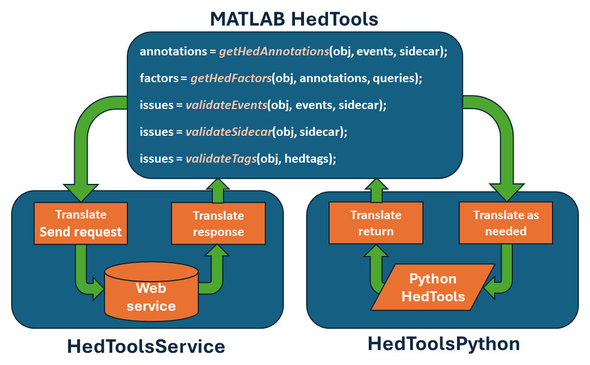

(matlab-hedtools-anchor)=
# HED MATLAB tools

The HED MATLAB tools allow validation, summary, search, factorization, data epoching
and other HED processing in MATLAB by providing MATLAB wrappers for the Python HEDTools.
These MATLAB wrappers allow MATLAB users to use HED without learning Python. 

## Tool overview

The HED MATLAB tools provide the following interface to HEDTools as explained in more detail in the following sections. 
The MATLAB HEDTools package provides two interchangeable implementations of these functions -- 
calling the HED Python tools through a web service or directly calling the Python HEDTools.

To use HED tools, you first create a HED object by calling `getHedTools`. 
If you provide the optional host argument, the HED tools use services, otherwise
direct calls to Python. Once created, you simply call the available methods
using that reference. The process is summarized in the following diagram.

. 

Both approaches take MATLAB data as input and translate these values as needed to access the HEDTools.
After making the call, the implementation translates the results back into MATLAB data types.
The MATLAB HedTools accept a variety of different types of MATLAB variables as input.

Calling the HED MATLAB tools using web services requires no installation beyond downloading the 
HED MATLAB package, but its use requires Internet access. 

Using direct calls to the Python HEDTools from MATLAB is more efficient
and provides additional functionality not available through the web service interface.
However, direct calls require a one-time setup of Python for your MATLAB installation.
See [**MATLAB Python install**](#matlab-python-install) for additional setup information.

Another option is to use the [**EEGLAB HEDTools plug-in**](./HedAndEEGLAB.md) integration for HED.
The EEGLAB plug-ins provide easy access through the EEGLAB GUI interface

### The HED MATLAB interface

The HED MATLAB tools provide the following routines for accessing HED:

```{list-table} MATLAB HEDTools interface (* indicates optional Name-Value parameter)
:header-rows: 1
:name: matlab-hedtools-interface

* - MATLAB
  - Purpose
  - Parameters
  - Returns
* - `getHedAnnotations`
  - Assemble a cell array of HED string<br/>annotations from data such as events.
  - `events`<br/>`sidecar`<br/>`removeTypesOn`<br/>`includeContext`<br/>`replaceDefs`
  - cell array of `char`
* - `searchHed`
  - Given a cell array of *n* HED string<br/>annotations and a cell array of <br/>*m* of HED queries return an <br/>*n* x *m* array indicating whether<br/>each annotation satisfied the<br/>respective query.
  - `annotations`<br/>`queries`
  - *n* x *m* array of 1's and 0's.
* - `validateEvents`
  - Validate HED events data in various<br/>format sand return a printable<br/>string with HED issues.
  - `events`<br/>`sidecar`<br/>`checkWarnings`*
  -  `char`
* - `validateSidecar`
  - Validate HED in a BIDS sidecar<br/>(in various formats) and return a <br/>printable string with HED issues.
  - `sidecar`<br/>`checkWarnings`*
  -  `char`
* - `validateTags`
  - Validate a HED annotation<br/>(in various formats) and return a<br/>printable string with HED issues.
  - `hedTags`<br/>`checkWarnings`*
  - `char`
```


The parameters are defined as follows:

```{list-table} Parameters for MATLAB HED tools (* indicates optional Name-Value parameter).
:header-rows: 1
:name: matlab-hedtools-parameters

* - Parameter
  - Description
  - MATLAB type
* - `annotations`
  - Cell array with hed annotations.
  - cell array of `char` or `string`, <br/>(or of `HedString` if Python)
* - `events` 
  - Tabular data with HED tags<br/>ex: EEGLAB EEG.events or BIDS _events.tsv.
  - `char`, `string`, `struct` <br/>(or `TabularInput` if Python)
* - `sidecar`
  - Data representing a BIDS-type sidecar<br/>containing metadata for tabular data.
  - `char`, `string`, `struct` <br/>(or `Sidecar` if Python)
* - `hedtags`
  - A HED annotation string.
  -  `char`, `string`<br/> (or `HedString` if Python)
* - `queries`
  - Valid HED query strings.
  - Cell array of `char` or `string`
* - `checkWarnings`*
  - Optional flag indicating whether to check<br/>for warnings during validation.
  - `true` or `false`
* - `includeContext`*
  - Optional flag indicating whether to<br/>include the event context in assembling HED tags.
  - `true` or `false`
* - `removeTypesOn`*
  - Optional flag indicating whether to<br/>remove *Condition-variable* and *Task* tags.  
  - `true` or `false`
* - `replaceDefs`*
  - Optional flag indicataing whether to <br/>eplace *Def* tags with contents<br/>of their definitions.  
  - `true` or `false`
```

(what-to-download-anchor)=
### What to download

The HED MATLAB tools can be downloaded from the [**hed-matlab**](https://github.com/hed-standard/hed-matlab) GitHub repository.
**Add the <em>hedmat</em> directory and all of its subdirectories to your path.**

The following table describes the directories of this repository:

```{list-table} Directories in hed-matlab GitHub repo.
:header-rows: 1
:name: matlab-hedtools-download

* - Directory
  - Description
* - Directory
  - Description
* - *data*
  - Data used for the demos and tests.
* - *docs*
  - Source code for the documentation.
* - *hedmat/hedtools*
  - MATLAB interface for the HED tools.
* - *hedmat/remodeling_demos*
  - Demos of calling the HED remodeling tools.
* - *hedmat/utilities*
  - General purpose utilities.
* - *hedmat/web_services_demos*
  - Demos of directly using the HED web services (without hedtools).
* - *tests*
  - Unit tests for MATLAB. (Execute `run_tests.m` to run all unit tests.)
```

## Using MATLAB HEDTools

This section gives some examples of using the HED MATLAB tools.

### Getting a HEDTools object

The HED MATLAB tools are all called by getting a `HedTools` object and then making the calls through this object.
Use the `getHedTools` function to get a `HedTools` object.

The following example gets a `HedTools` object using version 8.2.0 of the HED schema (standard vocabulary)
and the webservice available at [**https://hedtools.org/hed**](https://hedtools.org/hed).

````{admonition} Access HED tools through web services.
:class: tip

```matlab
hed = getHedTools('8.2.0', 'https://hedtools.org/hed');
```
````

The first parameter is number of the HED version to use, and the second parameter is the URL of the web service.
The `hed` returned by this call is `HedToolsService`, which implements the interface by calls to HED web services.
The [**https://hedtools.org/hed**](https://hedtools.org/hed) is the primary server for the HED online tools.
An alternative server for the web services is [**https://hedtools.org/hed_dev**](https://hedtools.org/hed_dev).
This is the HED development server, which deploys the latest features.

If you have installed the HED Python tools, you can access the HED MATLAB interface using direct calls to Python.

````{admonition} Access HED tools through direct Python calls.
:class: tip

```matlab
hed = getHedTools('8.2.0');
```
````
If you call the `getHedTools` with only the HED version number parameter,
`getHedTools` assumes you are using direct calls to Python and returns a `HedToolsPython` object.
The HED MATLAB interface calls and behavior are identical whether you use the services or direct calls.
You must have the HED Python tools installed to use direct calls.
See [**MATLAB Python install**](#matlab-python-install).

### Calling a tool
Once you have the HED tools object, you can use it to call the tools listed above
as illustrated in the following example:

````{admonition} Validate a string containing HED tags.
:class: tip

```matlab
issues = validateTags(hed, 'Sensory-event,Red,Blech,(Image, Banana)');
```
````
The `issues` is a printable `char` array.
The HED tags string in the above example has two unrecognized tags: *Blech* and *Banana*. 
The call to `validateTags` produces the following `issues` message:

````{admonition} Validate a string containing HED tags.
```text
   TAG_INVALID: 'Blech' in Blech is not a valid base hed tag.
   TAG_INVALID: 'Banana' in Banana is not a valid base hed tag.
```
````

### Input of events

Events are markers on the experimental timeline that indicate something of interest.
One of HED's primary purposes is to annotation event markers with usable metadata to assist in analysis.

Events are generally represented in a tabular input form with column names.
Each row in such a table corresponds to information associated with one event marker.

```{list-table} Example events input
:header-rows: 1
:name: example-events-tabular-input

* - row #
  - onset
  - latency
  - type
  - modifier
* - 1
  - 8.50
  - 851
  - show
  - A2
* - 2
  - 8.90
  - 891
  - show
  - A5
* - 3
  - 9.00
  - 901
  - resp
  - key1
* - 4
  - onset
  - 1001
  - resp
  - key2
```

HED expects that event files have an `onset` column that provides the
time in seconds of the event marker relative to the experimental timeline.

When this data is stored in a tab-separated value file called `test.tsv`, 
it can be read as:

````{admonition} Read a tab-separated value file into a char array.
:class: tip

```matlab
events = fileread('test.tsv')
```
The events is a char array:

```text
    'onset	latency	type	modifier
     8.50	851	show	A2
     8.90	891	show	A5
     9.00	901	resp	but1
     10.00	1001	resp	but2'
```
````

The same data can also be stored in MATLAB `struct` array:

````{admonition} Read a tab-separated value file into a char array.
:class: tip

```matlab
events(1) = struct('onset', 8.5, 'latency', 851, 'type', 'show', 'modifier', 'A2');
events(2) = struct('onset', 8.9, 'latency', 891, 'type', 'show', 'modifier', 'A5');
events(3) = struct('onset', 9, 'latency', 901, 'type', 'resp', 'modifier', 'but1');
events(4) = struct('onset', 10, 'latency', 1001, 'type', 'resp', 'modifier', 'but2');
```
Displaying events on the MATLAB command line just gives the overall structure:

```text
  1×4 struct array with fields:

    onset
    latency
    type
    modifier
```
but the MATLAB workspace editor provides a more informative view:
. 

````

Once you have events data, it is easy to validate the HED
associated with this data as shown by the following example:

````{admonition} Validate events data.
:class: tip

```matlab
issues = hed.validateEvents(events, sidecar);
```
````

### Input of sidecars
A tabular dataset may have a `HED` column whose entries provide HED
annotations for the individual event markers represented by the rows. 
However, a more typical approach to annotation is to provide
an additional dictionary, often called a sidecar.
In [**BIDS**](https://bids.neuroimaging.io/) the sidecar dictionaries
are represented in [**JSON**](https://www.json.org/json-en.html) format.
The MATLAB `jsonencode` and `jsondecode` translate various MATLAB data 
types into a JSON-compliant `char` value.

HED expects that sidecars will follow the BIDS format for sidecars associated 
with tabular files. The top-level JSON is a dictionary with keys that are the column
names of the associated tabular file. Each key points to a dictionary of metadata for a column.
One of the keys in this second dictionary can be `HED` as illustrated by the following example.

````{admonition} JSON sidecar for the events of previous section.
:class: tip

```json
{
   "type": {
      "HED": {
         "show": "Sensory-presentation, Experimental-stimulus",
         "resp": "Agent-action, Participant-response"
      }
   },
   "modifier": {
       "HED": {
          "A2": "(Face, Image)",
          "A5": "(Animal/Horse, Image)",
          "but1": "(Press, (Left, Mouse-button))",
          "but2": "(Press, (Right, Mouse-button))"
      }
   }
}
```
````

### Assembling HED annotations

The `getHedAnnotations` tool assembles the complete HED annotation for each
event marker (i.e., each row in an event structure).


````{admonition} Assembling HED annotations.
:class: tip

```matlab
annotations = hed.getHedAnnotations(events, sidecar);
```
````
Here `annotations` is a cell array with the same number of rows as `events`
containing the `char` HED annotations for the `events`.
The HEDTools look up the HED annotation for each element in a row of an events table and concatenate
those together (comma-separated) to form the HED annotation for the event marker. 

For the event data and sidecar defined in the previous sections,
the sidecar provides HED annotations for the `type` and `modifier` columns.
The resulting HED annotations for each row are given in the following table:

```{list-table} Example assembled HED annotations
:header-rows: 1
:name: assembled-hed-annotation-example

* - row
  - HED annotation
* - 1
  - *Sensory-presentation,Experimental-stimulus,(Face,Image)*
* - 2
  - *Sensory-presentation,Experimental-stimulus,(Animal/Horse,Image)*
* - 3
  - *Agent-action,Participant-response,(Press,(Left,Mouse-button))*
* - 4
  - *Agent-action,Participant-response,(Press,(Right,Mouse-button))*
```

The annotation for the first row consists of the HED tags for the `show` value in column `type`
(i.e., *Sensory-presentation,Experimental-stimulus*) concatenated with the
HED tags for the `A2` value in column `modifier` (i.e., *(Face,Image)*).
Note: HED annotations are unordered, so the tags may appear in any order.
Use parentheses to group tags as appropriate.

The example annotations do not use any `Def` tags, so the `replaceDefs` option is not relevant.
Users can give a name to particular string of HED tags using the `Definition` tag and then use
the `Def` tag with that name as a shortcut in annotations. The `Def` tags are useful for
tag strings that are frequently used and are required to define event processes.
However, when assembling annotations to search for tags, you usually want to replace these shortcut `Def`
tags with the actual HED tags they represent. Thus, the default value of `replaceDefs` is true.
See [**Advanced annotation**](https://hed-specification.readthedocs.io/en/latest/05_Advanced_annotation.html)
for details.

Since no special tags defining extended event processes are used (i.e., `Onset`, `Offset`, `Duration`)
in the example annotations, the `includeContext` option has no effect in this example.
If `includeContext` is true (the default) event processes contribute their tags to the
`Event-context` of time markers that fall in their scope. See
[**Advanced annotation**](https://hed-specification.readthedocs.io/en/latest/05_Advanced_annotation.html)
for an explanation of this.

The example annotation does not contain any `Condition-variable` or `Task` tags, so `removeTypesOn` has no effect. 
Typically `removeTypesOn` should be true to remove the effects of these tags for ordinary assembly and 
searching as extraction of design matrices is a separate operation. 
See [**HED conditions and design matrices**](https://www.hed-resources.org/en/latest/HedConditionsAndDesignMatrices.html)
for additional information.

### Searching HED annotations

The `searchHed` tool takes a cell array of *n* HED annotations and a cell array of *m* HED search queries
and returns an *n* x *m* array of 1's and 0's indicating whether the annotations satisfy the queries.

````{admonition} Example search of HED annotations
:class: tip

```matlab
factors = hed.searchHed(annotations, {'Sensory-event', 'Agent-action'});
```
```` 

The result of this query is the following:

```{list-table} Query result for the sample annotation.
:header-rows: 0
:name: query-results

* - 1
  - 0
* - 1
  - 0
* - 0
  - 1
* - 0
  - 1
```
The queries can be quite complex as described in the
[**HED search guide**](https://www.hed-resources.org/en/latest/HedSearchGuide.html).

(matlab-python-install-anchor)=
## MATLAB Python install

Although MATLAB began python support of python in 2014, **you must be using
MATLAB version 2020b or later** with the HEDTools because the
current version of the HEDTools requires Python 3.8 or later.
See [**compatible version of Python**](https://www.mathworks.com/support/requirements/python-compatibility.html) 
for a listing of which 
Python versions are compatible with which versions of MATLAB.

**Note:** For your reference, the source for `hedtools` is the 
[**hed-python**](https://github.com/hed-standard/hed-python) GitHub repository.
The code is fully open-source with an MIT license.
The actual API documentation is available [**here**](https://hed-python.readthedocs.io/en/latest/api2.html),
but the tutorials and tool documentation for `hedtools` on 
[**HED Resources**](https://www.hed-resources.org/en/latest/index.html) site provides more
examples of use.

You will need at least MATLAB version R2020b, 
since the Python HEDTools require at least Python 3.8.
See [**MathWorks Python Compatibility Docs**](https://www.mathworks.com/support/requirements/python-compatibility.html) for additional information.

### Installing Python

The greatest difficulty for users who are unfamiliar with Python is
getting Python connected to MATLAB.
Once that is done, many of the standard `hedtools` functions can be accessed through 
method call that take MATLAB variables and return either MATLAB variables or opaque objects that
can be passed to other MATLAB functions.

Thus, once the setup is done, you don't have to learn any Python syntax to use the tools.
You should only have to do this setup once, since MATLAB retains the setup information
from session to session.

````{admonition} Steps for setting up Python HEDtools for MATLAB.

[**Step 1: Find Python**](step-1-find-python-anchor). If a version >= Python 3.8 is found, skip to Step 3.
<p></p>

[**Step 2: Install Python if needed**](step-2-install-python-if-needed-anchor) .
<p></p> 

[**Step 3: Connect Python to MATLAB**](step-3-connect-python-to-matlab-anchor).
If already connected, skip to Step 4.
<p></p> 

[**Step 4: Install HEDtools**](step-4-install-hedtools-anchor)
````

(step-1-find-python-anchor)=
#### Step 1: Find Python

Follow these steps until you find a Python executable that is version 3.8 or greater.
If you can't locate one, you will need to install it.

````{Admonition} Does MATLAB already have a good version of Python you can use?

In your MATLAB command window execute the following function:

```matlab
>> pyenv
```
The following example response shows that MATLAB is using Python version 3.9
with executable located at `C:\Program Files\Python\Python39\python.EXE`.

```matlab
  PythonEnvironment with properties:

          Version: "3.9"
       Executable: "C:\Program Files\Python\Python39\python.EXE"
          Library: "C:\Program Files\Python\Python39\python39.dll"
             Home: "C:\Program Files\Python\Python39"
           Status: NotLoaded
    ExecutionMode: InProcess
```
````

If MATLAB has already knows about a suitable Python version that is at least 3.8,
you are ready to go to [**Step 4: Install HEDTools**](step-4-install-hedtools-anchor).
Keep track of the location of the Python executable.

If the `pyenv` did not indicate a suitable Python version, you will need to
find the Python on your system (if there is one), or install your own.

There are several likely places to look for Python on your system.

**For Linux users**:

>Likely places for system-space installation are `/bin`, `/local/bin`, `/usr/bin`, `/usr/local/bin`, or `/opt/bin`. User-space installations are usually your home directory in a subdirectory such as `~/bin` or `~/.local/bin`. The `which python` command will list the Python executable that is first found in your path.

**For Windows users**:
> Likely places for system-space installation are `C:\`, `C:\Python`, `C:\Program Files` or `C:\Program Files\Python`. User-space installations default to your personal account in `C:\Users\yourname\AppData\Local\Programs\Python\python39` where `yourname` is your Windows account name and `python39` will be the particular version (in this case Python 3.9).

If you don't have any success finding a Python executable,
you will need to install Python as described in 
[**Step 2: Install Python if needed**](step-2-install-python-if-needed-anchor).

Otherwise, you can skip to [**Step 3: Connect Python to MATLAB**](step-3-connect-python-to-matlab-anchor).

```{warning}
**You need to keep track of the path to your Python executable for Step 3.**
```

(step-2-install-python-if-needed-anchor)=
#### Step 2: Install Python if needed

If you don't have Python on your system, you will need to install it.
Go to [**Python downloads**](https://www.python.org/downloads/) and pick the correct installer
for your operating system and version.

Depending on your OS and the installer options you selected,
Python may be installed in your user space or in system space for all users. 
- You should keep track of the directory that Python was installed in.
- You may want to add the location of the Python executable to your system or user PATH.

```{warning}
MATLAB installs add-ons such as the HEDTools in a specific user directory as described below.
This makes user-installed Python modules available to all MATLAB projects.
**For this reason, we do not recommend trying to set up a virtual environment.**
```

(step-3-connect-python-to-matlab-anchor)=
#### Step 3: Connect Python to MATLAB

Setting the Python version uses the MATLAB `pyenv` function with the `'Version'` argument
as illustrated by the following example.

````{admonition} Example MATLAB function call connect MATLAB to Python.

```matlab
>> pyenv('Version', 'C:\Program Files\Python\Python39\python.exe')
```
````

Be sure to substitute the path of the Python that you have found.

Use the MATLAB `pyenv` function again without arguments to check that your installation is as expected.

(step-4-install-hedtools-anchor)=
#### Step 4: Install HEDTools  

The general-purpose package manager for Python is called `pip`.
By default, `pip` retrieves packages to be installed from the [**PyPI**](https://pypi.org)
package repository. You will need to use the version of `pip` that corresponds
to the version of Python that is connected to MATLAB.
The right version of `pip` is found in the `Scripts` subdirectory of your Python installation.


````{admonition} Command to install hedtools in MATLAB.
To install the latest released version of `hedtools` type a `pip` command such as the
following in your MATLAB command window.

```matlab
system('"C:\Program Files\Python\Python39\Scripts\pip" install hedtools')
```
Use the full path of the `pip` associated with the Python that your MATLAB is using.
````

Giving the full path to correct version of `pip` 
ensures that MATLAB knows about `HEDtools`.
(The version of Python that MATLAB is using may not be the same as the Python in the system PATH.)

Also watch the resulting messages in the MATLAB command window to make sure that HEDtools
was successfully installed.
In the above example, the Python being used is in system space,
which requires administrator privileges. The first line of the output from installation was:

```matlab
   Defaulting to user installation because normal site-packages is not writeable
```

On Windows these packages will be found in a `site-packages` directory such as:

```text
C:\Users\username\AppData\Roaming\Python\Python39\site-packages
```

On Linux these packages might be found in directory such as:

```text
/home/username/.local/lib/python3.9/site-packages/
```


```{warning}
If your system had a Python 2 installed at some point, your Python 3
executable might be named `python3` rather than `python`.

Similarly, the `pip` package manager might be named `pip3` instead of `pip`.

```

You will need to install the Python HEDTools.

````{admonition} Command to install HEDTools in MATLAB.
To install the latest released version of `hedtools` type a `pip` command such as the
following in your MATLAB command window:

```matlab
system('"C:\Program Files\Python\Python39\Scripts\pip" install hedtools')
```

````
The above command retrieves the latest version of HEDTools from the PyPI archive.
If you want the newest features of the Python HEDTools, you will need to install directly from the GitHub repository
as shown in the following example.

````{admonition} Command to install HEDTools from the GitHub repository.

```matlab
system('"C:\Program Files\Python\Python39\Scripts\pip" install git+https://github.com/hed-standard/hed-python/@develop')
```
This installs the version of HEDTools on the `develop` branch. 
Be sure to replace the path to `pip`, with the one for your Python installation.
````

````{warning}
If you have an existing version of HEDTools installed and you want to install a new version,
**you must uninstall the HEDTools first**:

```matlab
system('"C:\Program Files\Python\Python39\Scripts\pip" uninstall hedtools')
```
Be sure to replace the path to `pip`, with the one for your Python installation.
````

The following MATLAB statement can be used to test that everything was installed correctly.

````{Admonition} Test that everything is installed.

```matlab
pyrun("from hed import _version as vr; print(f'Using HEDTOOLS version: {str(vr.get_versions())}')")
```
If everything installed correctly, the output will be something like

```matlab
Using HEDTOOLS version: {'date': '2022-06-20T14:40:24-0500', 'dirty': False, 'error': None, 'full-revisionid': 'c4ecd1834cd31a05ebad3e97dc57e537550da044', 'version': '0.1.0'}
```
````

### MATLAB functions for Python

The following table lists the relevant MATLAB functions that are available.
You should refer to the help facility for your version of MATLAB to get the details of what is
supported for your version of MATLAB.

| MATLAB command | Purpose |
| -------------- | --------|
| `pyenv`   | Setup your Python environment in MATLAB.<br/>Without arguments outputs information about your current Python environment. |
| `pyrun`  | Run a Python statement and return results. |
| `pyargs` | A recent addition for more advanced argument handling. |
| `pyrunfile` | Run a Python script from MATLAB. |

The MATLAB `matlab.exception.PyException` captures error information generated during Python execution.


## Additional demos

### Calling HED remodeling tools

Many of the most useful HEDTools functions are packaged in the
HED remodeling tool suite.
These tools allow operations such as creating summaries, validating the dataset, and transforming event files to be run on an entire dataset.

The following example illustrates a call that creates a summary of the
experimental conditions for a HED-tagged dataset.

````{admonition} A MATLAB wrapper function for a remodeling operation to create a summary.
:class: tip

```matlab
function runRemodel(remodel_args)
    py.importlib.import_module('hed');
    py.hed.tools.remodeling.cli.run_remodel.main(remodel_args);
```

Example MATLAB calling code for this function:

```matlab

dataPath = 'G:\ds003645';
remodelFile = 'G:\summarize_hed_types_rmdl.json';
remodel_args = {dataPath, remodelFile, '-b', '-x', 'stimuli', 'derivatives'};
runRemodel(remodel_args);

```
````

The command line arguments to the various remodeling functions are
given in a cell array, rather than a regular MATLAB array.
For the remodeling operations, first and second operation must be the dataset root
directory and the remodeling file name, respectively.
In this example, dataset `ds003645` has been downloaded from [**openNeuro**](https://openneuro.org) to the `G:\` drive.
The remodeling file used in this example can be found at 
See [**HED remodeling quickstart**](HedRemodelingQuickstart.md)
and [**HED remodeling tools**](HedRemodelingTools.md) for
additional information.

(web-service-matlab-demos-anchor)=
### Web service MATLAB demos

MATLAB HED web services allow MATLAB programs to request the same services that are available 
through the online tools.
These services are available through the [**https://hedtools.org/hed**](https://hedtools.org/hed) server.
Alternatively, these services can be accessed through a locally-deployed docker module.
See the [**hed-web**](https://hed-web.readthedocs.io/en/latest/index.html)
GitHub repository documentation for additional information on the docker deployment.
The MATLAB code to run demos of these services is available on the 
[**web_services_demo**](https://github.com/hed-standard/hed-matlab/tree/main/hedmat/web_services_demos)
directory of the [**hed-matlab**](https://github.com/hed-standard/hed-matlab) GitHub repository. 

The following MATLAB code demos are available to show how to access HED web services.

| Target | MATLAB source                                                                                                                                            | Purpose   |
| ------ |----------------------------------------------------------------------------------------------------------------------------------------------------------|-----------|
| Overall | [**runAllDemos.m**](https://raw.githubusercontent.com/hed-standard/hed-matlab/main/hedmat/web_services_demos/runAllDemos.m)                              | Harness for running all demos.   |
| Overall | [**demoGetServices.m**](https://raw.githubusercontent.com/hed-standard/hed-matlab/main/hedmat/web_services_demos/demoGetServices.m)                      | List available services.  |
| Events | [**demoEventServices.m**](https://raw.githubusercontent.com/hed-standard/hed-matlab/main/hedmat/web_services_demos/demoEventServices.m) | Validation, conversion, sidecar generation.  |
| Events | [**demoEventSearchServices.m**](https://raw.githubusercontent.com/hed-standard/hed-matlab/main/hedmat/web_services_demos/demoEventSearchServices.m)      | Search, assembly.  |
| Schema | *in progress*                                                                                                                                            | For schema library developers.  |
| Sidecars | [**demoSidecarServices.m**](https://raw.githubusercontent.com/hed-standard/hed-matlab/main/hedmat/web_services_demos/demoSidecarServices.m)              | Validation, conversion, extraction, merging. |
| Spreadsheets | [**demoSpreadsheetServices.m**](https://raw.githubusercontent.com/hed-standard/hed-matlab/main/hedmat/web_services_demos/demoSpreadsheetServices.m)      | Validation, conversion.  |
| Strings | [**demoStringServices.m**](https://raw.githubusercontent.com/hed-standard/hed-matlab/main/hedmat/web_services_demos/demoStringServices.m)                | Validation, conversion.  |


The [**runAllDemos.m**](https://raw.githubusercontent.com/hed-standard/hed-matlab/main/hedmat/web_services_demos/runAllDemos.m)
script runs all the demo code and reports whether
the demos run successfully.
Before using the HED web services from MATLAB, 
you should run this script to make sure everything is working on your system,
that you have Internet access, and that the HED services are available.

This script also demonstrates how to call the individual demo functions.
Each demo function takes a host URL as a parameter and returns a list of errors.
The demos all use demo data read by the 
[**getDemoData**](https://raw.githubusercontent.com/hed-standard/hed-matlab/main/hedmat/web_services_demos/getDemoData.m) 
function, which returns a MATLAB `struct` containing all needed test data.
The individual demo scripts illustrate how to call each type of available web service.

(overview-of-service-requests-anchor)=
#### Overview of service requests

Calling HED services from MATLAB requires the following steps:

1. [**Set up a session**](setting-up-a-session-from-matlab-anchor).
2. [**Create a request structure**](creating-a-request-structure-anchor).
3. [**Make a request**](making-a-service-request-anchor).
4. [**Decode the response**](decoding-a-service-response-anchor).

Usually, you will do the first step (the session setup) once at the beginning of your script
to construct a fixed session header that can be used in subsequent requests in your script.

(setting-up-a-session-from-matlab-anchor)=
#### Setting up a session from MATLAB

The goal of the session setup is to construct a header that can be used in subsequent web requests.
The first step is to call the [**getHostOptions.m**](https://raw.githubusercontent.com/hed-standard/hed-matlab/main/hedmat/web_services_demos/getHostOptions.m).

(setting)=
`````{admonition} Establish a session.
:class: tip
```matlab

host = 'https://hedtools.ucsd.edu/hed';
[servicesUrl, options] = getHostOptions(host)

```
`````
The `host` should be set to the URL of the webserver that you are using.
The call to `getHostOptions`, only needs to be done once at the beginning of your session.
The `servicesURL` and the `options` can be used for all of your subsequent requests.

This function constructs the services URL from the host URL.
The function also makes a service request to obtain a CSRF token and a cookie using
[**getSessionInfo**](https://raw.githubusercontent.com/hed-standard/hed-matlab/main/hedmat/web_services_demos/getSessionInfo.m).
The function then constructs a header and calls the MATLAB `weboptions` function
to get an options object suitable for use with the MATLAB `webwrite` function
use in all of our examples.

The `getHostOptions` does all the setup for using the services.
As indicated by the code below, all communication is done in JSON.
However, as demonstrated below, the MATLAB `webwrite` function
takes a MATLAB `struct` as its `request` parameter and internally
converts to the format specified in the header before making the request.

(gethostoptions-source-anchor)=
`````{admonition} Source for getHostOptions.
:class: tip
```matlab
function [servicesUrl, options] = getHostOptions(host)
    csrfUrl = [host '/services']; 
    servicesUrl = [host '/services_submit'];
    [cookie, csrftoken] = getSessionInfo(csrfUrl);
    header = ["Content-Type" "application/json"; ...
              "Accept" "application/json"; ...
              "X-CSRFToken" csrftoken; "Cookie" cookie];

    options = weboptions('MediaType', 'application/json', ...
                         'Timeout', 120, 'HeaderFields', header);
```
`````

The `Timeout` parameter indicates how many seconds MATLAB will wait for a response
before returning as a failed operation.
The `timeout` value of 120 seconds is sufficient for most situations.
However, this can be adjusted upward or downward to suit the user.
The `HeaderFields` sets the parameters of HTTP request.

(creating-a-request-structure-anchor)=
#### Creating a request structure

The request structure is a MATLAB `struct` which must have a `service` field and can have an
arbitrary number of fields depending on which service is being requested.

The simplest service is `get_services`,
which returns a string containing information about the available services. 
This service requires no additional parameters. 
In this and other examples, we assume that `getHostOptions` has been called to retrieve
`servicesUrl` and `options` for use in the session.


`````{admonition} Request a list of available HED web services.
:class: tip
```matlab

request = struct('service', 'get_services');
response = webwrite(servicesUrl, request, options);
response = jsondecode(response);

```
`````

The MATLAB `webwrite` returns a JSON structure as specified in the `options`.
The MATLAB `jsondecode` function returns a MATLAB `struct` whose format is explained
below in [**Decoding a service response**](decoding-a-service-response-anchor).

Except for `get_services`, all other services are of the form *target_command*
where *target* is the primary type of data acted on (events, schema, sidecar, spreadsheet, or string).
The possible values for *command* depend on the value of *target*.
For example `sidecar_validate` requests that a JSON sidecar be validated.

The `get_services` command provides information about the HED services that
are available and the parameters required.
The `get_services` entry for `sidecar_validate` is the following:

`````{admonition} The get_services entry for sidecar_validate.
:class: tip
```text
sidecar_validate:  
	Description: Validate a BIDS JSON sidecar (in string form) and return errors.  
	Parameters:  
		json_string  
		schema_string or schema_url or schema_version  
		check_for_warnings  
	Returns: A list of errors if any.
```
`````

The *Parameters* section indicates the fields in addition to the  `service`
that are needed in the request structure.
For example, `sidecar_validate` requires a HED schema.
One possibility is to read a schema into a string and provide this information in `schema_string`.
Another possibility is to provide a URL for the schema.
The most-commonly used option is to use `schema_version` to indicate one of the supported
versions available in the 
[**hedxml**](https://github.com/hed-standard/hed-specification/tree/master/hedxml) directory of the
[**hed-schemas**](https://github.com/hed-standard/hed-schemas) repository on GitHub.

(create-request-sidecar-validate-anchor)=
`````{admonition} Create a request for the sidecar_validate web service.
:class: tip
```matlab
jsonText = fileread('../../datasets/eeg_ds003645s_hed_demo/task-FacePerception_events.json');
request = struct('service', 'sidecar_validate', ...
                 'schema_version', '8.2.0', ...
                 'json_string', jsonText, ...
                 'check_for_warnings', 'on');
```
`````
This example reads the JSON sidecar to be validated as a character array into the variable `jsonText`
and makes a request for validation using `HED8.2.0.xml`.

The request indicates that validation warnings as well as errors should be included in the response.
If you wish to exclude warnings, use `off` instead of `on` as the `check_for_warnings` field value.

The [**demoSidecarServices.m**](https://raw.githubusercontent.com/hed-standard/hed-matlab/main/hedmat/web_services_demos/demoSidecarServices.m)
function shows complete examples of the various HED services for JSON sidecars.

(making-a-service-request-anchor)=
#### Making a service request

The HED services all use the MATLAB `webwrite` to make HED web service requests.
The following call uses the 
[**sidecar_validate request**](create-request-sidecar-validate-anchor)
from the previous section.

`````{admonition} Request the sidecar validation service.
:class: tip
```matlab
response = webwrite(servicesUrl, request, options);
response = jsondecode(response);
outputReport(response, 'Example: validate a JSON sidecar');
```
`````

The [**<code>outputReport.m</code>**](https://raw.githubusercontent.com/hed-standard/hed-matlab/main/hedmat/web_services_demos/outputReport.m)
MATLAB script outputs the response in readable form with a user-provided table.

If the web server is down or times out during a request,
the MATLAB `web_write` function throws an exception,
and the script terminates without setting the response.

If the connection completes successfully, the response will set.
The next section explains the response structure in more detail.

(decoding-a-service-response-anchor)=
#### Decoding a service response

All HED web services return a response consisting of a JSON dictionary with 
4 keys as summarized in this table.

| Field name | Meaning |
| ---------- | ------- |
| service | Name of the requested service. |
| results | Results of the operation. |
| error_type | Type of error if the service failed. |
| error_msg | Explanation of the message if the service failed. |

The `jsondecode` function translates the JSON dictionary into a MATLAB structure.

The `error_type` indicates whether the service request completed successfully
and was able to get results. 
The `error_type` **does NOT** indicate the nature of the results 
(for example whether a JSON sidecar was valid or not),
but rather whether the server was able to complete the request without raising an exception.
A failure `error_type` is highly unusual and indicates some type of
unexpected internal web service error.
Errors of this type should be reported using the
[**GitHub hed-python issues**](https://github.com/hed-standard/hed-python/issues) mechanism.

The `results` structure has the actual results of the service request.

| Field name | Meaning   |
| ---------- | ------- |
| command | Command executed in response to the service request. |
| command_target | Type of data on which the command was executed. |
| data | Data returned by the service (either processed result or a list of errors). |
| msg_category | Success or warning depending on the result of processing the service. |
| msg | Explanation of the output of the service. |
| output_display_name | (Optional) File name for saving return data. |
| schema_version | (Optional) Version of the HED schema used in the processing. |

The `results` structure will always have `command`, `command_target`
fields indicating what operation was performed on what type of data.

The `msg_category` will be `success` or `warning` depending on whether there were errors.
The contents of the `data` field will contain different information depending on the `msg_category`.
For example, if a sidecar had validation errors, 
`results.msg_category` will be `warning` and the `results.data` value
should be interpreted as a list of errors.
If the sidecar had no errors, `results.data` will be an empty string.
