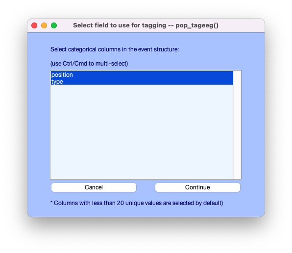
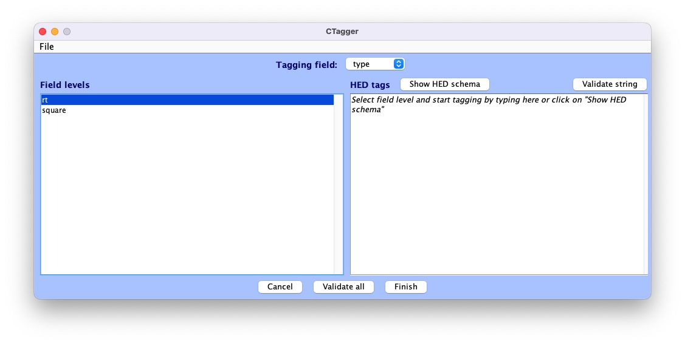
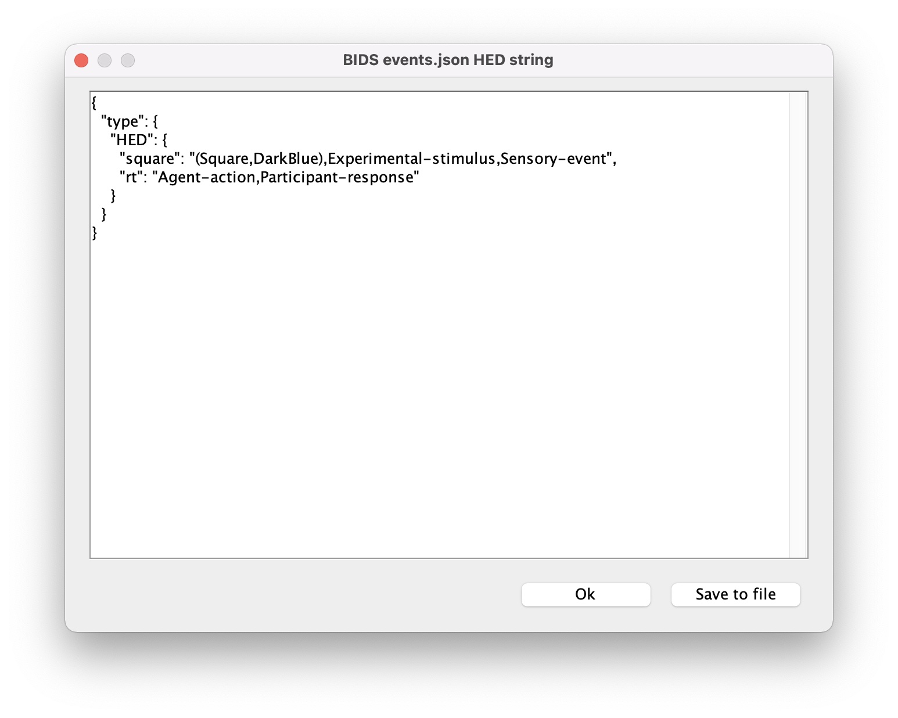
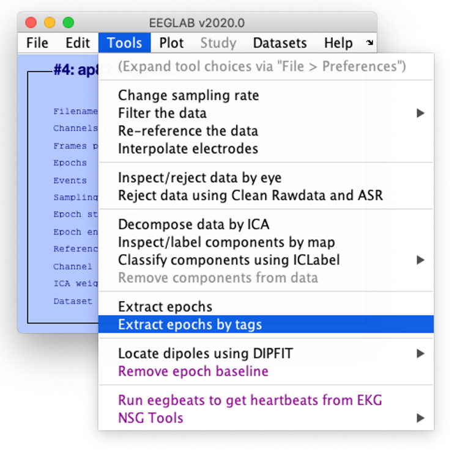
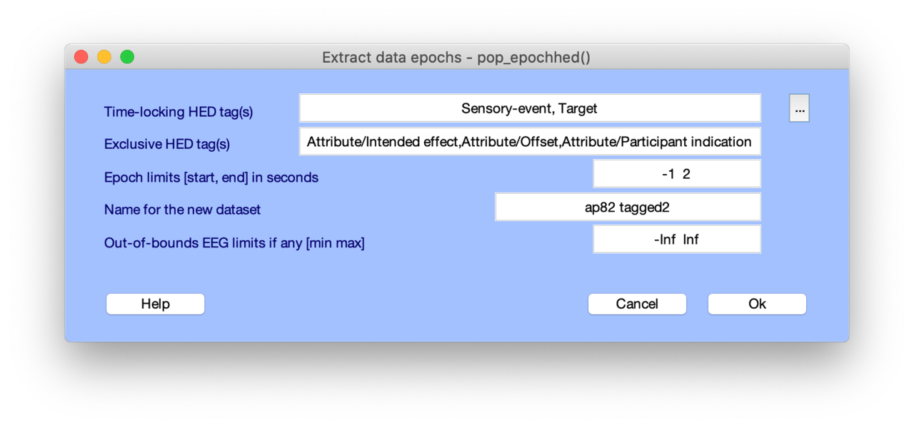
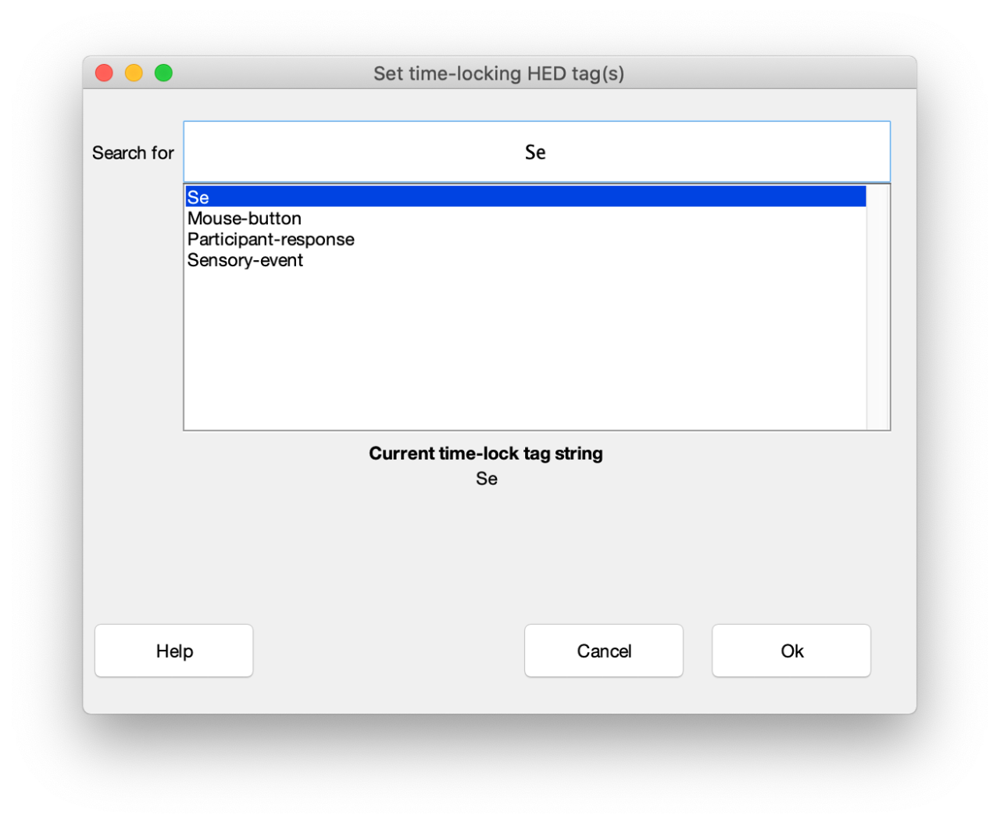

# HED MATLAB tools

There are currently three types of support available for HED (Hierarchical Event Descriptors) supports in MATLAB:

* [**HED services in MATLAB**](hed-services-matlab-anchor) - web services called from MATLAB scripts
* [**EEGLAB plug-in integration**](eeglab-integration-anchor) - EEGLAB plugins and other HED support
* [**Python HEDTools in MATLAB**](python-hedtools-in-matlab-anchor) - explains how to call the HED python tools from within MATLAB.

HED services allow MATLAB programs to request the same services that are available 
through the browser at [https://hedtools.ucsd.edu/hed](https://hedtools.ucsd.edu/hed).

(hed-services-matlab-anchor)=
## HED services in MATLAB

HED RESTful services allow programs to make requests directly to the
HED online tools available at
[https://hedtools.ucsd.edu/hed](https://hedtools.ucsd.edu/hed) or
in a locally-deployed docker module.
See [**HED-web**](https://hed-web.readthedocs.io/en/latest/index.html)
for additional information on the deployment.

The [**runAllTests.m**](https://raw.githubusercontent.com/hed-standard/hed-examples/main/hedcode/matlab_scripts/web_services/runAllTests.m)
is a main script that runs all the example code and reports whether
the code runs successfully.
You should start by running this script to make sure everything is working on your system,
that you have Internet access, and that the HED services are available.

This script also demonstrates how to call the individual test functions.
Each test function takes a host URL as a parameter and returns a list of errors.
The individual test scripts illustrate how to call each type of available web service.


| Target | MATLAB source|  Purpose |
| ------ | ------------- | ------- |
| Overall | [**runAllTests.m**](https://raw.githubusercontent.com/hed-standard/hed-examples/main/hedcode/matlab_scripts/web_services/runAllTests.m) | Harness for running all tests. |
| Overall | [**testGetServices.m**](https://raw.githubusercontent.com/hed-standard/hed-examples/main/hedcode/matlab_scripts/web_services/testGetServices.m) | List available services. |
| Events | [**testEventServices.m**](https://raw.githubusercontent.com/hed-standard/hed-examples/main/hedcode/matlab_scripts/web_services/testEventServices.m) | Validation, conversion, sidecar generation. |
| Events | [**testEventSearchServices.m**](https://raw.githubusercontent.com/hed-standard/hed-examples/main/hedcode/matlab_scripts/web_services/testEventSearchServices.m) | Search, assembly.|
| Schema |      *in progress*          | For schema library developers. |
| Sidecars | [**testSidecarServices.m**](https://raw.githubusercontent.com/hed-standard/hed-examples/main/hedcode/matlab_scripts/web_services/testSidecarServices.m) | Validation, conversion, extraction, merging. |
| Spreadsheets | [**testSpreadsheetServices.m**](https://raw.githubusercontent.com/hed-standard/hed-examples/main/hedcode/matlab_scripts/web_services/testSpreadsheetServices.m) | Validation, conversion.|
| Strings | [**testStringServices.m**](https://raw.githubusercontent.com/hed-standard/hed-examples/main/hedcode/matlab_scripts/web_services/testStringServices.m) | Validation, conversion. |


### Overview of service requests

Calling HED services from MATLAB requires the following steps:

1. **Set up a session**:
   1. Establish a session by requesting a CSRF token and a cookie.
   2. Construct a header array using the token and the cookie.
2. **Create a request structure**.
5. **Make a request** using the MATLAB `webwrite`.
6. **Decode the response** returned from `webwrite`.

Usually, you will do the first step (the session setup) once at the beginning of your script
to construct a fixed session header that can be used in subsequent requests in your script.

### Setting up a session from MATLAB

The goal of the session setup is to construct a header that can be used in subsequent web requests.
The first step is to call the [**getHostOptions.m**](https://raw.githubusercontent.com/hed-standard/hed-examples/main/hedcode/matlab_scripts/web_services/getHostOptions.m).
This function constructs the services URL from the host URL.
The function also makes a service request to obtain a CSRF token and a cookie.
The function then constructs a header and calls the MATLAB `weboptions` function
to get an options object suitable for use with the MATLAB `webwrite` function
use in all of our examples.

(setting)=
`````{admonition} Establish a session.
:class: tip
```matlab

host = 'https://hedtools.ucsd.edu/hed';
[servicesUrl, options] = getHostOptions(host)

```
`````
The `host` should be set to the URL of the webserver that you are using.
The call to `getHostOptions`, only needs to be done once at the beginning of your session.
The `servicesURL` and the `options` can be used for all of your subsequent requests.


The `getHostOptions` does all the setup for using the services.
As indicated by the code below, all communication is done in JSON.
However, as demonstrated below, the MATLAB `webwrite` function
takes a MATLAB `struct` as its `request` parameter and internally
converts to the format specified in the header before making the request.

The `Timeout` parameter indicates how many seconds MATLAB will wait for a response
before returning as a failed operation.
The `timeout` value of 120 seconds is sufficient for most situations.
However, but this can be adjusted upward or downward to suit the user.
The `HeaderFields` sets the parameters of HTTP request.


(gethostoptions-source-anchor)=
`````{admonition} Source for getHostOptions.
:class: tip
```matlab
function [servicesUrl, options] = getHostOptions(host)
    csrfUrl = [host '/services']; 
    servicesUrl = [host '/services_submit'];
    [cookie, csrftoken] = getSessionInfo(csrfUrl);
    header = ["Content-Type" "application/json"; ...
              "Accept" "application/json"; ...
              "X-CSRFToken" csrftoken; "Cookie" cookie];

    options = weboptions('MediaType', 'application/json', ...
                         'Timeout', 120, 'HeaderFields', header);
```
`````

In the following examples, we assume that `getHostOptions` has been called to retrieve
`servicesUrl` and `options` for use in the session.

### Creating a request structure

The request structure is a MATLAB `struct` which must have a `service` field and can have an
arbitrary number of fields depending on which service is being requested.

The simplest service is `get_services`,
which returns a string containing information about the available services. 
This service requires no additional parameters.

`````{admonition} Request a list of available HED web services.
:class: tip
```matlab

request = struct('service', 'get_services');
response = webwrite(servicesUrl, request, options);
response = jsondecode(response);

```
`````

The MATLAB `webwrite` returns a JSON structure as specified in the `options`.
The MATLAB `jsondecode` function returns a MATLAB `struct` whose format is explained
below in [**Decoding a service response**](decoding-a-service-response-anchor).


Except for `get_services`, all other services are of the form *target_command*
where *target* is the primary type of data acted on (events, schema, sidecar, spreadsheet, or string).
The possible values for *command* depend on the value of *target*.
For example `sidecar_validate` requests that a JSON sidecar be validated.

The `get_services` command provides information about the HED services that
are available and the parameters required.
The `get_services` entry for `sidecar_validate` is the following:

`````{admonition} The get_services entry for sidecar_validate.
:class: tip
```text
sidecar_validate:  
	Description: Validate a BIDS JSON sidecar (in string form) and return errors.  
	Parameters:  
		json_string  
		schema_string or schema_url or schema_version  
		check_for_warnings  
	Returns: A list of errors if any.
```
`````

The *Parameters* section indicates the fields in addition to the  `service`
that are needed in the request structure.
For example, `sidecar_validate` requires a HED schema.
One possibility is to read a schema into a string and provide this information in `schema_string`.
Another possibility is to provide a URL for the schema.
The most-commonly used option is to use `schema_version` to indicate one of the supported
versions available in the 
[**hedxml**](https://github.com/hed-standard/hed-specification/tree/master/hedxml) directory of the
[**hed-specification**](https://github.com/hed-standard/hed-specification) repository on GitHub.

(create-request-sidecar-validate-anchor)=
`````{admonition} Create a request for the sidecar_validate web service.
:class: tip
```matlab
jsonText = fileread('../../../datasets/eeg_ds003654s_hed/task-FacePerception_events.json');
request = struct('service', 'sidecar_validate', ...
                 'schema_version', '8.0.0', ...
                 'json_string', jsonText, ...
                 'check_for_warnings', 'on');
```
`````
This example reads the JSON sidecar to be validated as a character array into the variable `jsonText`
and makes a request for validation using HED8.0.0.xml.

The request indicates that validation warnings as well as errors should be included in the response.
If you wish to exclude warnings, use `off` instead of `on` as the `check_for_warnings` field value.

The [**testSidecarServices.m**](https://raw.githubusercontent.com/hed-standard/hed-examples/main/hedcode/matlab_scripts/web_services/testSidecarServices.m)
function shows complete examples of the various HED services for JSON sidecars.

### Making a service request

The HED services all use the MATLAB `webwrite` to make HED web service requests.
The following call uses the 
[**sidecar_validate request**](create-request-sidecar-validate-anchor)
from the previous section.

`````{admonition} Request the sidecar validation service.
:class: tip
```matlab
response = webwrite(servicesUrl, request, options);
response = jsondecode(response);
outputReport(response, 'Example: validate a JSON sidecar');
```
`````

The [**<code>outputReport.m</code>**](https://raw.githubusercontent.com/hed-standard/hed-examples/main/hedcode/matlab_scripts/web_services/outputReport.m)
MATLAB script outputs the response in readable form with a user-provided table.

If the web server is down or times out during a request,
the MATLAB `web_write` function throws an exception,
and the script terminates without setting the response.

If the connection completes successfully, the response will set.
The next section explains the response structure in more detail.

(decoding-a-service-response-anchor)=
### Decoding a service response

All HED web services return a response consisting of a JSON dictionary with 
4 keys as summarized in this table.

| Field name | Meaning |
| ---------- | ------- |
| service | Name of the requested service. |
| results | Results of the operation. |
| error_type | Type of error if the service failed. |
| error_msg | Explanation of the message if the service failed. |

The `jsondecode` function translates the JSON dictionary into a MATLAB structure.

The `error_type` indicates whether the service request completed successfully
and was able to get results. 
The `error_type` **does NOT** indicate the nature of the results 
(for example whether a JSON sidecar was valid or not),
but rather whether the server was able to complete the request without raising an exception.
A failure `error_type` is highly unusual and indicates some type of
unexpected internal web service error.
Errors of this type should be reported using the
[**GitHub hed-python issues**](https://github.com/hed-standard/hed-python/issues) mechanism.

The `results` structure has the actual results of the service request.

| Field name | Meaning   |
| ---------- | ------- |
| command | Command executed in response to the service request. |
| command_target | Type of data on which the command was executed. |
| data | Data returned by the service (either processed result or a list of errors). |
| msg_category | Success or warning depending on the result of processing the service. |
| msg | Explanation of the output of the service. |
| output_display_name | (Optional) File name for saving return data. |
| schema_version | (Optional) Version of the HED schema used in the processing. |

The `results` structure will always have `command`, `command_target`
fields indicating what operation was performed on what type of data.

The `msg_category` will be `success` or `warning` depending on whether there were errors.
The contents of the `data` field will contain different information depending on the `msg_category`.
For example, if a sidecar had validation errors, 
`results.msg_category` will be `warning` and the `results.data` value
should be interpreted as a list of errors.
If the sidecar had no errors, `results.data` will be an empty string.

(eeglab-integration-anchor)=
## EEGLAB plug-in integration
EEGLAB is the most widely used EEG software environment for analysis of 
human electrophsyiological (and related) data.
EEGLAB combines graphical and command-line user interfaces,
making it friendly for both beginners who may who prefer a visual,
and automated way of analyzing data as well as experts,
who can easily customize, extend, and automate the EEGLAB tool environment by writing new 
EEGLAB-compatible scripts and functions.

HED is fully integrated into EEGLAB via the *HEDTools* plug-in, allowing users to annotate their
EEGLAB STUDY and datasets with HED,
as well as enabling HED-based data manipulation and processing.

### Installing *HEDTools*

*HEDTools* EEGLAB plug-in can be installed using one of the following ways:

#### Method 1: EEGLAB Extension Manager: 

Launch EEGLAB. From the main GUI select:

> **File --> Manage EEGLAB extension**

The extension manager GUI will pop up. 

From this GUI look for and select the plug-in *HEDTools* from the main window,
then click into the *Install/Update* button to install the plug-in.


#### Method 2: Download and unzip

Download the zip file with the content of the plug-in *HEDTools* either from
[**HED Matlab EEGLAB plugins**](https://github.com/hed-standard/hed-matlab/blob/master/EEGLABPlugin)
or from the EEGLAB [**plug-ins summary page**](https://sccn.ucsd.edu/eeglab/plugin_uploader/plugin_list_all.php). 

Unzip file into the folder *../eeglab/plugins* and restart the *eeglab* function in a MATLAB session.

(annotating-datasets-anchor)=
### Annotating datasets

We will start by adding HED annotations to the EEGLAB tutorial dataset.

After installing the *HEDTools* open the EEGLAB main window and load the dataset by selecting the menu item:  

> **File --> Load existing dataset** .

Selecting the tutorial dataset under your eeglab installation _eeglab/sample_data/eeglab_data.set_. 

Read a description of the dataset and of its included event codes by selecting:  

> **Edit --> About this dataset**:


The description gives a general idea of the codes found in the event structure.
Yet, inquisitive researchers interested in the nature of the stimuli
(e.g., color and exact location of the squares on the screen)
would have to look up the referenced paper for details.

Our goal in using HED tags is to describe the experimental events that are recorded 
in the *EEG.event* data structure in sufficient detail that anyone using the dataset
in the future will not need to find and read a separate, detailed description of the dataset
or study to understand the recorded experimental events. 
As demonstrated below, such annotation will allow us to extract epochs using meaningful
HED tags instead of the alpha-numeric codes often associated with shared EEG data.

#### Launching EEGLAB HEDTools
To add and view HED tags for the dataset, from EEGLAB menu, select:  

> **Edit --> Add/Edit event HED tags**.  

_HEDTools_ will extract information from the *EEG.event* structure,
automatically detecting the event structure fields and their unique values.  

The _HEDTools_ ignore the fields the event structure fields *.latency*, *.epoch*, and *.urevent*. 

A window will appear asking you to verify/select categorical fields:



Here both *position* and *type* are categorical fields. 
*HEDTools* automatically selects fields with less than 20 unique values to be categorical,
but the user can modify which values are chosen.

CTagger (for 'Community Tagger') is a graphical user interface (GUI) built to facilitate
the process of adding HED tags to recorded events in existing datasets.
Clicking *Continue* brings up the *CTagger* interface:



The CTagger GUI is organized using a split window strategy.
The left window shows the items to be tagged,
and the right window shows the current HED tags associated with the selected item.
The *Show HED schema* button brings up a browser for the HED vocabulary. 

Through the CTagger GUI, users can explore the HED schema,
quickly look up and add tags (or tag groups) to the desired event codes,
and use import/export features to reuse tags on from other data recordings in the same study.

The process of tagging is simply choosing tags from the available vocabulary
(using the HED schema browser) and associating these tags with each event code.

Once familiar with HED and the vocabulary, most users just type the tags directly in the tag window
shown on the right. 

CTagger is used as part of the HEDTools plug-in in this tutorial,
but it can also be used as a standalone application. 

Instructions on downloading and using the standalone version of CTagger,
as well as step-by-step guide on how to add HED annotation with CTagger,
can be found at in [**Tagging with CTagger**](./CTaggerGuiTaggingTool.md).

#### Tagging the events
A brief step-by-step guide to selecting tags can be found at
[**HED annotation quickstart**](./HedAnnotationQuickstart.md).
The following shows example annotations using the process suggested in the quickstart. we will import the annotation saved in the _events.json file format. 
Download the file [**eeglab-tutorial_events.json**](./_static/data/eeglab-tutorial_events.json) then select:

> **File --> Import --> Import BIDS events.json file**

to import it to CTagger. You can now review all the tags via:

> **File --> Review all tags** 



#### Validation
The last step of the annotation process is to validate the HED annotations.
Click on the *Validate all* button at the bottom pane.
A window will pop up showing validation results.
If there are issues with the annotation, there will be a line for each of the issues found.

Here is an example of validation log file with issues:


If the annotation was correct, a message will appear confirming the validity:


Click *Finish* on the main CTagger window to end the annotation. 

The tag review window will show up again for a final review and the option to save
the annotation into an _events.json file for distribution just as with the *eeglab-tutorial_events.json*.
Hit *Ok* to continue after that.

A last window will pop up asking what you would like to overwrite the old dataset with the
tagged one or save new dataset as a separate file. Click **Ok** when you're done. 


You just finished tagging! *HEDTools* generates the final HED string for each event
by concatenating all tags associated with the event values of that event (separated by commas).
The final concatenated version is put the string in a new field **HED** in EEG.event. 

### HED-based epoching

The EEGLAB *pop_epoch* function extracts data epochs that are time locked to specified event types.
This function allows you to epoch on one of a specified list of event types as defined by the
*EEG.event.type* field of the EEG structure. 

*HEDTools* provides a simple way for extracting data epochs from annotated datasets using 
a much richer set of conditions. 
To use HED epoching, you must have annotated the EEG dataset. 

If the dataset is not tagged, please refer to [Annotating datasets](#annotating-datasets)
on how to tag a dataset.

Start by choosing the menu option: **Tools --> Extract epochs by tags**:




This will bring up a window to specify the options for extracting data epochs:



The *pop_epochhed* menu is almost identical to the EEGLAB *pop_epoch* menu with the 
exceptions of the first input field (**Time-locking HED tag(s)**) and the second 
input field (**Exclusive HED tag(s)**). 

Instead of passing in or selecting from a group of unique event types,
the user passes in a comma separated list of HED tags.
For each event all HED tags in this list must be found for a data epoch to be generated. 

Clicking the adjacent button (with the label …) will open a search tool to help you select
HED tags retrieved from the dataset.



When you type something in the search bar, the dialog displays a list below containing possible matches.
Pressing the "up" and "down" arrows on the keyboard while the cursor is in the search bar moves to the
next or previous tag in the list.

Pressing "Enter" selects the current tag in the list and adds the tag to the search bar.
You can continue search and add tags after adding a comma after each tag.
When done, click the **Ok** button to return to the main epoching menu. 

(python-hedtools-in-matlab-anchor)=
## Python HEDTools in MATLAB

**Under construction...**

If you are running MATLAB version 2019a or later, you can run functions from the Python `hedtools` library
directly in MATLAB. With these tools you can incorporate validation, summary, search, factorization,
and other HED processing operations directly into your MATLAB processing scripts without needing to
reimplement these operations in MATLAB.

**Note:** For your reference, the source for `hedtools` is the 
[**hed-python**](https://github.com/hed-standard/hed-python) GitHub repository.
The code is fully open-source with an MIT license.
The actual API documentation is available [**here**](https://hed-python.readthedocs.io/en/latest/api.html),
but the tutorials and tool documentation for `hedtools` on 
[**HED Resources**](https://www.hed-resources.org/en/latest/index.html) provides more
examples of use.


### Getting started

#### Requirements

The `hedtools` library requires a Python version >= 3.7. 
In order to call functions from this library in MATLAB, 
you must be running MATLAB version >= R2019a and have a 
[**compatible version of Python**](https://www.mathworks.com/support/requirements/python-compatibility.html)
installed on your machine.


#### Installation
The example setup in this section assumes MATLAB R2022b with Python 3.9,
but the instructions are similar for other compatible combinations of MATLAB and Python.

First a little background for non-Python users... A typical setup
is to do a system-wide installation of Python and then to create a separate
virtual environment for each application that references the system-wide
Python installation, but has the specific extra libraries required for the application.

These instructions install a copy of Python specifically for your use in MATLAB
in your user space with the specific libraries needed.
Create a new directory in your user space for the installation.
We will refer to this directory as **PythonPath**.

Go [**Python downloads**](https://www.python.org/downloads/) and pick the correct installer
for your operating system and version.

You will need to keep track of what folder you installed python to for the next steps, especially if you didn't install it system-wide.  
<hr/>

If you are an adept python user, feel free to point matlab to any compatible installation.  The only package required is "hedtools" and its dependencies.

#### Basic installer instructions
Verify you can use the version of python you want in matlab.  This is done by opening matlab and typing<br>
```
pyenv
```

This should display something like the following:
```ans = 

  PythonEnvironment with properties:

          Version: "3.10"
       Executable: "/usr/bin/python3"
          Library: "libpython3.10.so.1.0"
             Home: "..."
           Status: NotLoaded
    ExecutionMode: InProcess
```

As long as the Version box denotes the version of python you want, this step is complete.

If version is empty, or you do not see the one you want, you can set it via the following:

To set the location type the following, where PythonPath is your local path you noted earlier.
```
pyenv("Version", "[PythonPath]/bin/python")
```

##### Creating virtual environment using script

Now create the virtual environment by running the create_venv function(found in wherever we put the matlab scripts).  Simply pass it the folder name you wish to create the virtual environment in and it will update your matlab python and install hedtools there.
```
% It's fine if location of venv is your project directory.  It will be created in a subfolder called "venv".
create_venv(location_of_venv)
```
If this all worked, you should be able to now copy and paste the following line into matlab:
```
pyrun("from hed import _version as vr; print(f'Using HEDTOOLS version: {str(vr.get_versions())}')")
```
Output:
```
Using HEDTOOLS version: {'date': '2022-06-20T14:40:24-0500', 'dirty': False, 'error': None, 'full-revisionid': 'c4ecd1834cd31a05ebad3e97dc57e537550da044', 'version': '0.1.0'}
```

(matlab-wrappers-for-HED-tools-anchor)=
### MATLAB wrappers for HEDTools

The [**hedtools_wrappers**](https://github.com/hed-standard/hed-examples/tree/main/hedcode/matlab_scripts/hedtools_wrappers) directory in the
[**hed-examples**](https://github.com/hed-standard/hed-examples) GitHub repository
contains MATLAB wrapper functions for calling various commonly used HED tools.

The following example shows the MATLAB wrapper function
[**validateHedInBids.m**](https://raw.githubusercontent.com/hed-standard/hed-examples/main/hedcode/matlab_scripts/hedtools_wrappers/validateHedInBids.m),
which contains the underlying calls to HEDTools Python BIDs validation.


````{admonition} A MATLAB wrapper function for validating HED in a BIDS dataset.
:class: tip

```matlab
function issueString = validateBidsHed(dataPath)
    issueString = '';
    pyrun("bids = hed.tools.BidsDataset(dataPath)")
    pyrun("issues = bids.validate()")
    pyrun("issueString = hed.get_printable_issue_string(issues))")
```

Example MATLAB calling code for this function:

```matlab
myPath = '/myDatasetRoot';
issueString = validateHedInBids(dataPath);
if isempty(issueString)
    fprintf('Dataset %s has no HED validation errors\n', myPath);
else
    fprintf('Validation errors for dataset %s:\n%s\n', myPath, issueString);
end

```
````

### Exceptions
By default, python handles things like file not found by raising an exception.  Matlab automatically converts these to matlab exceptions, which can be caught as follows:
```
try
   validate_bids("this file does not exist")
catch ME
   disp(ME.message)
end
```
Output similar to:

```
Python Error: FileNotFoundError: [Errno 2] No such file or directory: '/home/user/hed_matlab/this file does not exist/dataset_description.json'
```

### Directly calling python code from matlab
#### MATLAB calling syntax

The following table lists the relevant MATLAB commands that you will need to run Python in MATLAB.
You should refer to the help facility for your version of MATLAB to get the details of what is
supported for your version of MATLAB.

| MATLAB command | Purpose |
| -------------- | --------|
| `pyenv`   | Setup your Python environment in MATLAB.<br/>Without arguments outputs information about your current Python environment. |
| `pyrun`  | Run a Python statement and return results. |
| `pyargs` | A recent addition for more advanced argument handling. |
| `pyrunfile` | Run a Python script from MATLAB. |

The MATLAB `matlab.exception.PyException` captures error information generated during Python execution.

### Example of validating a file via pyrun commands
This is not really recommended, but you can use the pyrun command to directly execute python commands similar to the following:
````{admonition} 
:class: tip

```matlab
    % Load the python library.  This only needs to be called once when you first load python.
    pyrun("import hed")
    % Retrieve and/or load the schema you wish to validate against
    pyrun("schema = hed.load_schema_version(version)", version="8.0.0")
    % Open the datafile you wish to validate
    pyrun("data = hed.TabularInput(filename)", filename="test_events.tsv")
    % Validate the datafile
    pyrun("errors = data.validate_file(hed_ops=schema)")
    % Translate the errors to a string, and print them.
    pyrun("print(hed.get_printable_issue_string(errors))")
```
````

````{admonition} This demonstrates how to get return values out from the python code back to matlab.
:class: tip

```matlab
    % Load the python library.  This only needs to be called once when you first load python.
    pyrun("import hed")
    % Note the second parameter "schema".  This specifies the names variable(s) we are returning from python.
    schema = pyrun("schema = hed.load_schema_version(version)", "schema", version="8.0.0");
    % Note the second parameter "data", which is the return value like above.
    data = pyrun("data = hed.TabularInput(filename)", "data", filename="test_events.tsv");
    % Validate the file against the schema, and return the errors as a list.
    errors = pyrun("errors = data.validate_file(validation_schema)", "errors", validation_schema=schema);
    % Translate the error_list to a string, and print them.
    pyrun("print(hed.get_printable_issue_string(error_list))", error_list=errors)
```
````

