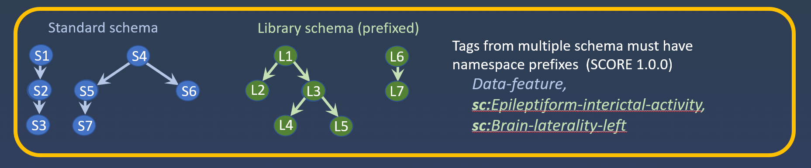
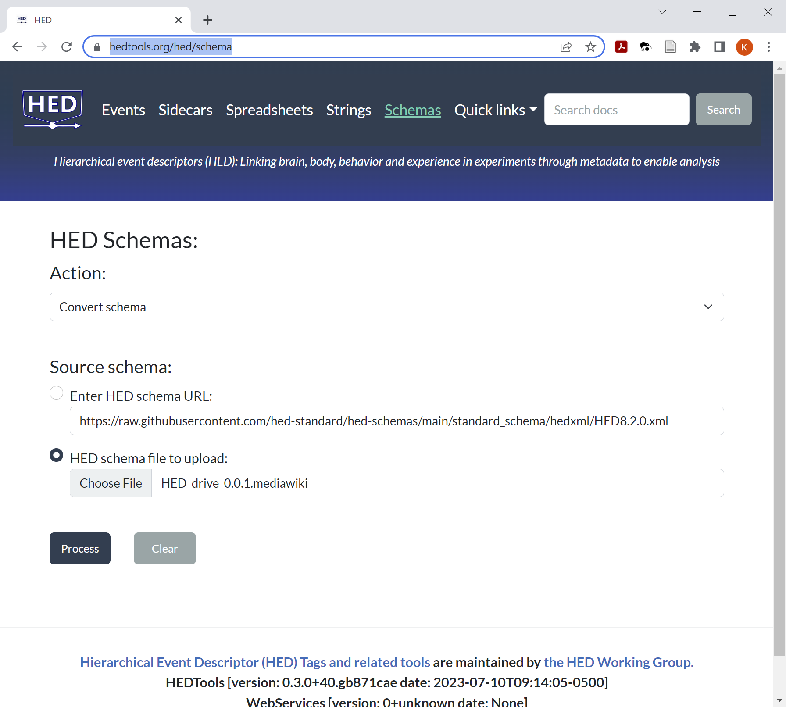

# HED schema developer's guide

A **HED schema** is a structured vocabulary of terms that can be used in HED annotations.
The **HED standard schema** contains basic terms that are common across
most human neuroimaging, behavioral, and physiological experiments.
The HED ecosystem also supports **HED library schemas** to expand the HED vocabulary 
in a scalable manner to support specialized data annotations.

This guide describes how to begin developing your own library schema or 
contribute to existing HED vocabularies.
If you have questions about how to get started,
please post an issue on the [**hed-schemas issues**](https://github.com/hed-standard/hed-schemas/issues) GitHub forum or
email the [**HED maintainers**](mailto:hed.maintainers@gmail.com).

More detailed information is available in
the [**Library schemas**](https://https://hed-specification.readthedocs.io/en/latest/07_Library_schemas.html) chapter of
the [**HED specification**](https://hed-specification.readthedocs.io/en/latest/index.html).

Details about syntax are available in the 
[**Schema formats**](https://hed-specification.readthedocs.io/en/latest/03_HED_formats.html#schema-formats) section and
the [**Schema format details**](https://hed-specification.readthedocs.io/en/latest/Appendix_A.html) chapter of the
[**HED specification**](https://hed-specification.readthedocs.io/en/latest/index.html).

## Schema design basics

A HED schema is structured as a set of trees,
each of which corresponds to a major term category for the vocabulary.

Before developing a schema,
you should explore the standard schema and other available schemas using the
[**HED Schema Viewer**](https://www.hedtags.org/display_hed.html). 
In the standard schema for example, the `Clap-hands` tag is in the `Action`
subtree, but is 3 levels down:

> `Action` &rarr; `Communicate` &rarr; `Communicate-gesturally` &rarr; `Clap-hands`

### Uniqueness and forms
All tags (vocabulary terms) in a HED schema must be unique, so the short-form `Clap-hands` uniquely specifies the term,
as does any partial path: `Communicate-gesturally/Clap-hands`, 
`Communicate/Communicate-gesturally/Clap-hands` and
`Action/Communicate/Communicate-gesturally/Clap-hands`.

### Is-a
An important feature of HED schemas is that each child (path successor) extends or
specializes its parent (predecessor) in the hierarchy.
Thus, `Clap-hands` is a type of `Communicate-gesturally` action.
The **is-a** relationship between a child term and its ancestors in the hierarchy is fundamental
to HED and enables search generality:  a search for `Communicate-gesturally` will return
annotations that contain any of this tag's descendents (e.g., tags such as `Nod-head`, 
`Pump-fist`, etc.).

### Top-level as categories
As a vocabulary designer, you should think about the **major categories** 
that are appropriate for your schema
in selecting top-level nodes to anchor your schema's major categories.
For example, the standard schema has the following top-level tags:
`Event`, `Agent`, `Action`, `Item`, `Property`, and `Relation`.

### Choosing tag names

Each individual tag in your vocabulary must stand by itself ---
that is, its meaning should be clear.
Tags must be unique and should be distinct from the tags in
the standard schema.
(You should avoid overlap with tags from other libraries if possible,
although this is not required.)

Tag names may only contain alphanumeric characters, hyphens, and underbars.
No blanks are allowed.
Except for certain SI unit designators, HED tags are case-insensitive.
However, the tag names in the schema should follow the following conventions:
- The first character of tag names starting with a letter is capitalized.  
- All letters in a tag name except for the first character are in lower case.  
- Tags representing multiple words are hyphenated.

The [**Naming conventions**](https://hed-specification.readthedocs.io/en/latest/03_HED_formats.html#naming-conventions) 
section of the HED specification gives a complete discussion of naming conventions.

### Design principles for schema

All HED schema (both the standard and library schemas) must conform to certain design principles
in addition to properly validating.

``````{admonition} Rules for HED schema design.
:class: tip

1. [**Unique**] Every term must be unique within the schema and must conform to the rules for
HED schema terms.
2. [**Meaningful**] Schema terms should be readily understood by most users. The terms should not be ambiguous and should be meaningful in themselves **without** reference to their position in the schema hierarchy.
3. [**Organized**] If possible, a schema sub-tree should have no more than 7 direct subordinate sub-trees.
4. [**Orthogonal**] Terms that are used independently of one another should be in different sub-trees (orthogonality).
5. [**Sub-classed**]Every term in the hierarchy satistifies the **is-a** relationship with its ancestors in the schema tree.
In other words if B has A as an ancestor in the schema hierarchy, then B is an example of A.
Searching for A will also return B (search generality).

``````

### Deciding partnership

While developing a schema as a standalone vocabulary is supported,
**it is strongly recommended that library schemas partner with the (latest) standard schema**.
For more detailed rules and syntax about partnering
see the [**Partnered schemas**](https://hed-specification.readthedocs.io/en/latest/07_Library_schemas.html#partnered-schemas)
section of the [**HED specification**](https://hed-specification.readthedocs.io/en/latest/index.html).

#### Unpartnered libraries

The standard schema provides the basic terms needed for annotating events in most experiments. 
A library's role is to provide additional specialized vocabulary for a specific application.
If multiple schemas are used to annotate a datasets, the tags from
one of the datasets must be prefixed with a user-selected
namespace designator as shown in this schematic.



Here the standard schema (blue nodes) and an unpartnered
library schema (green nodes) are used in an annotation. 
Each of these schemas could be used individually in a dataset
without reference to the other.
However, if annotations in a dataset use more than one schema,
tags from one of the schemas must be prefixed with a namespace designator. 
The choice of which schema's tags will be prefixed is up to the user.
In the example on the right of the diagram, the tags from SCORE library version 1.0.0
are prefixed with `sc:` as indicated by the **HEDVersion** specification at the bottom.

#### Partnered schemas

Most applications need terms from both the standard schema and possibly a library schema.
For this reason the concept of **partnered schemas** was introduced.
Schema partnership means that a library schema is merged with a
specific version of the standard schema when the library schema is
distributed with its standard schema partner as a single schema.
Tags from both the library schema and its partnered standard schema can be used
without prefixes as shown in the following schematic.
Note that tags from other additional schemas will still need to be prefixed.


Here the standard schema (blue nodes) and its partnered
library schema (green nodes) are merged and viewed as a single
schema when the schema is validated and distributed.

Notice that some green nodes in the diagram are children
of nodes in the standard schema.
While some top-level nodes in your library schema may represent categories that stand by themselves,
it is likely that other nodes are elaborations of terms that already exist in the standard schema.
You can declare a top-level node in your schema (and its attached subtree)
to be placed under a node in the standard schema by giving it the `rooted=XXX`
attribute, where `XXX` is the name of the parent node in
the standard schema under which the subtree should be rooted.

```{warning}
**Whether a particular library schema version is partnered or unpartnered is
fixed when the library is released and cannot be changed.  

For example,
SCORE version 1.0.0 is unpartnered, but SCORE version 1.1.0 is partnered
with standard schema version 8.2.0.**
```

### Naming your schema

Before starting, you must decide on a name for your schema.
It should be a relatively short, informative, alphabetic string.
The name can be an acronym or a meaningful name, 
but it cannot be the same name as any other recognized HED schema.

The SCORE library, for example, is an acronym based on its derivation from the
SCORE standard: Standardized Computer Based Organized Reporting of EEG.
The LISA library, a language schema now in prerelease, is another acronym standing for
LInguistic Stimuli Annotation.
A good name for a schema with vocabulary describing simulated driving
experiments might be DRIVE.

### Schema file names

All HED schemas, including library schemas, adhere to [**semantic versioning**](https://semver.org/). 
The rules for what constitutes major, minor and patch changes are given
in the hed-schemas [**README**](https://github.com/hed-standard/hed-schemas/#hed-semantic-versioning).

Suppose you are just starting to create a library called DRIVE for
a vocabulary specific to simulated driving tasks.
The file name for the first version of your schema should be `HED_drive_0.0.1.mediawiki`.
This file will eventually go in your prerelease directory 
on [**hed-schemas**](https://github.com/hed-standard/hed-schemas).

## Creating your schema

The following sections briefly describe how to go about actually creating your schema
files.

### Introducing MediaWiki

Schema developers work with HED schema in `.mediawiki` format for ease in editing.
MediaWiki is a markdown-like text format that can be displayed
in GitHub in a nicely formatted manner for easy editing.

Mediawiki was chosen as the developer format because of its clear
representation of indented outlines (or equivalently, trees)
as illustrated in the following example:


````{admonition} **Example:** Top-level node and children in MediaWiki format.

```moin
'''Top-level-1''' <nowiki>[The best top-level node in this schema.]</nowiki>
* Child-1 <nowiki>{extensionAllowed}[A child of Top-level-1.]</nowiki>
** Grandchild-1 <nowiki>[A child of Child-1.]</nowiki>
* Child-2 <nowiki>[A child of Top-level-1 that cannot be extended.]</nowiki>
```
````

The MediaWiki GitHub previewer shows this as:


Each line in the MediaWiki file represents a distinct tag (or other schema entity),
so `Top-level-`, `Child-1`, `Grandchild-1`, and `Child-2` are all
tags or terms in the schema.

Lines defining tags cannot be split.

Everything after the tag name should be enclosed in
<b>&lt;nowiki&gt; &lt;/nowiki&gt;</b> delimiters.
The tag description appears in square brackets ([ ]),
while schema attributes such as `extensionAllowed` are
enclosed in curly braces ({ }).

The tag `Top-level-1`, which is a top-level tag or root of one of the schema's trees,
represents a major category in the schema. Top-level tags are enclosed in 
sets of three consecutive single quotes.

In contrast, child tags  such as `Child-1` appear on lines that start
with 1 or more asterisks (`*`), indicating the level of indentation or
alternatively depth in the schema tree.

### Defining a schema

We assume that you are going to develop a partnered library schema,
which requires only the schema tags and no auxiliary sections.
Unpartnered schemas require that all auxiliary sections be provided,
while partnered schemas use the auxiliary sections from their standard
schema partner.

The following illustrates the format for using an
exemplar library schema called drive. 

````{admonition} **Example:** Driving library schema (MEDIAWIKI template).

```moin
HED library="drive" version="0.0.1" withStandard="8.2.0" unmerged="true"

'''Prologue'''
Drive has tags of interest to driving experiments.

!# start schema

'''Vehicle-part''' <nowiki>{rooted=Device}[Parts of a vehicle of any kind.]</nowiki>
* Steering-device <nowiki>[The part of a vehicle used for steering.]</nowiki>
** Steering-wheel <nowiki>[A wheel used for steering as for a car.]</nowiki>
** Steering-yoke <nowiki>[A horizontal column used for steering, primarily in aircraft.]</nowiki>
* Brake-device <nowiki>[A part of a vehicle used for steering]</nowiki>

!# end schema 

!# end hed 

```
````

This schema would be saved in a MediaWiki file called `HED_drive_0.0.1.mediawiki`.
To start developing simply replace "drive" with the name of your schema
and replace the drive tags with your own.

### Checking syntax

While developing, you should validate your schema frequently using
the [**HED online tools**](https://hedtools.org).

The following tools shows screen shows the user interface for
validating your schema using the online tools.


Simply choose the MediaWiki file you wish to valid,
select the *Validate* action and press *Process*.
If your file has errors, a text file containing the errors will be
available for download.

### Converting to XML

Although developers use the MediaWiki format, tools access the
schema in XML format.
Use the [**HED online tools**](https://hedtools.org) to convert as shown in the following screenshot:




## Becoming official

### Getting listed

To get recognized as a HED library schema project,
post an issue to [**issue forum**](https://github.com/hed-standard/hed-schemas/issues) 
of the [**hed-schemas**](https://github.com/hed-standard/hed-schemas) GitHub repository
with a brief overview of your schema, its purpose, and the GitHub names of your development team.
The HED Working Group will work with you to get started.

As part of the initiation process, the HED maintainers
will create a subdirectory in the
[**library_schemas**](https://github.com/hed-standard/hed-schemas/tree/main/library_schemas)
subdirectory of the [**hed-schemas**](https://github.com/hed-standard/hed-schemas)
GitHub repository. The name of this new directory will be your schema name in lowercase. 
This newly created subdirectory will be your development team's working directory.

A basic `README.md` file will be created in your schema subdirectory.
You should update this file to be informative.

As an example, the working directory for the SCORE library team is 
[**hed-schemas/library_schemas/score**](https://github.com/hed-standard/hed-schemas/tree/main/library_schemas/score).
This directory has the following subdirectories:

- [**hedxml**](https://github.com/hed-standard/hed-schemas/tree/main/library_schemas/score/hedxml) contains the released versions of the schemas in XML format. Once a file is placed in this directory, it should never be modified. You will need to create a new version to make corrections.
- [**hedwiki**](https://github.com/hed-standard/hed-schemas/tree/main/library_schemas/score/hedwiki) contains the released versions of the schemas in MediaWiki format. Once a file is placed in this directory, it should never be modified. You will need to create a new version to make corrections.
- [**prerelease**](https://github.com/hed-standard/hed-schemas/tree/main/library_schemas/score/prerelease) is the working directory for the schema development team.
- [**README.md**](https://github.com/hed-standard/hed-schemas/blob/main/library_schemas/score/README.md) contains an informative overview of your library schema.

You will use the GitHub Pull Request (PR) mechanism to make changes to your `prerelease` subdirectory.
This directory will contain both the MediaWiki and XML versions of your draft schema.
The XML version is needed so that you can view your schema via the 
[**HED Schema Viewer**](https://www.hedtags.org/display_hed.html).

You will also be asked to create and maintain a documentation page for your schema.
For example, the SCORE library Markdown document is located in
the [**hed-schemas/docs/source/hed_score_schema.md**](https://github.com/hed-standard/hed-schemas/blob/main/docs/source/hed_score_schema.md) file
in the [**hed-schemas**](https://github.com/hed-standard/hed-schemas) repository.
Your documentation page will be similarly named and located --- just replace the word
*score* with your library name.

Your documentation page will be available on the [**HED schemas documentation**](https://hed-schema-library.readthedocs.io/en/latest/index.html) site.


(proposing-changes-anchor)=
### Proposing changes

As development proceeds, all changes are made through the GitHub pull request (PR) mechanism. 
Changes will be reviewed by one or more of the HED maintainers to make sure that they
don't impact other HED schemas and conform to the HED design requirements. 
HED follows an open process so comments on the PR may be made by any GitHub user.

When making a change, you should add a bullet point describing
the modification in the `CHANGES.md` file.
You should edit the `.mediawiki` file in the `prerelease` directory
and replace the `.xml` file with the converted version of your new `.mediawiki` file
(via pull request of course).

To engage your user community in discussion about a proposed modification, post an issue to the  [**issue forum**](https://github.com/hed-standard/hed-schemas/issues) of [**hed-schemas**](https://github.com/hed-standard/hed-schemas).
Start the title of the issue with the name of your library to flag it for your users.

As modifications to the HED schema are proposed, add them to your `PROPOSED.md` file.
When the change has been agreed upon, modify your schema files and update `CHANGES.md`
and other files as described above.

Examples of these files for the standard schema can be found in the standard schema [**prerelease**](https://github.com/hed-standard/hed-schemas/tree/main/standard_schema/prerelease) directory.

Prereleases are all viewable in the [**HED Schema Viewer**](https://www.hedtags.org/display_hed.html) 

### Releasing a schema

Upon final review, the HED maintainers release your schema.
During this process, your prerelease XML file will be copied to your library schema's
`hedxml` directory, and your prerelease `.mediawiki` file will be copied to your library schema's `hedwiki` directory.

The prerelease `CHANGES.md` will be added to the `CHANGELOG.md` file which is
at the top level of your library subdirectory in [**hed-schemas**](https://github.com/hed-standard/hed-schemas).
You may decide to update the version number in this process.
For example, schema developers might choose the version number of their first 
release to be 1.0.0 rather than 0.0.1.

After final checks, the HED maintainers will create a [**zenodo**](https://zenodo.org) entry for your library and obtain
a DOI to with a badge to add to your `README.md` file and to the overall `README.md` file.


### Summarizing the process

Here is a brief summary of the development process.

````{admonition} **Standard development process HED libraries.**
:class: tip

- Choose a schema name.
- Get listed on [**hed-schemas**](https://github.com/hed-standard/hed-schemas).
- Develop your schema:
  - Modify your prerelease `.mediawiki`.
  - Validate the prerelease `.mediawiki` file using the [**HED online tools**](https://hedtools.org/hed/schema).
  - Convert to the prerelease `.mediawiki` file to `.xml` using the [**HED online tools**](https://hedtools.org/hed/schema) and replace the existing prerelease `.xml`.
  - Check the schema using [**HED Schema Viewer**](https://www.hedtags.org/display_hed.html).
  - Update your prerelease `CHANGES.md` and `PROPOSED.md` files.
  - Update your schema's `README.md`.
  - Create and/or modify your schema's documentation page.
  - Repeat until ready to release a permanent version.
- Release your schema:
  - Choose the final version number.
  - Get final reviews.
  - Request release by posting an issue.
  - Comment and approve final release PR created by hed-maintainers.

````


## Further documentation

The documentation on this page refers specifically to the HED vocabulary and supporting tools
relevant to developing a library schema. Additional documentation is available on the following sites:

> [**HED project homepage**](https://www.hedtags.org)  
> directs users to appropriate places to find information.

> [**HED organization**](https://github.com/hed-standard)  
> GitHub organization that houses the repositories holding HED source (all of which is open).

> [**hed-schemas**](https://github.com/hed-standard/hed-schemas)  
> GitHub repository houses all HED schemas in a form that
> can be accessed by tools at runtime.

> [**HED Resources**](https://www.hed-resources.org)  
> the main website for HED documentation and tutorials.

> [**HED Specification**](https://hed-specification.readthedocs.io/en/latest/index.html)  
> displays the HED specification.

> [**HED Schema Viewer**](http://www.hedtags.org/display_hed.html)  
> allows users to explore the schemas that have been uploaded to [**hed-schemas**](https://github.com/hed-standard/hed-schemas).
