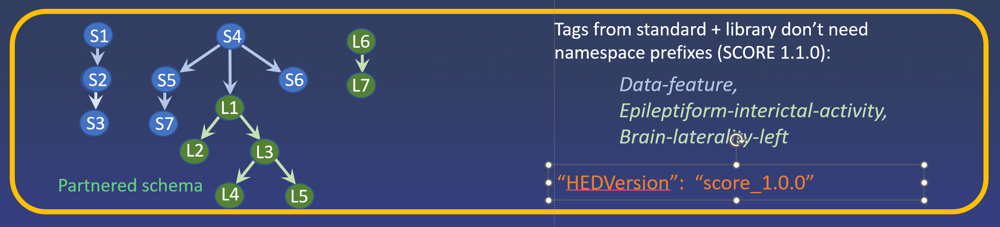

# HED schemas

## HED schema basics

HED annotations consist of unordered comma separated lists of HED tags.
The annotations may include parentheses to group terms that belong together.
For example in the HED annotation *Red, Triangle, Blue, Square*,
cannot use ordering to determine which tags belong together.
To indicate a red triangle and a blue square, you must use parentheses:
*(Red, Triangle), (Blue, Square)*.

The HED tags used to annotate data come from a controlled vocabulary
called a **HED schema**. A HED schema consists of a series of **top-level** tags representing
general categories in this vocabulary.
Each top-level tag is the root of a tree containing tags falling into that category.

Each child tag in a HED schema is considered to be a special type of its ancestors.
Consider the tag *Square*, which has a full schema path
*Item/Object/Geometric-object/2D-shape/Rectangle/Square*.
*Square* is-a type of *Rectangle*, which is-a type of *2D-shape*, etc.

The strict requirement of child **is-a** type of any ancestor
means that when downstream tools search for *2D-shape*, 
the search will return tag strings containing *Square* as well as those 
containing the tags *Rectangle* and *2D-shape*.

Rules for the HED schema vocabulary and for HED-compliant tools can be found in the
[**HED Specification**](https://hed-specification.readthedocs.io/en/latest/).

Additional details about particular schemas can be found in the
[**HED schemas**](https://hed-schemas.readthedocs.io/en/latest/index.html) documentation page.

### Tag forms

When you tag, you need only use the tag node name (e.g, *Square*).
**HED-compliant tools** can convert between this "short-form" and the complete path or "long-form" 
(e.g. */Item/Object/Geometric-object/2D-shape/Rectangle/Square*) 
when needed for search, summarization, or other processing.

### Types of schemas

The HED standard schema consists of a terms that are likely to be of use in all experiments,
while library schemas capture the terms that are important for annotations in a specialized areas.
You may use terms from as many schemas as you wish.
However, if you use more than one schema, terms from the additional schemas must be prefixed
by **local namespace designators** to indicate which schemas the tags came from.
A namespace designator is the form *xx:* where *xx* is a user-chosen string of alphabetic characters.

The following diagram shows a representation of a standard schema (blue nodes) used in
conjunction with the SCORE 1.0.0 library schema (green nodes).
Tags from the standard schema, such as *Data-feature* appear without the prefix.
The remaining tags, which come from the SCORE library, 
appear with the user-defined *sc:* namespace prefix in the annotation.

.  

Starting with HED schema version **8.2.0**, HED supports **partnered schemas**,
which are library schemas that are merged with a standard schema.
Partnered schemas allow schema designers to include library
tags that are elaborations of tags in the standard schema in addition to other
specialized tags as shown in the following diagram:

.

SCORE version 1.1.0 will be distributed as a partnered schema.
Annotations from a partnered schema can include tags from both the library schema
and its partner without prefixes.

## Viewing schemas

All versions of the HED schemas are located in the GitHub
[**hed-schemas**](https://github.com/hed-standard/hed-schemas)
and can be best-viewed using the [**HED schema browser**](https://www.hedtags.org/display_hed.html).

## Available schemas

### The standard schema

The HED standard schema contains the basic vocabulary for annotating experiments.
These are terms that are likely to be useful in all types of annotations.
The HED standard schema source is located in the 
[**standard_schema**](https://github.com/hed-standard/hed-schemas/tree/main/standard_schema)
directory of the [**hed-schemas**](https://github.com/hed-standard/hed-schemas) GitHub repository.

| Format | Type | Use | 
| ------ | ---- | ---- | 
| XML |  [**Raw**](https://raw.githubusercontent.com/hed-standard/hed-schemas/main/standard_schema/hedxml/HED8.2.0.xml) | Accessed by tools for validation and analysis. |  
|   | [**Formatted**](https://github.com/hed-standard/hed-schemas/blob/main/standard_schema/hedxml/HED8.2.0.xml) | Readable display. |
| Mediawiki | [**Raw**](https://raw.githubusercontent.com/hed-standard/hed-schemas/main/standard_schema/hedwiki/HED8.1.0.mediawiki) | Edited to create a new schema. |  
|  | [**Formatted**](https://github.com/hed-standard/hed-schemas/blob/main/standard_schema/hedwiki/HED8.1.0.mediawiki) |  Readable display for editing. |
| Prerelease  | [**Directory**](https://github.com/hed-standard/hed-schemas/tree/main/library_schemas/score/prerelease) |  Working directory for developing the prerelease. |

### The SCORE library

The HED SCORE library is an implementation of the [**SCORE**](https://hed-schemas.readthedocs.io/en/latest/hed_lisa_schema.html) standard for clinical annotation of EEG by neurologists.
For more information and the latest references see 
[**HED SCORE schema**](https://hed-schemas.readthedocs.io/en/latest/hed_score_schema.html).

| Format | Type | Use | 
| ------ | ---- | ---- | 
| XML |  [**Raw**](https://raw.githubusercontent.com/hed-standard/hed-schemas/main/library_schemas/score/hedxml/HED_score_1.0.0.xml) | Accessed by tools for validation and analysis. |  
|   | [**Formatted**](https://github.com/hed-standard/hed-schemas/blob/main/library_schemas/score/hedxml/HED_score_1.0.0.xml) | Readable display. |
| Mediawiki | [**Raw**](https://raw.githubusercontent.com/hed-standard/hed-schemas/main/library_schemas/score/hedwiki/HED_score_1.0.0.mediawiki) | Edited to create a new schema. |  
|  | [**Formatted**](https://github.com/hed-standard/hed-schemas/blob/main/library_schemas/score/hedwiki/HED_score_1.0.0.mediawiki) |  Readable display for editing. |
| Prerelease  | [**Directory**](https://github.com/hed-standard/hed-schemas/tree/main/library_schemas/score/prerelease) |  Working directory for developing the prerelease. |

### The LISA library

The HED LISA library represents a vocabulary for annotating linguistic stimuli in language and other
types of experiments.
For more information and the latest references see 
[**HED LISA schema**](https://hed-schemas.readthedocs.io/en/latest/hed_lisa_schema.html).
The LISA library is under development and is only available in prerelease format.

| Format | Type | Use | 
| ------ | ---- | ---- | 
| XML | **Raw** | Accessed by tools for validation and analysis. |  
|   | [**Formatted**] | Readable display. |
| Mediawiki | [**Raw**] | Edited to create a new schema. |  
|  | [**Formatted**] |  Readable display for editing. |
| Prerelease  | [**Directory**](https://github.com/hed-standard/hed-schemas/tree/main/library_schemas/lisa/prerelease) |  Working directory for developing the prerelease. |

