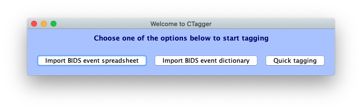
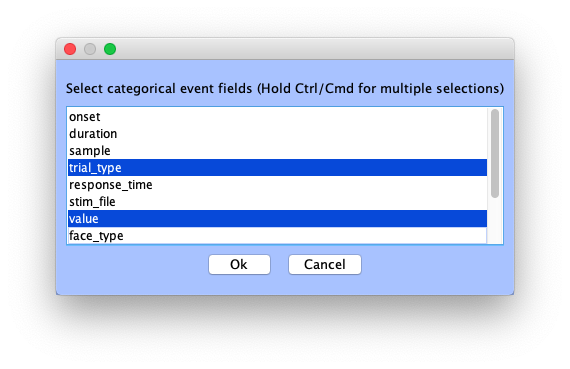
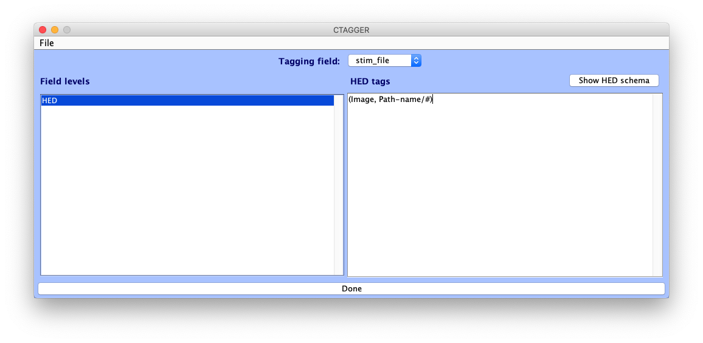

# Tagging with CTagger

**This tutorial is underdevelopment.**

This tutorial takes you through the process of using CTagger, a user interface we developed to ease the process of adding HED annotations. 
CTagger can be used as a standalone application, or as part of the EEGLAB BIDS data pipeline, making it easily intergratable to the annotation pipeline mentioned in the Quick guide.

## Installation
**Standalone application**

- Check to see that you have Java installed. Linux usually comes with OpenJDK (open source version of JDK) already installed. We have tested up to Java version 11 in Mac and Ubuntu. Executing `java -version` on terminal should return something similar to
`java version "1.8.0_211"` or `openjdk version "11.0.11" 2021-04-20`
    * If Java is not installed, download and install Java Runtime Environment accordingly to your OS: https://www.oracle.com/java/technologies/javase-jre8-downloads.html. You might be asked to create an Oracle account first before you can download. 
- Download [CTagger.jar](https://github.com/hed-standard/CTagger/raw/main/CTagger.jar).
- Double click on *CTagger.jar* to run. 
    * If you're on macOS you might need to update your Security settings to allow the app to run. On Linux, you might need to make the jar executable first by executing `chmod +x CTagger.jar` while in the directory containing the downloaded CTagger.

**Within EEGLAB environment**

Install HEDTools plugin.

## Loading BIDS event files into CTagger
From the CTagger launcher window, users have the option to import either the BIDS event dictionary or event spreadsheet to start tagging. 

If **Import BIDS event dictionary** is selected, users will be prompted to select an *events.json* file. Any field (corresponding to event column) with the key "Levels" will be interpreted as having categorical column, and each of the sub levels will be considered as the categorical values of the field. All other fields will be considered as having continuous values. If users import an *events.tsv* file via **Import BIDS event spreadsheet**, CTagger will ask users to specify categorical fields. Unique categorical values of these fields will then be automatically extracted from the file.

Once importing is finished, users will see the main CTagger tagging interface. Users can toggle between different fields using the **Tagging field** dropdown. For non-categorical fields, the left panel will contain a single item **HED** to which the HED string containing the # symbol will be associated as explained above. For categorical fields, the **Field levels** panel on the left will contains a list of the categorical values of the field. Users can choose any item on the list to start tagging. Users specify HED tags on the right panel. CTagger will associated the HED string formed in the right panel with the list item selected in the left panel. It is important that an item is selected from the **Field levels** list, otherwise the HED string formed will not be saved. 

You are now ready to start tagging! 

## Adding HED annotation
Helping users construct HED annotations quickly and easily is the main goal of CTagger. New **search capacity** and **dynamic formatting** features  and the new **schema-browsing view,** help users to quickly compose HED annotations. 

When the user types into the tag editor in CTagger, the character sequence is compared to all the schema nodes. Nodes whose long-form tag match any part of the input sequence (case-insensitive) will be displayed (in long form) in the CTagger **Search Results** box (just below the input cursor). Users can scroll through the resulting results display by pressing the *down-arrow* key and clicking on *Enter/return* to select a tag to add to the HED annotation. Else, the user can scroll through the results by mouse and click on a tag to select it. CTagger will always add the short-form tag, replacing the input sequence, and the *Search Results* box will disappear. At any point, the user can make the *Search Results* box disappear by pressing *Esc* key or by clicking on the text area outside the *Search Results* box. 

The user can also open up the HED schema itself to browse for an appropriate tag in a more exploratory way, expanding the hierarchical structure of the schema at any point of interest. Clicking on the **Show HED schema** button brings up the schema display, in which any schema node that contains children is expandable/collapsible. Clicking on a node will add its short-form tag to the current annotation. For nodes that take values, clicking on the **#** underneath the node will add the node name, followed by a forward-slash (**/**) to the annotation. the user will then type in the value for that node. 

In HED, tags can be grouped together to indicate that they modify each other and should be interpreted (e.g. during search) as a whole unit. A **tag group** is specified by surrounding comma-separated tags in the same group with parentheses. For example, the tag group *(Triangle, Green)* describes a green triangle. HED also allows **nested tag groups**, for example to annotate something containing something else. Having multiple levels of nested tag groups (hence lots of nested pairs of parentheses) can be difficult to parse visually. CTagger allows users to incorporate new lines and tab indentation (using the *Newline* and *Tab* keys) to make their annotations more readable. Once the annotation for an event or event type is complete, a final, comma-separated full-form **HED string** is created. CTagger will automatically strip *Newline* and *Tab* characters from the HED string to produce a HED string format compatible with any annotation destination file. 

In CTagger, at any time during the annotation process, the user can view the current (if still incomplete) version of the long-form HED string by going to *File > Review all tags*.

### Validating your annotation
At any point of the tagging process users can validate their current HED string by clicking on the **Validate string** button. Users can also validate annotation of the entire event file by clicking on the **Validate all** button. 

Users must fix any validation error before being able to finish tagging. Once done with their annotation, users can then copy the HED string and paste it into an intended location (e.g., an **event design** file table), or can save the HED annotation as a JSON dictionary file. Click **Finish > Save to file** and give a name to your json file; then select where you want to save it. You're done! 
